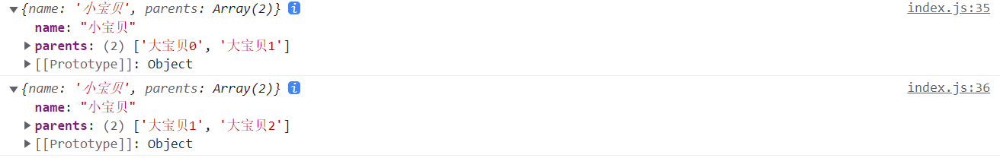

#### 2022/3/31

1. ##### `.gitignore`更新生效

     ```bash
    git rm -r --cached .
    ```

1. ##### 浅克隆与深克隆

2. `浅克隆`：只进行一级克隆，基本类型为值传递，对象类型引用传递，和原来的对象公用相同的堆地址

   方法有：`展开运算符...`，`slice`，`Object.assign(target, source)`

   函数克隆直接通过浅克隆就能实现，因为函数克隆的时候会在内存中单独开辟一片空间，互不影响（这里不太明白）

   `深克隆`：对象所有的属性和值都会一层一层完全复制，新对象的修改不会影响原来的对象，如果克隆对象的某个值还是对象的话

* 方法一：`js.parse(js.stringify())`
  
    原理：先把原对象转为字符串，然后再parse成一个全新的对象，就实现了内容的深度克隆
  
    问题：可以处理`Number`，`String`，`Array`这种能够被 `js`正确表示的数据结构，但是函数处理后会变为`null`，正则对象处理后会变为空对象`{}`
- 方法二：自己写

  > - 递归调用函数
  > - 函数开头判断类型
  > - 对于数组或者对象则通过`for in`写法递归复制所有的键值

  例子
  
  ```js
  let obj1 = [
    10,
    20,
    { name: "小宝贝", parents: ["大宝贝1", "大宝贝2"] },
    /^\d+$/,
    function () {},
  ];
  ```
  
  
  
  ```js
  function deepClone(obj) {
    if (!obj)
      return obj; /* 如果为null，不需要克隆 */
  
    if (typeof obj != "object") return obj; /* 如果不是对象，不需要克隆 */
  
    /* 如果为正则，新建正则对象 */
    if (obj.constructor === RegExp) return new RegExp(obj);
    /* 日期同理 */
    if (obj.constructor === Date) return new Date(obj);
  
    /* 否则就是对象或者数组 */
    const clone = obj.constructor();
    for (const key in obj) {
      /* 遍历键，保证是obj自己的 */
      if (obj.hasOwnProperty(key)) {
        clone[key] = deepClone(obj[key]);
      }
    }
  
    return clone;
  }
  
  let clone = deepClone(obj1);
  clone[3].parents = ["大宝贝0", "大宝贝1"];
  
  console.log(`原对象：${clone}`);
  console.log(`克隆对象：${obj1}`);
  ```



- 另一个对象的例子：

  ```js
  let obj2 = {
  			name: '小明',
  			ke: ['语文', '数学', '英语'],
  			color: {
  				n: 'red',
  				m: 'blue'
  			}
  		};
  
  let clone = deepClone(obj2);
  clone.color.n = "lightblue";
  console.log(clone.color.n === obj2.color.n) // false
  
  ```

- 同样的可以改变一下顺序

  > 1. 先`for in`循环键
  > 2. 然后再对这个值的各种情况进行处理
  >    - 基本类型或者Function，直接复制
  >    - RegEx或者Date类型，构造函数复制一下
  >    - 数组或者对象，递归调用函数

  ```js
  function deepClone(obj) {
    const clone = new obj.constructor(); /* 新建对象，Array或者Object */
    for (const key in obj) {
      /* 循环键 */
      if (obj.hasOwnProperty(key)) {
        if (obj[key] == null || typeof obj[key] != "object") {
          clone[key] = obj[key]; /* 排除null和其他基本类型，以及function */
        } else if (/RegEx|Date/.test(_type(obj[key]))) {
          /* 构造函数创建一个新的正则或者日期对象 */
          clone[key] = new obj[key].constructor(obj[key]);
        } else {
          /* 循环调用了 */
          clone[key] = deepClone(obj[key]);
        }
      }
    }
    return clone;
  }
  
  /* 打印类型，如正则对象输出‘Object RegEx’ */
  function _type(obj) {
    return Object.prototype.toString.call(obj);
  }
  ```


1. ##### JavaScript数据类型

   > 各种数据类型主要的特点，各自的区别以及判断的方法

* 首先JavaScript是一种弱类型/动态语言，不用提前声明变量的类型，一个变量可以保存不同类型的数据

  ```js
  let foo = 42; // 现在是Number
  foo = "I'm a String"; // 现在是String
  foo = false; // 现在是Boolean
  ```

* 基本数据类型有七种，`Boolean`, `Null`, `Undefined`, `Number`, `String`, `Bigint`, `Symbol`;

  基本数据类型处在语言底层，值不可变，比如说JavaScript的String是不可变的；所以也称为原始值，Primitive Values

* 对象类型，Object，是一组属性的集合

* `Boolean`布尔类型：表示一个逻辑实体，两种取值，true或者false；判断语句的条件本质上会转换成布尔值；PS：布尔对象和布尔值是不同的

* `Null`类型：只有一种取值：`null`；`null`表示缺少，指代变量未指向任何对象；

  PS：`null`会相等（`==`）于undefined，但不会强等于（`===`）；因为前者会执行类型转换

* `Undefined`类型：一个没有赋值的变量就会默认为`undefined`；它是全局对象的一个属性，即全局作用域的一个变量，其初始值就是基本类型`undefined`；这个属性是不能配置或重写的；

* `Number`数字类型：基于IEEE754标准的双精度64位二进制浮点数，能表示`(2^53-1) ~ (2^53-1)`的数字，除了表示浮点数，还有三个带符号的值，`+Infinity`、`-Infinity`和`NaN`（非数值，Not-a-Number），判断数值是否在JS表达的范围之内，可以使用`Number.MAX_VALUE`和`Number.Min_VALUE`；

* `Bigint`：可以表示任意精度的整数，使用ta甚至可以超过Number类型的安全整数范围。通过在整数的末尾附加字母`n`或者调用构造函数来创建的；通过引用Bigint，可以在数字递增时，操作超过`Number.MAX_SAGE_INTEGER`也能返回预期的结果；不能与Number相互运算，否则，将抛出`TypeError`

* `String`类型：用于表示文本数据。字符串一旦创建，不可更改；但是，可以通过对源字符串的操作来创建新的字符串。例如

  * 获取字串可通过直接按照索引选择某些字母，或者使用<u>`substr()`</u>;
  * 字符串拼接使用连接运算符`+`或者<u>`concat`</u>；

* `Symbol`类型，它是一种唯一且不可修改的基本数据类型；

  * 通过调用`Symbol`函数创建数据实例；
  * 可以用作对象的键，用于创建匿名的对象属性；它唯一的作用就是创建私用成员；
  * 但是这个键是不能通过`for in `来打印的，也不会出现在`Object.getOwnPropertyNames()`的返回数组里；
  * 要访问这个属性只能通过创建时的原始symbol值来访问，或者遍历`Object.getOwnPropertySymbols()`返回的数组来访问；
  * 访问全局的symbol注册表的方法，只能通过反射方法，`Symbol.for(tokenString)`返回一个symbol值，反之，`Symbol.keyFor(symbolValue)`从注册表返回一个token字符串

4. ##### 基本数据类型和对象数据类型的区别

- 存储方式的区别
  - 基本数据类型变量的存储只涉及到栈区，在内存栈区存着变量标识符和对应的值，也就是基本数据类型
  - 而对象数据类型变量的存储涉及到内存栈区和的堆区（这里堆区是指内存里里的堆内存）；栈内存里保存变量标识符和存储在堆内存里的对象的地址，所以本质上所有对象类型变量存储的都是指针，一个对象类型变量赋值给另一个变量，就是把指针赋值了一份过去，指向的还是同一个对象；而为什么对象类型要放在堆内存中，一方面是对象的大小并不固定，可以改变；另一方面是引用变量操作查找更加方便；
- 两个变量之间的比较
  - 基本数据类型变量比较的时候比较的是值，`==`在比较之前会进行数据类型转换，比如`Boolean`类型和`Number`类型比较的时候会先把`true`变成`1`，或者`false`变成`0`；
  - 而对象类型的变量比较的时候比的是存在栈内存里的指针，所有哪怕两个对象的内容完全一样，这两个对象的地址不同，比较引用变量的时候也是不同的（我好啰嗦）
- 能否增删改
  - 基本数据类型处在语言底层，值不可变，不能添加属性；以`String`类型为例
  - 对象类型的值可以改变同时能添加属性

5. ##### 对象类型

* `对象`：在计算机科学中，对象是指内存中可以被`标识符`引用的的一块区域；

* `标识符`：代码中用来标识变量、函数或者属性的字符序列；

* `键/属性`：在JavaScript中，对象可以看作一组属性的集合；对象的键可以是`字符串`或者`Symbol`类型；每个属性(`property`)都有对应的`attributes`（翻译成特性）来控制；

  对象的属性包括两种`数据属性`和`访问器属性`

* `数据属性`以键值对的形式存在，而其描述符称为数据描述符，描述符是对象，包括一下属性
  * `value`：这个属性的数据值，可以是任何Javascript类
  * `writable`：`Boolean`值，决定属性值（`vlaue`）能不能修改
  * `Enumerable`：`Boolean`值，决定这个属性能不能被`for...in`循环来枚举
  * `Configurable`：`Boolean`值，决定除了`vlaue`和`Writable`以外的特性能不能修改
* `访问器属性`：有一个或者两个访问器函数（`get`和`set`来存取数值）
  
  * `Get`：为函数对象或者`undefined`
  * `Set`：同上
  * `Enumberable`：同上
  * `Configurable`：`Boolean`值，如果是`false`，表示属性不能删除，且不能转换成数据属性
* "标准的"对象和函数：
  - 一个JavaScript对象就是键和值之间的映射，键和值的要求见上，对象非常符合`哈希表`的要求
  - 函数则是一个附带了可被调用功能的常规对象，一样有键值
* `日期对象`（`Date`）：显示日期，使用JavaScript内置的`Date`对象
* 有序集，包括数组`Array`和类数组`Typed Arrays`
  * `Array`：是一种整数作为键，并且键与长度`length`相关的对象
  * 数组对象继承了`Array.prototype`的一些操作数组的方法，如`indexOf`或`push`，是列表或集合的最优选择
  * 类数组（`Typed Arrays`）是ES6新定义的JavaScript对象

* 带键的集合：`Map`，`Set`，`WeakMap`，`WeakSet`

  这些数据结构将对对象的引用，即引用对象的标识符作为键；`Map`和`WeakMap`将值和对象关联起来，`Set`和`WeakSet`表示一组对象。`WeakMaps`和`WeakSet`的键是不可枚举的，对象是弱引用的；且对于`WeakMap`来说键只能是对象，对于WeakSet来说值也只能是对象，而不能是原始类型；弱引用的特点使得他们有更好的垃圾回收机制优化。

  `与对象的对比`

  查询时间上：其实在ES5也能实现Maps和Sets，但对象不能进行比较，所以查询时线性的时线性的，而ES6的原生实现（包括WeakMap）的查询时间是相对恒定的，对数增长

  数据绑定方面：通常，原生对象上也能设置属性或者使用`data-*`属性，这样也能将数据绑定到DOM元素上，然后有缺陷，这样在任何脚本内，数据都运行在同样的上下文。而相较之下，`Map`和`WeakMap`能够方便的将数据*`私密`*地绑定到一个对象上

* 结构化数据：`json`（`JavaScript Object Notion`）

  是一种轻量级地数据交换格式，来源于JavaScript，同时也被多种语言所使用，其被用来构建通用地数据结构

* `typeof`操作符用于判断对象类型，具体的示例和注意事项参：[`MDN typeof`](https://developer.mozilla.org/zh-CN/docs/Web/JavaScript/Reference/Operators/typeof)


#### 2022/04/01

1. ##### 二叉树的层序遍历

> 输入为二叉树的根节点`root`，返回节点值的层序遍历数组，逐层从左到右访问所有节点。

* 遍历每一层，首先结果集假如当前层的的节点值数组，同时得到非空的下一层节点数组

  ```js
  /**
   * @param {TreeNode} root
   * @return {number[][]}
   */
  var levelOrder = function (root) {
      if (!root) return [];/* 保证root非空 */
      let NodesByLevel = [root];/* 存储每一层的节点，保证非空 */
      let temp = [];
      const resArr = [];
  
      while (NodesByLevel.length) {
          resArr[resArr.length] = [];/* 新加一层 */
          for (const node of NodesByLevel) {
              resArr[resArr.length - 1].push(node.val);/* push value */
              if (node.left) temp.push(node.left);/* 下一层节点 */
              if (node.right) temp.push(node.right);
          }
          /* 更新节点列表 */
          NodesByLevel = temp;
          temp = [];
      }
      return resArr;
  };
  ```

* 优化后，可以只要一个二维数组，原地更新就行

  ```js
  /**
   * @param {TreeNode} root
   * @return {number[][]}
   */
  var levelOrder = function (root) {
      if (!root) return [];/* 保证root非空 */
      let resArr = [[root]];/* 初始化二维数组 */
      let level = 0;/* 当前层 */
      let cur;/* 当前节点 */
  
      /* 遍历最后一层 */
      while (resArr[level].length) {
          /* 加一层 */
          resArr[level + 1] = [];
          for (const index in resArr[level]) {
              cur = resArr[level][index];
              /* 先加入下一层 */
              if (cur.left) resArr[level + 1].push(cur.left);
              if (cur.right) resArr[level + 1].push(cur.right);
              resArr[level][index] = cur.val;/* 更新为节点值 */
          }
          level++;/* 更新当前层 */
      }
  
      return resArr.slice(0, resArr.length - 1);/* 去掉最后一层空的 */
  };
  ```

* 也可以采用队列先进先出的特性进行层序遍历，就是JavaScript的数组shitft操作可能比较耗时间，但也挺快的，是时间复杂度O(n)的写法

  ```js
  /**
   * @param {TreeNode} root
   * @return {number[][]}
   */
  var levelOrder = function (root) {
      if (!root) return [];/* 保证root非空 */
      const nodesQueue = [root];/* 记录当前层和下一层节点，作为队列使用 */
      const resArr = [];
      let cur;/* 当前节点 */
      let size;
  
      /* 直到队列空了 */
      while (nodesQueue.length) {
          /* 得到当前层的节点数 */
          size = nodesQueue.length;
          /* 结果加一层 */
          resArr[resArr.length] = [];
          /* 层序遍历，先进先出 */
          while (size--) {
              cur = nodesQueue.shift();/* 拿出第一个 */
              /* 下一层入队列 */
              if (cur.left) nodesQueue.push(cur.left);
              if (cur.right) nodesQueue.push(cur.right);
              /* 记录节点值 */
              resArr[resArr.length - 1].push(cur.val);
          }
      }
  
      return resArr;
  };
  ```

* 递归法

  同样的，层序遍历也能递归，不过需要传入结果数组指针，以及当前结点所在层级

  ```js
  /**
   * @param {TreeNode} root
   * @return {number[][]}
   */
  var levelOrder = function (root) {
      if (!root) return [];
      const resArr = [[]];/* 结果数组 */
      depthFirst(resArr, root, 0);
      return resArr;
  
      /* 递归方法，传入结点以及所在层级，从0开始 */
      function depthFirst(arr, node, level) {
          /* 如果arr层数不够，加一层 */
          if (arr.length - 1 < level) {
              arr[level] = [];
          }
  
          /* 加入当前值 */
          arr[level].push(node.val);
  
          /* 递归调用，从左到右 */
          if (node.left) depthFirst(arr, node.left, level + 1);
          if (node.right) depthFirst(arr, node.right, level + 1);
      }
  };
  ```

2. ##### 二叉树的层序遍历Ⅱ

   > 输入同样是根节点root，返回的是自底向上的层序遍历。逐层从左向右遍历

* 仍然是原地遍历得到结果数组，然后将数组翻转一下得到结果

  ```js
  /**
   * @param {TreeNode} root
   * @return {number[][]}
   */
  var levelOrderBottom = function (root) {
      /* 首先进行从上至下的层序遍历 */
      if (!root) return [];
      /* 初始化二维数组 */
      const resArr = [[root]];
      let level = 0;/* 当前层 */
  
      /* 遍历当前层 */
      while (true) {
          let nextLevel = [];/* 下一层结点 */
  
          for (const index in resArr[level]) {
              let cur = resArr[level][index];/* 当前结点 */
              /* 先加入下一层，然后更新这一层为值 */
              if (cur.left) nextLevel.push(cur.left);
              if (cur.right) nextLevel.push(cur.right);
              resArr[level][index] = cur.val;
          }
  
          if (!nextLevel.length) break;
          resArr.push(nextLevel);
          level++;
      }
  
      /* 第二步，将数组逆转 */
      for (let left = 0, right = resArr.length - 1; left < right; left++, right--)
          [resArr[left], resArr[right]] = [resArr[right], resArr[left]]
  
      return resArr;
  };
  ```


3. ##### 二叉树的右视图

   输入是根节点root，返回从右侧看从上到下每一层的最后一个节点；

   `注意`：由于用于不知道下一层的最后一个节点是这一层那个节点的孩子，故而需要从左到右得到所有的孩子

* 方法一，原地迭代

  ```js
  /**
   * @param {TreeNode} root
   * @return {number[]}
   */
  var rightSideView = function (root) {
      if (!root) return [];
      /* 层序遍历，只保留每一层的最后一个 */
      const resArr = [[root]];
      let level = 0;
      /* 循环，直到下一层为空 */
      while (true) {
          let nextLevel = [];/* 初始化下一层 */
          /* 遍历当前层 */
          for (let index = 0; index < resArr[level].length; index++) {
              let cur = resArr[level][index];
              /* 从左至右得到下一层所有非空节点 */
              if(cur.left) nextLevel.push(cur.left);
              if(cur.right) nextLevel.push(cur.right);
          }
          /* 得到当前层的最后一个的值 */
          resArr[level] = resArr[level].pop().val;
  
          /* 判断下一层还有没有 */
          if (!nextLevel.length) return resArr;
          /* 更新level，遍历下一层 */
          resArr[level + 1] = nextLevel;
          level++;
      }
  };
  ```

* 使用队列，先进先出层序遍历

  ```js
  /**
   * @param {TreeNode} root
   * @return {number[]}
   */
  var rightSideView = function (root) {
      if (!root) return [];
      /* 使用队列进行层序遍历 */
      const nodesQueue = [root];
      const resArr = [];
      let cur;
  
      /* 遍历每一层 */
      while (nodesQueue.length) {
          /* 当前层节点数 */
          let size = nodesQueue.length;
          while (size--) {
              cur = nodesQueue.shift();
  
              /* 下一层入队 */
              if (cur.left) nodesQueue.push(cur.left);
              if (cur.right) nodesQueue.push(cur.right);
          }
          resArr.push(cur.val);/* 最右侧的值进结果 */
      }
  
      return resArr;
  };
  ```

* 递归法，必然深度优先，从右往左，传一个深度level和数组，节点进去，只有当当前层的最右还没有确定的时候才会push数值进结果数组

  ```js
  /**
   * @param {TreeNode} root
   * @return {number[]}
   */
  var rightSideView = function (root) {
      if (!root) return [];
      const resArr = [];
      depthFirst(resArr, root, 0);
      return resArr;
  
      /* 递归方法，从右往左调用递归方法 */
      function depthFirst(arr, node, level) {
          /* 如果当前层的最右节点还没确定 */
          if (arr.length - 1 < level)
              arr[level] = node.val;
  
          /* 从右往左递归 */
          if (node.right) depthFirst(arr, node.right, level + 1);
          if (node.left) depthFirst(arr, node.left, level + 1);
      }
  };
  ```

##### 4. 判断一个对象是数组

* 使用`instanceof`进行判断

  `instanceof`可以用于判断指定构造函数的`prototype`属性是否出现在指定实例对象的原型链的任何位置，返回一个`Boolean`值

  ```js
  a = [];
  console.log(a instanceof Array); //true
  ```

  然而也有例外，例如在多个全局环境（`multi-globals`）的情况下，为了保证不出现混乱，不同的全局环境（如`iframe`）中的数组原型就不是一样了，如下: `iframe`中的`Array`构造函数和全局`window`的的`Array`构造函数原型就不会全等

  ```js
  const iframe1 = document.createElement('iframe'); // 创建一个iframe对象
  document.body.append(iframe1);
  var xArray = windows.frames[0].Array; // 得到iframe1环境中的数组构造函数
  
  let arr = new xArray();
  /* 因为iframe会产生新的全局环境 */
  console.log(arr instanceof Array); //false
  ```

* 使用`constructor`进行判断

  `constructor`会指向对象的构造函数，同样的一个对象的构造函数也是可以手动更改的：

  ```js
  let arr = [];
  arr.constructor = Object
  ```

  而且同样会出现多个全局变量的情况

* 使用`Object.prototype.toString.call`进行判断

  `Object`原型中默认的`toString`方法会输出“`object`”+具体类型；数组之类的重写了这个方法，故而需要使用原型方法来`call`，它不仅能判断`Data`，`Array`之类的，还能判断`Number`，`String`这种原始值类型

  ```js
  console.log(Object.prototype.toString.call(/my-type/g); 
  // [object RegEx]
  let arr = [];
  console.log(Object.prototype.toString.call(arr);
  // [object Array]
  console.log(Object.prototype.toString.call(1);
  // [object Number]
  ```

  同样在多全局环境中也能输出理想结果

- 使用`Array.isArray`

  `Array.isArray`是ES5提出来的，简单好用，同样能解决多环境问题

  ```
  const arr = [];
  console.log(Array.isArray(arr)); // true
  ```

  而且如果ES5之前不支持的话，可以自己封装一下

  ```js
  if(!Array.isArray){
  	Array.isArray = function(arg){
          return Object.prototype.toString.call(arg) === "[object Array]";
      }
  }
  ```


#### 2022-04-22

1. ##### 二叉树的层平均值

   给定一个**`非空`**二叉树的根节点root，以数组的形式返回每一层节点的平均值。保证精度在10^-5以内

   仍旧采用队列先进先出，注意节点出去是shift

   ```js
   /**
    * @param {TreeNode} root
    * @return {number[]}
    */
   var averageOfLevels = function (root) {
       const nodeQueue = [root];/* 队列辅助层序遍历 */
       const resArr = [];
       while (nodeQueue.length) {
           /* 当前层的节点数 */
           let size = nodeQueue.length;
           let sum = 0;/* 初始化每一层的和 */
           for (let i = 0; i < size; i++) {
               let cur = nodeQueue.shift();
               sum += cur.val;
               if (cur.left) nodeQueue.push(cur.left);
               if (cur.right) nodeQueue.push(cur.right);
           }
           resArr.push(sum / size);/* 当前层节点的平均值 */
       }
   
       return resArr;
   };
   ```


2. ##### N叉树的层序遍历

   给定一个N叉树的`root`节点，返回层序遍历，其构造函数如下：

   ```js
   function Node(val,children) {
       this.val = val;
       this.children = children;
    };
   ```

   采用递归，在递归函数中去循环递归调用所有子节点

   ```js
   /**
    * @param {Node|null} root
    * @return {number[][]}
    */
   var levelOrder = function (root) {
       /* 采用递归的写法 */
       if (!root) return [];
       const resArr = [];
       levelDown(resArr, root, 0);
       return resArr;
   
       /* 递归，传入数组，当前节点，当前层级（从0开始） */
       function levelDown(arr, node, level) {
           /* 如果结果中还没有这一层，加一层 */
           if (arr.length - 1 < level) {
               arr[level] = [];
           }
           arr[level].push(node.val);
   
           /* 从左往右递归children，传入level+1 */
           for (const child of node.children) {
               if (child) levelDown(arr, child, level + 1);
           }
       }
   };
   ```

3. ##### 在每个树行中找最大值

   > 给定root，层序遍历，找到每一层的最大值

   采用队列方法如下：

   ```js
   /**
    * @param {TreeNode} root
    * @return {number[]}
    */
   var largestValues = function (root) {
       if (!root) return [];
       /* 使用队列，先进先出 */
       const resArr = [];
       const nodesQueue = [root];
   
       while (nodesQueue.length) {
           let size = nodesQueue.length;/* 得到当前层节点数 */
           let max = nodesQueue[0].val;/* 初始化最大值 */
   
           while (size--) {
               let cur = nodesQueue.shift();
               /* 得到更大的 */
               max = Math.max(max, cur.val);
               if (cur.left) nodesQueue.push(cur.left);
               if (cur.right) nodesQueue.push(cur.right);
           }
           resArr.push(max);
       }
   
       return resArr;
   };
   ```


4. ##### 反转二叉树

   > 输入二叉树的根节点，然后左右翻转这颗二叉树，然后返回根节点

* 递归，前序遍历，将每个节点的左右孩子都交换一下，不能中序遍历，因为这样原左边节点会翻转两次，原右边节点翻不到

  ```js
  /**
   * @param {TreeNode} root
   * @return {TreeNode}
   */
  var invertTree = function (root) {
      if (root) invertNode(root);
      return root;
  
      function invertNode(node) {
          /* 当前左右子节点交换一下 */
          [node.left, node.right] = [node.right, node.left];
  
          /* 递归调用 */
          if (node.left) invertNode(node.left);
          if (node.right) invertNode(node.right);
      }
  };
  ```

* 直接用一个堆栈来存还没有翻转的节点

  ```js
  /**
   * @param {TreeNode} root
   * @return {TreeNode}
   */
  var invertTree = function (root) {
      if (!root) return root;
      unInvertedNodes = [root];/* 一个堆栈存储还没翻转的节点 */
      let len = 1;
      while (len--) {
          /* 得到当前要翻的节点 */
          let cur = unInvertedNodes.pop();
  
          /* 翻转 */
          [cur.left, cur.right] = [cur.right, cur.left];
  
          /* 存入 */
          if (cur.left) unInvertedNodes[len++] = cur.left;
          if (cur.right) unInvertedNodes[len++] = cur.right;
      }
  
      return root;
  };
  ```

* 也可以层序遍历，用一个队列来翻转

  ```js
  /**
   * @param {TreeNode} root
   * @return {TreeNode}
   */
  var invertTree = function (root) {
      if (!root) return root;
      let unInvertedNodes = [root];/* 队列，层序遍历 */
  
      while (unInvertedNodes.length) {
          let cur = unInvertedNodes.shift();
  
          /* 翻转 */
          [cur.left, cur.right] = [cur.right, cur.left];
  
          if (cur.left) unInvertedNodes.push(cur.left);
          if (cur.right) unInvertedNodes.push(cur.right);
      }
  
      return root;
  };
  ```


5. ##### HTTP缓存机制

   > 借鉴资源：
   >
   > - `MDN`： [`HTTP缓存`](https://developer.mozilla.org/zh-CN/docs/Web/HTTP/Caching#varying%20responses) 		[`Cache-Control`](https://developer.mozilla.org/zh-CN/docs/Web/HTTP/Headers/Cache-Control)
   > - 掘金：[`轻松理解HTTP缓存策略-蒋鹏飞`](https://segmentfault.com/a/1190000038562294)

* 缓存是一种保存资源副本并且再下次请求时直接使用该副本的技术

* HTTP缓存减少了等待时间和网络流量，进而减少了显示资源表示形式所需的时间。这使得网站更加具有响应性

* 缓存种类很多，大致分为两类：`私有缓存`和`共享缓存`。共享缓存存储的响应能被多个用户使用，私有缓存则只针对特定用户。以下的HTTP缓存策略主要针对浏览器或者代理缓存；部署在服务器上的缓存还包括：`网管缓存`、`CDN`、`反向代理缓存`、`和负载均衡器`等。为站点和web应用提供更好的稳定性、性能和扩展性

* `HTTP缓存策略`的存在是为了解决客户端和服务端的信息不对称问题。

* `浏览器缓存`/`私有缓存`：针对单独用户，浏览器缓存拥有用户通过HTTP下载的所有文档；这些缓存一来为浏览过的网页提供前后向导航、保存网页、查看源码等功能。同样能够在某种程度上保证离线浏览。

* `代理缓存`/共享缓存：热门资源通过架设一个web代理来作为本地网络基础的一部分提供给用户。减少网络拥堵和延迟。

* 常见的需要使用到缓存的案例（一般是针对`GET`请求的响应）：

  * 检索成功的响应，`GET`请求返回`200`，表示`ok`，包含html文档，图片或者文档的响应
  * 永久重定向：`301`
  * 错误响应（客户端方）：`404`页面
  * 不完全响应：`206`，只返回部分信息
  * 除了`GET`请求外，如果在响应中匹配到了被定义的cache键名（疑惑）
  * 也可以通过一些关键字来有区分地存储和使用不同响应来组成缓存，如`Vary`键则决定了不同设备对应不同地缓存

* `缓存控制技术`：

* 主要是HTTP/1.1定义的`Cache-Control`头来决定应该采用哪种缓存策略，请求头和响应头都会带有这个属性，通过它提供的不同的值来决定采用哪种缓存策略。

  常用的头如下：

  | 属性              | 应用                                                                                                                              |
  | ----------------- | :-------------------------------------------------------------------------------------------------------------------------------- |
  | `no-store`        | 强制不缓存，不存储任何关于客户端请求和服务器响应的内容，每次都得重新请求内容                                                      |
  | `no-cache`        | 可以缓存，但每次发出的请求都会发到服务器重新验证缓存是否可用                                                                      |
  | `private`         | 响应头可带，表示只能被单个用户缓存，不能作为共享缓存                                                                              |
  | `public`          | 响应头可带，表示可以被任何中间人缓存，如代理服务器，`CDN`等，通常是不能被中间人缓存的页面，如带验证信息的页面或者请求方法为`POST` |
  | `max-age`         | 表示缓存的过期时间，单位为秒；与`Expires`相反，它是相对于请求的时间，`Expires`是一个固定的时间                                    |
  | `s-maxage`        | 覆盖`max-age`或者`Expires`头，仅适用于共享缓存                                                                                    |
  | `must-revalidate` | 表示资源过期后，必须在成功向服务器验证之后才能使用缓存资源，即`协商缓存`                                                          |
  
  `举例说明：`
  
  禁止缓存可以用以下的头：
  
  ```js
  Cache-Control: no-strore
  ```
  
  缓存静态资源时可以让其同时存在公共缓存中
  
  ```js
  Cache-Control:public, max-age=31536000
  ```
  
  若要设置成客户端可以缓存，但必须强制每次验证缓存
  
  ```js
  Cache-Control: no-cache
  ```
  
  ```js
  Cache-Control: max-age=0, must-revalidate
  ```

* `Pragma`头

  `Pragma`是`HTTP/1.0`标准中定义的一个`header`属性，其作用跟`Cache-Control：no-cache`相同，可以用于向后兼容`HTTP/1.0`的客户端

* `Expires`头

  包含过期的日期/时间，优先级低于`Cache-Control`响应头设置的`max-age`或者`s-maxage`

* 故而在客户端发出请求是检索到有缓存时，会首先计算其新鲜度，如果有`Cache-control`的`max-age`或者`s-maxage`，则以它作为参考，否则就去看`Expires`头是否存在

* 倘若已经缓存已经过期了，或者缓存的响应头中设置了使用缓存之前必须先进行缓存验证，就会在每次需要重新发出请求使用缓存时进行缓存验证。而缓存验证时往往会带上之前服务器发过来的响应头中的校验器。校验器其实就是一种同步的事件标志。分为两种，强校验器和弱校验器。

  * `Etag`是一种缓存的强校验器，优先级更高。`Etag`其实就是从资源本身算出来的一个`hash`值或者版本号，客户端请求验证的时候会在请求头带上`Etag`的值，然后对应的键是`If-None-Match`。意思就是问服务器，你那边的Etag和我这个是不是不`Match`，不`Match`就把新的资源传过来
  * `Last-Modified`响应头则是一种若校验器，表示每一次资源修改的时间，说它弱是因为精度只到一秒，而`Etag`的时间颗粒度更高，而且有的时候文件更新的而内容并不会边，这个时候`Etag`也不会更新，更加的准确，而对于有`Last-Modified`的响应头信息的缓存，验证的时候会带上`If-Modified-Since`，也很直观，意思就是问服务器自从上次修改时间是不是又改了

* 当服务器处理缓存验证的请求的时候，会返回`200`ok，表示会返回更新之后的正常的结果。或者`304` `Not Modified`，而不返回内容，表示客户端可以使用缓存。`304`和`200`的响应头都可以更新缓存文件的过期时间，如果设置了`max-age`之类的响应头的话。

* 总而言之，如果设置了过期时间相关的头的话，就会先计算缓存还新不新鲜，如果过期了就在进行缓存验证，如果又缓存验证相关的头的话就把这些头带上。当然，服务器可以进行的设置还是很多的。

* `Vary`响应头

  `Vary`响应头决定了对于后续的请求，是否要请求一个新的资源还是使用缓存的内容。比如`Vary`的键设置成了

  `Content-Encoding`这回将缓存了的资源的`encoding`和请求的`encoding`进行比较看有没有，使用`Vary`头明显增强了内容服务的动态多样性。

  再比如说，如果需要区分移动端和客户端的展示内容，避免再不同的终端展示错误的布局和内容呢等，就可以使用如下响应头：

  ```js
  Vary：User-Agent
  ```

  同时这可以帮助`Google`或者其他的搜索引擎更好地发现页面的移动版本。


#### 2022-04-03

1. ##### 填充每个节点的下一个右侧节点指针

   给了一个完美二叉树，填充所有的节点的next指针为下一个右侧节点，没有就默认是null；输入根节点，输出根节点。二叉树的定义如下：

   ```js
   function Node(val,left,right,next){
       this.val = val === undefined ? 0 : val;
       this.left = left === undefined ? null : left;
       this.right = right === undefined ? null : right;
       this.next = next === undefeined ? null : next;
   }
   ```

* 法一、采用队列进行层序遍历

  ```js
  /**
   * @param {Node} root
   * @return {Node}
   */
  var connect = function (root) {
      /* 队列，先进先出进行层序遍历 */
      if (!root) return root;
      const nodesQueue = [root];
  
      while (nodesQueue.length) {
          let size = nodesQueue.length;/* 当前层的节点数 */
          while (size--) {
              let cur = nodesQueue.shift();/* 获得队首 */
              /* 填充下一个，判断是否当前层最右节点 */
              if (size != 0) cur.next = nodesQueue[0];
              /* 左右子节点入队 */
              if (cur.left) nodesQueue.push(cur.left);
              if (cur.right) nodesQueue.push(cur.right);
          }
      }
  
      return root;
  };
  ```

* 法二，两个数组，一个保存当前层，临时数组保存下一层

  ```js
  /**
   * @param {Node} root
   * @return {Node}
   */
  var connect = function (root) {
      if (!root) return root;
      let curLevel = [root];/* 当前层 */
  
      /* 遍历当前层 */
      while (true) {
          let nextLevel = [];/* 下一层 */
          let size = curLevel.length;
          for (let i = 0; i < size; i++) {
              /* 填充下一个 */
              if (i < size - 1) curLevel[i].next = curLevel[i + 1];
              if (curLevel[i].left) nextLevel.push(curLevel[i].left);
              if (curLevel[i].right) nextLevel.push(curLevel[i].right);
          }
  
          /* 还有没有下一层 */
          if (!nextLevel.length) return root;
          curLevel = nextLevel;/* 更新当前层 */
      }
  };
  ```

* 递归，深度优先，不过会带一个数组和当前节点所在深度

  ```js
  /**
   * @param {Node} root
   * @return {Node}
   */
  var connect = function (root) {
      if (!root) return root;
      const arr = [];/* 数组，记录每一层的一个节点，从左往右更新 */
      depthFirst(arr, root, 0);/* 调用递归 */
      return root;
  
      /* 接受一个数组，节点以及其所在深度 */
      function depthFirst(arr, node, level) {
          /* 判断是不是还没有遍历过这一层 */
          if (arr.length - 1 < level) {
              arr[level] = node;
          } else {
              /* 填充next指针并且更新数组 */
              arr[level].next = node;
              arr[level] = node;
          }
  
          /* 递归调用，从左往右填 */
          if (node.left) depthFirst(arr, node.left, level + 1);
          if (node.right) depthFirst(arr, node.right, level + 1);
      }
  };
  ```

2. 对称二叉树

​	输入一个根节点root，判断它的值是否轴对称

* 迭代法，层序遍历，一层一层地查

  ```js
  /**
   * @param {TreeNode} root
   * @return {boolean}
   */
  var isSymmetric = function (root) {
      if (!root) return true;
      /* 层序遍历 */
      let curLevel = [root];
  
      while (curLevel.length) {
          let nextLevel = [];
          /* 首先遍历，将当前层转为值，得到下一层 */
          for (const index in curLevel) {
              let cur = curLevel[index];
              if (!cur) continue;/* 保证cur不是null */
              nextLevel.push(cur.left);
              nextLevel.push(cur.right);
              curLevel[index] = cur.val;
          }
  
          /* 判断当前层是否对称 */
          for (let left = 0, right = curLevel.length - 1; left < right; left++, right--) {
              if (curLevel[left] != curLevel[right]) return false;
          }
  
          curLevel = nextLevel;/* 更新 */
      }
  
      return true;
  };
  ```

* 递归，先得到层序遍历的二维数组，然后判断是否对称

  ```js
  /**
   * @param {TreeNode} root
   * @return {boolean}
   */
  var isSymmetric = function (root) {
      /* 递归层序遍历，得到二维数组 */
      const resArr = [];
      depthFirst(resArr, root, 0);
  
      /* 遍历二维数组的每一层 */
      for (let index = 0; index < resArr.length - 1; index++) {
          let curLevel = resArr[index];
          for (let left = 0, right = curLevel.length - 1; left < right; left++, right--) {
              if (curLevel[left] != curLevel[right]) return false;
          }
      }
      return true;
  
      function depthFirst(arr, node, level) {
          if (resArr.length - 1 < level) {
              /* 如果还没有遍历到这一层，则在结果加一层 */
              resArr[level] = [];
          }
          if (!node) {
              /* 如果为null */
              resArr[level].push(null);
              return;
          }
          resArr[level].push(node.val);
  
          /* 递归调用 */
          depthFirst(arr, node.left, level + 1);
          depthFirst(arr, node.right, level + 1);
      }
  };
  ```

* 递归法，前序遍历，左树以中左右的顺序，右树以中右左的顺序，得到两个数组，然后再比较是不是一样的

  ```js
  /**
   * @param {TreeNode} root
   * @return {boolean}
   */
  /* 递归左树 */
  function leftTreeTraversal(arr, node) {
      if (!node) {
          arr.push(null);
          return;
      }
  
      arr.push(node.val);
  
      /* 不遍历叶子节点的孩子节点 */
      if (!node.left && !node.right) {
          return;
      }
  
      /* 中左右的顺序遍历左树 */
      leftTreeTraversal(arr, node.left);
      leftTreeTraversal(arr, node.right);
  }
  
  /* 递归右树 */
  function rightTreeTraversal(arr, node) {
      if (!node) {
          arr.push(null);
          return;
      }
  
      arr.push(node.val);
  
      /* 不遍历叶子节点的孩子节点 */
      if (!node.left && !node.right) {
          return;
      }
      /* 中右左的顺序遍历右数 */
      rightTreeTraversal(arr, node.right);
      rightTreeTraversal(arr, node.left);
  }
  var isSymmetric = function (root) {
      // 前序遍历对比两个子树，递归方法
      if (!root) return true;
      const leftTreeArray = [];
      const rightTreeArray = [];
  
      leftTreeTraversal(leftTreeArray, root.left);
      rightTreeTraversal(rightTreeArray, root.right);
  
      if (leftTreeArray.length != rightTreeArray.length) return false;
  
      /* 遍历两个数组 */
      for (const index in leftTreeArray) {
          if (leftTreeArray[index] != rightTreeArray[index]) return false;
      }
      return true;
  };
  ```

* 递归方法，递归分别比较两边的内测和外侧

  ```js
  /**
   * @param {TreeNode} root
   * @return {boolean}
   */
  var isSymmetric = function (root) {
      if (!root) return true;
      /* 递归比较左树和右树 */
      return compareTrees(root.left, root.right);
  };
  
  /* 递归方法，返回Boolean值 */
  function compareTrees(left, right) {
      if (!left && right) return false;   /* 如果有一方是空节点 */
      else if (left && !right) return false;
      else if (!left && !right) return true;  /* 如果都为空则是相同 */
      else if (left.val != right.val) return false;/* 接下来才能比较当前节点的值 */
  
      /* 分别比较下一层的外侧的里侧 */
      return compareTrees(left.left, right.right) && compareTrees(left.right, right.left);
  }
  ```

* 使用堆栈来模拟递归，不过堆栈里的元素是要比对的二元数组

  ```js
  /**
   * @param {TreeNode} root
   * @return {boolean}
   */
  var isSymmetric = function (root) {
      if (!root) return true;
      const nodesStack = [[root.left, root.right]];
      /* 使用栈来存储未递归的部分，先外侧再内侧 */
      while (nodesStack.length) {
          /* 出栈 */
          let len = nodesStack.length;
          let left = nodesStack[len - 1][0];
          let right = nodesStack[len - 1][1];
          nodesStack.pop();
  
          /* 先比较值 */
          if (!right && left) return false;
          else if (right && !left) return false;
          else if (!right && !left) continue;
          else if (right.val != left.val) return false;
  
          /* 然后分别将内侧和外侧放入堆栈 */
          nodesStack.push([left.right, right.left]);
          nodesStack.push([left.left, right.right]);
      }
      return true;
  };
  ```
  
* 使用队列

  和堆栈类似，每次入栈的都是一个要比对的节点对

  ```js
  /**
   * @param {TreeNode} root
   * @return {boolean}
   */
  var isSymmetric = function (root) {
      if (!root) return true;
      let nodesQueue = [[root.left, root.right]];/* 使用队列来进行比较 */
  
      while (nodesQueue.length) {
          /* 得到当前要对比的左右 */
          let left = nodesQueue[0][0];
          let right = nodesQueue[0][1];
          nodesQueue.shift();
  
          if (!left && !right) continue;/* 如果都为空 */
          else if (!left || !right) return false;/* 如果某一个为空 */
          else if (left.val != right.val) return false; /* 如果当前节点值就不相同 */
  
          /* 然后再将外侧，内测要对比的放进去 */
          nodesQueue.push([left.left, right.right]);
          nodesQueue.push([left.right, right.left]);
      }
  
      return true;
  };
  ```


3. ##### 前端页面性能优化

   > 借鉴：
   >
   > - `MDN`: [`Populating the pages How browsers work`](https://developer.mozilla.org/zh-CN/docs/Web/Performance/How_browsers_work)
   > - `掘金`: [`聊一聊前端性能优化--俊劫`](https://juejin.cn/post/6911472693405548557)
   > - `SegmentFault：`：[`前端性能优化 24 条建议---谭光志`](https://segmentfault.com/a/1190000022205291)

* 首先要善用工具，浏览器提供的各种调试工具

  * `NetWork`面板：

    可以看到所有资源的加载情况，评估影响页面性能的因素，面板底部还有各种信息：包括`requests`的数量，`DOMContentLoaded`即`DOM`渲染完成的时间，`Load`即当前页面所有资源加载完成的时间

    同时可以判断那些资源对当前页面加载无用做出相应优化

  * 瀑布流`Waterfall`

    点进每个资源可以看到每个HTTP请求过程的每个步骤的具体用时，包括:

    * `Queueing`：资源入队时间
    * `Stalled`： 再队列中停止时间
    * `DNS lookup`：DNS解析时间
    * `Initial connection`：建立HTTP连接时间
    * `SSL`：建立安全性连接的时间
    * `TTFB`：等待服务器返回数据的时间
    * `Content Download`：资源下载时间

    很显然，每次`HTTP`请求的耗时都不仅仅是资源下载的时间，故而建议将多个小文件合并为一个大文件来减少`HTTP`请求次数，进而减少过多的时间耗损

  * Lighthouse

    根据chrome的一些策略自动对网站做一个质量评估，并且会给出一些优化的建议；

    `Frist Contentful Paint` 首屏渲染时间，1s内为绿色

    `Speed Index` 速度指数，4s内为绿色

    `Time to Interactive` 到页面可交互的时间

    `...`

  - Performance

    录制网页，给出相当多的数据以及分析

* 减少cookie的传输

  cookie的传输会造成带宽浪费，

  - 故而可以一定程度上减少cookie中存储的东西

  - 同时静态资源就不使用cookie了，使用其他域名时就不会自动带上cookie

* 减少重排重绘

  首先要了解浏览器渲染一个页面的整个过程

  对于一个用户而言，良好的冲浪体验包括两个部分：`页面内容的快速加载`和`流畅的交互`；而要实验流畅的交互，开发者要确保网站从流畅的网页坤东到点击响应的交互体验。而要实现这个目标渲染时间是重中之重。

  首先浏览器加载并且渲染一个页面包括以下步骤。

  * 首先是`导航`，用户再地址栏输入目标`url`提交表单等

  * 然后是`DNS查找`，要访问一个网站，首先要得到其服务器的IP地址，如果以前没有访问过，就需要进行`DNS`查找。再第一次初始化请求后，这个`IP地址`会被缓存一段时间，当然可能加载一个页面会需要多次`DNS查找`，因为可能`fonts`，`images`，`scripts`，`ads`都有着不同的主机名

  * `TCP Handshake`，然后浏览器会通过`TCP“三次握手”`来与服务器建立连接，三次握手技术经常称为“`SYN`-`SYN`-`ACK`”，其实更准确的说是`SYN`，`SYN-ACK`，`ACK`；因为客户端和服务器需要发送三个消息才能协商完毕。而此时真正的请求还没有发出

  * `TLS`协商，要再`HTTPS`上建立安全的连接，必须要进行令一番三次握手。更准确地说是TLS协商。这个过程验证了服务器，同时决定了用什么密钥来进行加密通信。保证再进行真实的数据传输之前建立安全的连接。

    

    如上图所示，浏览器在发送真正的请求之前，一共和服务器进行了八次往返。如`MDN`上说，以下整个过程才能称之为`导航`：

    `The DNS lookup, the TCP handshake, and 5 steps of the TLS handshake including clienthello, serverhello and certificate, clientkey and finished for both server and client.`

  - 下一步就是响应了

    建立了`web`服务器的连接后，浏览器会代表用户发出一个初始的`HTTP GET`请求，得到一个网页。

  - `TCP慢开始/14kb规则`

    为了避免拥塞，TCP会初始`14Kb`的响应然后逐步增加发送数据的数量，直到达到网络的最大带宽。这是为了逐渐建立一个适合网络能力的传输速度。

  * `拥塞控制`

    服务器通过`TCP`包发送数据时，客户端会返回`ACK`确认帧，而如果发的太快了，可能会出现丢包现象，然后就不会有确认帧。拥塞控制算法正是通过这个过程来决定合适的发送速率。

  * 接下来是被`MDN`称为`CRP`（关键渲染路径/Critical Redering Path）的五步。关键渲染路径是值浏览器将`HTML`,`CSS`和`JavaScript`转换为屏幕上的像素所经历的步骤，包含了`文档对象模型(DOM)`，`CSS对象模型(CSSOM)`，`渲染树`，`布局`，和`绘制`五步。

    - 第一步是处理HTML标签并且构造`DOM`树。`HTML`的解析设计到`tokenization`以及树的构造。`DOM`树称为文档对象模型，描述了文档的内容。尽可能少一点节点，尽管几个额外的节点并不会导致什么区别，但是`“DIV癖”(divitis)`可能会有点问题。在解析HTML文件转化成`DOM树`的过程中，浏览器每次发现外部资源就会进行请求，有的时候请求会阻塞HTML解析的过程。而对于CSS文件，解析会继续，但是一旦遇到`<script>`标签，就会阻塞渲染和HTML解析的过程，故而倾向于将其放到末尾，或者如果顺序不重要的话添加`async`或者`defer`属性。
    - 第二步是处理`CSS`并且构建`CSSOM`树。`CSS`对象模型和`DOM`是类似的，但是DOM可以是增量的，`CSSOM`却不是，它会阻塞渲染，因为CSS的规则是会互相覆盖的。比如后续规则可能被之前的覆盖。当然一般构建`CSSOM`非常非常快。所以尽管太多太具体的选择器会有一定的弊端，然后为了可读性未必值得优化
    - 第三步是将`DOM`和`CSSOM树`组合为渲染树。浏览器会从根节点开始检查每个节点，并且决定要添加那些`CSS`规则。渲染树只包含可见内容，`<head>`和他的子节点，具有`display:none`样式的节点以及他的子节点都不会出现在渲染树上，但是具有`visibility：hidden`的节点是会的，因为其会占用空间，这也是为什么这个属性并不能避免重排，只能避免重绘
  
      这一步给每个可见节点都应用了其`CSSOM`规则。渲染树保存了所有具有内容和计算样式的可见节点。更具`CSS`级联约定了每个节点的计算样式
    
    - 第四步是`Layout`---布局，在渲染树被构建完成过后，就能在其基础上计算每个节点的几何体。布局从否意义上取决于屏幕的尺寸。布局这个步骤决定了对各节点的宽高和位置，以及他们的相关性。而`回流Reflow`则是对页面的局部或者整个文档进行重新确定大小和位置。
    
      布局的过程中从渲染树的根节点开始遍历。布局要更具视窗的大小为基础，然后从`body`开始计算，确定`body`的所有子孙节点的尺寸，然后对于向不知道具体尺寸的元素，例如`图片`，提供占位符空间。
    
      视窗的源标签定义了布局`视窗`的宽度，从而影响布局。如果没有，则使用视窗的默认宽度。默认全屏浏览器通常是`960px`，而手机浏览器要想默认为设备的宽度可以设置为：`<meta name="viewport" content="width=device-width">`.
    
      布局的性能收到`DOM`影响， 节点数越多，布局时间越长，而在添加节点，改变内容或者在一个节点更新和模型样式的时候都会发生布局，而在布局期间如果需要滚共或者动画的时候就会被布局阻碍导致`20ms`的延迟，即`停滞`。
    
      为了减小布局时间的频率和时长，应该批量更新或者避免改动盒模型的属性。
    
      关于`Layout`和`Reflow`，第一次确定节点大小和位置称之为布局/`Layout`，而随后对节点大小和位置的重新结算就称之为回流/`Reflow`。
    
      举例： 假设初始布局在真正的图像资源被返回之前，那如果没有首先声明图片的大小，一旦真正要渲染图片，就会导致`回流`。
    
    - 最后一步是`Paint`---绘制。即将像素或者说各个节点绘制在屏幕上。`绘制`也称为`光栅化`，在这个阶段，浏览器会将在布局阶段计算的每个框以及它的各种各样你的细节转化成屏幕上了每个实际像素。在在第一次绘制之后，当有节点的样式有更改，就有可能会发生重绘，而浏览器在这方面做出了很大的优化——浏览器只会重绘需要绘制的最小区域。因此绘制往往是一个非常快的过程，在这方面的性能提高可能不是最有效的，往往移出一个小的样式增加，只能带来0.001ms的优化。故而可能应该更多的聚焦到排列或者说回流上去。在进行web页面优化时最重要的应该是测量出精准的数据，才能更明确那一步的优先级更高。
    
      现在的设备如iPad有超过324.5万像素需要绘制，而为了确保`重绘`比`初始绘制`的速度更快，会将布局数上的元素分成多层。将内容提高到`GPU`上的层而不是`CPU`上的主线程。这可以提高绘制以及重新绘制的性能。标签包括`<video>`和`<canvas>`,带有`CSS`属性包括：`opacity`、`CSS3`的转换`transitions`，`3D变换(transform)`的元素等等，这些节点以及子节点会被一起会知道他们自己的层上。而如果像这样绘图被分成了多个层，就需要进行合成(`Compositing`)，保证一正确的顺序绘制到屏幕上。
    
      分层的确能够提高性能，但它是以内存管理为代价的，因此并不应该作为web性能优化策略的一部分过度使用.
    
      总而言之，在某些情况下，可以将内容提升到自己的层进行合成，通过在`GPU`而不是`CPU`上绘制屏幕的一部分来提高性能，从而释放主线程.

#### 2022/04/04

1. ##### 二叉树的最大深度

   给定一个二叉树，返回最大深度，即到根节点最远的叶子节点的路径上的节点数（包括首尾）

* 直接迭代，采用两个数组指针，一个curLevel是当前层，遍历当前层得到下一层，过程中得到最大深度

  ```js
  /**
   * @param {TreeNode} root
   * @return {number}
   */
  var maxDepth = function (root) {
      if (!root) return 0;
      let curLevel = [root];
      let maxDepth = 0;
  
      while (true) {
          let nextLevel = [];
          /* 遍历当前层 */
          for (const node of curLevel) {
              if (node.left) nextLevel.push(node.left);
              if (node.right) nextLevel.push(node.right);
          }
          maxDepth++;/* 深度加一 */
          if (!nextLevel.length) return maxDepth;/* 如果下一层没了 */
          curLevel = nextLevel;
      }
  };
  ```

* 递归法一，前序遍历，每次都传一个当前最大深度进去

  ```js
  /**
   * @param {TreeNode} root
   * @return {number}
   */
  var maxDepth = function (root) {
      if (!root) return 0;
      /* 递归，前序遍历，每次将最大深度和当前深度传给递归函数 */
      let maxDepth = 0;
      return preOrderTraversal(maxDepth, root, 1);
  
      function preOrderTraversal(maxDepth, node, level) {
          /* 如果还没有遍历过这一层 */
          if (maxDepth < level)
              maxDepth = level;
  
          let leftMaxDepth = node.left ? preOrderTraversal(maxDepth, node.left, level + 1) : maxDepth;
          let rightMaxDepth = node.right ? preOrderTraversal(maxDepth, node.right, level + 1) : maxDepth;
          return Math.max(leftMaxDepth, rightMaxDepth);
      }
  };
  ```

* 递归法二，传一个数组指针进去，最终返回数组的大小

  ```js
  /**
   * @param {TreeNode} root
   * @return {number}
   */
  var maxDepth = function (root) {
      if (!root) return 0;
      /* 递归，前序遍历，用一个数组来记录深度 */
      const resArr = [];
      preOrderTra(resArr, root, 0);
      return resArr.length;
  
      function preOrderTra(arr, node, level) {
          /* 如果还没有遍历过这一层 */
          if (arr.length - 1 < level)
              arr[level] = level;
  
          if (node.left) preOrderTra(arr, node.left, level + 1);
          if (node.right) preOrderTra(arr, node.right, level + 1);
      }
  };
  ```

* 递归方法三，后序遍历递归，从叶子节点开始网上得到根结点的高度

  ```js
  /**
   * @param {TreeNode} root
   * @return {number}
   */
  var maxDepth = function (root) {
      /* 后续遍历，从叶子节点开始递归加一得到根节点的高度 */
      return getDepth(root);
  
      function getDepth(node) {
          if (!node) return 0;/* 如果是空，高度为0 */
  
          let leftDepth = getDepth(node.left);/* 得到子节点高度 */
          let rightDepth = getDepth(node.right);/* 得到右子节点高度 */
  
          return 1 + Math.max(leftDepth, rightDepth);/* 加上当前节点 */
      }
  };
  ```

  精简一下：

  ```js
  /**
   * @param {TreeNode} root
   * @return {number}
   */
  var maxDepth = function (root) {
      if (!root) return 0;/* 如果根节点为空，高度为0 */
  
      /* 递归得到左右子节点的高度较大者 */
      /* 加一是算上当前根节点的高度 */
      return Math.max(maxDepth(root.left), maxDepth(root.right)) + 1;
  };
  ```

2. ##### 二叉树的最小深度

* 与上面恰好相反，要找的是离根节点最近的叶子节点的距离

  使用队列来进行层序遍历，一旦遇到叶子节点就返回所在深度

  ```js
   */
  /**
   * @param {TreeNode} root
   * @return {number}
   */
  var minDepth = function (root) {
      /* 层序遍历，一旦遇到叶子节点就返回当前深度 */
      if (!root) return 0;
      const nodeQueue = [root];
      let minDepth = 0;
  
      while (nodeQueue.length) {
          let size = nodeQueue.length;/* 得到当前层节点数 */
          minDepth++;/* 深度加一 */
          while (size--) {
              let cur = nodeQueue.shift();
              if (!cur.left && !cur.right) return minDepth;/* 如果遇到了叶子节点 */
              if (cur.left) nodeQueue.push(cur.left);
              if (cur.right) nodeQueue.push(cur.right);
          }
      }
  };
  ```

* 递归法，后序遍历，只有当遇到了叶子节点才算是边界条件返回1

  ```js
  /**
   * @param {TreeNode} root
   * @return {number}
   */
  var minDepth = function (root) {
      if (!root) return 0;
      /* 后序遍历，从叶子节点往上计算高度，并且比较得到比较小的那个 */
      return getMinDepth(root);
  
      function getMinDepth(node) {
          /* 如果node为叶子节点，返回1 */
          if (!node.left && !node.right) return 1;
          /* 如果两边都还有，那就返回比较小的那个高度，然后加1 */
          else if (node.left && node.right) return Math.min(getMinDepth(node.left), getMinDepth(node.right)) + 1;
          /* 如果还有一遍有，就不是叶子节点，还要往下找 */
          else if (node.left) return getMinDepth(node.left) + 1;
          else if (node.right) return getMinDepth(node.right) + 1;
      }
  };
  ```

  精简一下：

  ```js
  /**
   * @param {TreeNode} root
   * @return {number}
   */
  var minDepth = function (root) {
      /* 如果根节点为空，高度为0 */
      if (!root) return 0;
  
      /* 如果不是叶子节点，但一方为空 */
      if (!root.left && root.right)
          return minDepth(root.right) + 1;
      else if (!root.right && root.left)
          return minDepth(root.left) + 1;
      /* 否则就是叶子节点或者两方都不为空 */
      else return Math.min(minDepth(root.left), minDepth(root.right)) + 1;
  };
  ```

* 递归，前序遍历，维护一个minDepth变量，然后传level进去，遇到了叶子节点才更新，前序遍历反而更好理解一点

  ```js
  var minDepth = function (root) {
      if (!root) return 0;
      this.minDepth = Infinity;/* 先初始化为最大 */
      getMinDepth(root, 1);
      return this.minDepth;
  
      function getMinDepth(node, level) {
          /* 如果遇到了叶子节点就更新 */
          if (!node.left && !node.right && level < this.minDepth)
              this.minDepth = level;
  
          /* 递归调用 */
          if (node.left) getMinDepth(node.left, level + 1);
          if (node.right) getMinDepth(node.right, level + 1);
      }
  };
  ```

2. ##### N叉树的最大深度

   给定一个N叉树，找到最大深度

   其构造方法如下：

   ```js
   function Node(val,children){
       this.val = val === undefined ? 0 : val;
       this.children = children === undefined ? [] : children;
   }
   ```

* 采用后序遍历，从叶子节点开始往上数根节点的高度

  ```js
  /**
   * @param {Node|null} root
   * @return {number}
   */
  var maxDepth = function (root) {
      /* 采用后序遍历，从叶子节点开始往上数根节点的高度 */
      if (!root) return 0;
  
      let maxLevel = 0;/* 初始化子节点最大深度 */
      /* 递归孩子节点，比出他们的最大值 */
      for (const child of root.children) {
          maxLevel = Math.max(maxLevel, maxDepth(child));
      }
  
      return maxLevel + 1;
  };
  ```

  精简一下如下，map方法可能比较耗时间：

  ```js
  /**
   * @param {Node|null} root
   * @return {number}
   */
  var maxDepth = function (root) {
      /* 采用后序遍历，从叶子节点开始往上数根节点的高度 */
      if (!root) return 0;
  
      if (!root.children.length) return 1;/* 如果没有孩子 */
      return Math.max(...root.children.map(child => maxDepth(child))) + 1;
  };
  ```

* 还是层序遍历方便，虽然shift方法可能有点慢

  ```js
  /**
   * @param {Node|null} root
   * @return {number}
   */
  var maxDepth = function (root) {
      if (!root) return false;
      /* 采用层序遍历 */
      let nodeQueue = [root];
      let maxDepth = 0;
  
      while (nodeQueue.length) {
          let size = nodeQueue.length;
          maxDepth++;
          while (size--) {
              let cur = nodeQueue.shift();
              /* 遍历孩子 */
              if (cur.children) {
                  for (const child of cur.children) {
                      nodeQueue.push(child);
                  }
              }
          }
      }
  
      return maxDepth;
  };
  ```


#### 2022/04/05

1. ##### 完全二叉树的节点个数

   输入为一个完全二叉数的根节点`root`，返回节点个数

   注意完全二叉树的定义：除了最底层节点可能没填满，其余都是满的。如当最底层为第`h`层，则该层包含$1~到~2^h$个节点，如下图，最底层为第`2`层：

   

* 层序遍历，时间复杂度为O(n)

  ```js
  /**
   * @param {TreeNode} root
   * @return {number}
   */
  var countNodes = function (root) {
      if (!root) return 0;
      /* 层序遍历，时间复杂度为O(n) */
      const nodesQueue = [root];
      let nodesNum = 0;
  
      while (nodesQueue.length) {
          let size = nodesQueue.length;
          nodesNum += size;
  
          while (size--) {
              let cur = nodesQueue.shift();
              if (cur.left) nodesQueue.push(cur.left);
              if (cur.right) nodesQueue.push(cur.right);
          }
      }
      return nodesNum;
  };
  ```


* 后序遍历，从下往上数

  ```js
  /**
   * @param {TreeNode} root
   * @return {number}
   */
  var countNodes = function (root) {
      /* 递归，后序遍历，从后往前数 */
      if (!root) return 0;/* 边界条件 */
  
      /* 递归调用,先得到左右子树的数量，然后加上当前值 */
      return countNodes(root.left) + countNodes(root.right) + 1;
  };
  ```

* 前序遍历也行，没有后续简洁，但更好理解

  ```js
  /**
   * @param {TreeNode} root
   * @return {number}
   */
  var countNodes = function (root) {
      /* 递归，前序遍历，维护一个全局变量num */
      this.nodesNum = 0;
      if (root) getNodesNum(root);
      return nodesNum;
  
      function getNodesNum(node) {
          this.nodesNum++;
  
          if (node.left) getNodesNum(node.left);
          if (node.right) getNodesNum(node.right);
      }
  };
  ```

* 递归

  利用完全二叉树的特性，通过找到子树中的所有满二叉树然后通过公式求得总结点个数

  ```js
  /**
   * @param {TreeNode} root
   * @return {number}
   */
  var countNodes = function (root) {
      if (!root) return 0;
      let level = 1;
      let left = root.left, right = root.right;
  
      /* 得到左右深度 */
      while (left && right) {
          level++;
          left = left.left;
          right = right.right;
      }
      /* 判断是不是满二叉树 */
      if (left) {
          /* 此时right已经指向空，但是left还是指向非空节点，说明非满,只能递归左右子树 */
          return 1 + countNodes(root.left) + countNodes(root.right);
      } else {
          return 2 ** level - 1;/* 满二叉树的节点个数为2^层数-1 */
      }
  };
  ```

2. ##### 平衡二叉树

   输入一个二叉树的根结点`root`, 判断是不是**`高度`**平衡的二叉树。

   所谓高度平衡就是，**每个**节点的左右子树高度差的绝对值都不超过一。

* 递归法

  所以应该采用后序遍历，从下往上数才是高度。并且在遍历的过程中是要分别得到每个节点的左右子树的最大高度的，刚好进行比较，只需维护一个`Boolean`值即可

  ```js
  /**
   * @param {TreeNode} root
   * @return {boolean}
   */
  var isBalanced = function (root) {
      if (!root) return true;
      this.flag = true;/* 记录是否平衡二叉树 */
      getHeight(root);
      return this.flag;
      function getHeight(node) {
          /* 后序遍历，从下开始计算每个左右子树的深度 */
          if (!node) return 0;
  
          let leftHeight = getHeight(node.left);
          let rightHeight = getHeight(node.right);
          if (Math.abs(leftHeight - rightHeight) > 1) this.flag = false;
          return Math.max(leftHeight, rightHeight) + 1;
      }
  };
  ```

  优化一下，返回-1表示不是平衡二叉树

  ```js
  /**
   * @param {TreeNode} root
   * @return {boolean}
   */
  var isBalanced = function (root) {
      if (!root) return true;
      return getHeight(root) != -1;
      function getHeight(node) {
          /* 后序遍历，从下开始计算每个左右子树的深度 */
          if (!node) return 0;
  
          let leftHeight = getHeight(node.left);
          let rightHeight = getHeight(node.right);
          if (leftHeight == -1 || rightHeight == -1) return -1;/* 如果遇到了-1 */
          return Math.abs(leftHeight - rightHeight) > 1 ? -1 : Math.max(leftHeight, rightHeight) + 1;
      }
  };
  ```

  ​         如上后序遍历自下而上数出来才是真正的高度，不论是层序遍历还是`DFS`中的前序遍历都是从上往下数。数出来的是深度。从下网上数的过程中就可以判断每个节点的左右子树的高度差，从某种意义上来说，这才是时间复杂度为`O(n)`的算法。而如果要从上往下数深度，就要首先从上往下找到每个节点的左右子树进行对比。需要调用求深度的函数。

  ​       然而后序遍历的方法很难转化成采用堆栈的迭代法。

*  迭代法

    以下首先将原来的前序遍历的函数转为迭代法，通过堆栈，原来前序遍历的递归法求最大深度其实是一种相当标准的回溯方法，采用堆栈也是模拟这个回溯的过程，再走过的每个节点都先`push`一个`null`作为标志，之后再回溯就让深度减一。然后每次循环都与最大深度进行比较。进而得到最大深度。

  以下是通过前序遍历递归法求最大深度的代码：

  ```js
  /**
   * @param {TreeNode} root
   * @return {number}
   */
  var maxDepth = function (root) {
      if(!root) return 0;
      this.maxDepth = 0;
      getDepth(root, 1);
      return this.maxDepth;
  
      function getDepth(node, level) {
          /* 判断需不需要更新最大深度 */
          this.maxDepth = this.maxDepth < level ? level : this.maxDepth;
  
          /* 递归调用 */
          if (node.left) getDepth(node.left, level + 1);
          if (node.right) getDepth(node.right, level + 1);
      }
  };
  ```

  很显然，这是一个从上往下求深度的过程。将其转为迭代法，然后再前序遍历每个节点的左右子树是否合规。

  ```js
  /* 使用堆栈模拟前序遍历求深度，求最大深度相当于找最长的路径，是一个回溯的过程 */
  function getDepth(node) {
      if (!node) return 0;
      let maxDepth = 0;/* 记录最大深度 */
      let level = 0;/* 表示当前节点所在深度 */
      const nodeStack = [node];
  
      while (nodeStack.length) {
          let cur = nodeStack.pop();
          /* 如果cur不为空，以中右左的顺序来push进堆栈，模拟后序遍历 */
          if (cur) {
              level++;/* 表示所在层数加一 */
              /* 中间节点push一个null进来，标识之后再遇到就是回溯了 */
              nodeStack.push(null);
              /* 然后再将右树左树push进来 */
              if (cur.left) nodeStack.push(cur.left);
              if (cur.right) nodeStack.push(cur.right);
          } else {
              level--;/* 回溯，回到上一层 */
          }
          /* 判断是不是比当前最大深度要大 */
          maxDepth = maxDepth < level ? level : maxDepth;
      }
  
      return maxDepth;
  }
  /**
   * @param {TreeNode} root
   * @return {boolean}
   */
  var isBalanced = function (root) {
      if (!root) return true;
      /* 通过堆栈模拟前序遍历 */
      const nodeStack = [[root.left, root.right]];
  
      /* 遍历，开始从上到下对比每组左右树的高度差 */
      while (nodeStack.length) {
          let cur = nodeStack.pop();
          let leftNode = cur[0];
          let rightNode = cur[1];
          let leftHeight = getDepth(leftNode);
          let rightHeight = getDepth(rightNode);
  
          if (Math.abs(leftHeight - rightHeight) > 1) return false;
  
          /* 先push右树的孩子再push左树的孩子 */
          if (rightHeight > 2) nodeStack.push([rightNode.left, rightNode.right]);
          if (leftHeight > 2) nodeStack.push([leftNode.left, leftNode.right]);
      }
      return true;
  };
  ```


  * 要减少重排重绘，首先要了解哪些动作会导致它的发生。经过上面的讨论，明显减少重排是性能优化非常重要的一环。
  
  * 以下动作会导致重排：
  
    - 添加/删除可见的`DOM`元素
    
    - 改变元素位置
    
    - 改变元素尺寸：通过更改`margin`、`padding`、`border`、`width`、`height`等属性
    
    - 改变元素内容
    
    - 改变元素字体大小
    
    - 改变浏览器窗口尺寸，用户手动更改或者发生`resize`时间等
    
    - 激活了`CSS`伪类，然后里面有些涉及尺寸的属性
    
    - 增添伪元素当然也算
    
    - 设置`style`属性的值，如果通过`style`改变节点样式，每设置一次都会触发一次回流
    
    - 读取元素某些属性或者调用某些计算方法，如`offsetWidth`，`offsetHeight`等，方法包括`getComputedStyle`或者`IE`浏览器中的`currentStyle`。
    
      为什么读取一个元素也会触发重排呢，因为浏览器的`渲染队列机制`，每次修改DOM样式的代码并不会立即执行，而在读取属性的时候，为了保证`即时性`和`准确性`会立即触发重排。而这也正是之后建议`读写分离`的原因
  
  * 同时重排影响的范围
  
    由于浏览器渲染界面是基于流式布局模型的，所以某个元素的样式更改可能会导致周围`DOM`也得重新排列。影响的范围有两种
  
    * 全局，从根节点`body`开始整个渲染树的布局都得重新计算
    * 局部，只需要对渲染树的某个部分进行重新布局
  
  * 很显然，全局范围的重排是由于元素之间的嵌套，而所有元素都是在`body`标签中的
  
  * 而局部布局则是将一个DOM节点的宽高以及位置之类的属性写死了，脱离的整体文件流，故而对该`DOM元素`或者其内部元素的更改指挥在其内部触发重排
  
  * 而重绘：则是所有对元素的视觉表现属性如颜色`visibility`等的修改，就会导致`重绘`。
  
    

  4. 减少重排的办法
  
     > 重排的代价昂贵，影响页面性能，在严重时会让UI展示变得非常缓慢，阻塞用户的交互行为。而要减少重排的负面影响主要可以从两方面下手：减少重排的次数，减少从拍的范围

  * 减少重排范围
  
    * 使用`absolute`，`fixed`等让`DOM元素`脱离文档流，不会对其他节点造成太多影响，同时当要增加一个绝对定位的元素时，其他节点的像素绘制可能会有变化，但是不会导致重排
    
    * 对于某些宽高不定的元素最好提前设置其所在块级元素的宽高，尤其时图片，在渲染前必须指定其大小，因为第一次排列实在图片加载之前发生的，如果不设置宽高，加载出来图片后很可能导致整个页面重排
    
    * 尽量不适用`table`进行布局，因为对table的任何一个小部分的改动都会造成整个`table`的重新布局。同时如果需要隐藏某行某列可以设置`visibility:collapse`, 这个值可以从表中快速删除行或者列，而不强制重新计算整个表的宽度或者高度。
    
      如果不得已使用`table`的话，可以通过设置`table-layout:auto;`或者`table-layout：fixed;`来让`table`一行一行的渲染，限制重排的影响范围。同时设置`fixed`属性后可以通过指定width来限制表格的宽度，而`text-overflow`属性用于文字过长时显示省略号。
  
  * 减少重排的次数
  
    * css属性读写分离
    
      通过上面的讨论直到，如果读和写交叉出现，基本上每次进行读操作都会强制执行前面的写操作导致重新渲染（重排重绘）。如下面例子所示
    
      ```js
      // bad 每次读取会强制刷新，一共触发四次重排重绘
      div.style.top = div.offsetTop + 1 + 'px';
      div.style.right = div.offsetRight + 1 + 'px';
      div.style.bottom = div.offsetBottom + 1 + 'px';
      div.style.left = div.offsetLeft + 1 + 'px';
      
      // 读写分离，好一点，缓存布局信息，只会触发一次重排+重绘。因为只读的时候不会倒是重排
      let curTop = div.offsetTop;
      let curRight = div.offsetRight;
      let curBottom = div.offsetBottom;
      let curLeft = div.offsetLeft;
      
      // 集中写，触发Flush渲染队列，只触发一次渲染
      div.style.top = curTop + 1 + 'px';
      div.style.right = curRight + 1 + 'px';
      div.style.bottom = curBottom + 1 + 'px';
      div.style.left = curLeft + 1 + 'px';
      ```
    
      关于渲染队列机制：
    
      > 在代码从上往下执行的时候，把所有要修改`DOM`样式的代码都放入队列中，然后一次性同一渲染，从而只触发一次回流和重绘。利用该运行机制可以进行读写分离，来控制浏览器的渲染次数
    
    * 集中更改样式
    
      为了避免频繁地操作样式，对于一个静态页面而言，更明智并且可维护地做法是切换或者增加`class`。而倘若要通过`style`属性来批量的操作元素样式地话，更好地方法时通过字符串模板统一在`style.cssText`变量进行编辑，虽然现在大部分现代浏览器都支持`Flush`队列进行渲染队列优化，但是有些老版本地浏览器如`IE6`依然效率低下。如下
    
      ```js
      // 可能不太好
      let top = 10;
      let left = 10;
      el.style.top = top + "px";
      el.style.left = left + "px";
      
      // 批量操作style可以通过cssText
      el.style.cssText += `;left: ${left}; top: ${top};`;
      
      // 比较好的方法是操作classList，
      // Element.classList是一个只读属性
      // 返回一个实时的DOMTokenList集合
      // 标识某个DOM元素的类属性
      // 提供了许多有用的函数
      const div = document.createElement("div");
      div.className = "foo";
      
      console.log(div.outerHTML); // <div class="foo"></div>
      
      let classes = div.classList;
      console.log(classes.contains("foo")); // true
      
      // 使用classList API移出、添加类，可以带多个参数，会自动去重
      div.classList.remove("foo");
      div.classList.add("anotherclass");
      
      // toggle,如果已经存在则移出，否则添加
      div.classList.toggle("visible");
      
      // 添加或者删除，取决于第二个参数，Boolean值，true则add，否则就相当于remove
      let i = 4;
      div.classList.toggle("visible", i < 10); // 强制add，不管有没有，返回true
      ```

#### 2022/04/06

1. ##### 二叉树的所有路径

   输入是一个二叉树的根结点root，按照任意顺序，返回所有从根节点到叶子节点的路径

* 递归法

  前序遍历，维护一个全局变量path，达到回溯的效果，把pop函数放在花括号里更有回溯的感觉

  ```js
  /**
   * Definition for a binary tree node.
   * function TreeNode(val, left, right) {
   *     this.val = (val===undefined ? 0 : val)
   *     this.left = (left===undefined ? null : left)
   *     this.right = (right===undefined ? null : right)
   * }
   */
  
  /**
  * @param {TreeNode} root
  * @return {string[]}
  */
  var binaryTreePaths = function (root) {
      this.path = [];
      this.resArr = [];
      if (!root) return [];
      getPath(root);
      return this.resArr;
  
  
      // 前序遍历，中左右，维护一个path指针指向数组
      // 每次循环结束将当前节点的path中的最后一个pop出去相当于回溯
      // 遇到叶子节点再将path push进结果
      function getPath(node) {
          /* 前序遍历 */
          this.path.push(node.val);
  
          /* 如果当前为叶子节点 */
          //将当前路径push进结果, 然后就可以返回了
          if (!node.left && !node.right) {
              this.resArr.push(this.path.join("->"));
              return;
          }
          if (node.left) {
              getPath(node.left);
              this.path.pop();/* 回溯 */
          }
          if (node.right) {
              getPath(node.right);
              this.path.pop();/* 回溯 */
          }
  
      }
  };
  ```

* 也可以直接给递归方法传一个path字符串

  ```js
  /**
   * @param {TreeNode} root
   * @return {string[]}
   */
  var binaryTreePaths = function (root) {
      if (!root) return [];
      this.resArr = [];
      getPath(root, "");
      return this.resArr;
  
      /* 
       * 递归方法
       * 传入当前节点以及当前路径（字符串）
       */
      function getPath(node, path) {
          path += node.val;// 加入当前值
  
          if (!node.right && !node.left) this.resArr.push(path);
          else {
              if (node.left) getPath(node.left, path + "->");
              if (node.right) getPath(node.right, path + "->");
          }
      }
  };
  ```

* 迭代法，采用堆栈模拟回溯的过程

  ```js
  /**
   * @param {TreeNode} root
   * @return {string[]}
   */
  var binaryTreePaths = function (root) {
      if (!root) return [];
      /* 使用堆栈来模拟递归，并且每经过一个节点首先push一个null作为回溯用 */
      /* 维护一个path数组 */
      const resArr = [];
      const path = [];
      const nodeStack = [root];
  
      while (nodeStack.length) {
          let cur = nodeStack.pop();
          if (cur) {
              /* 如果不是回溯的null */
              nodeStack.push(null);/* 首先push回溯标志 */
              path.push(cur.val);
              if (!cur.left && !cur.right) {
                  resArr.push(path.join("->"));
              } else {
                  if (cur.right) nodeStack.push(cur.right);
                  if (cur.left) nodeStack.push(cur.left);
              }
          } else {
              path.pop();/* 回溯 */
          }
      }
  
      return resArr;
  };
  ```

* 采用元素为二元组的堆栈来模拟递归，二元组包括当前节点以及从根结点来的路径

  ```js
  /**
   * @param {TreeNode} root
   * @return {string[]}
   */
  var binaryTreePaths = function (root) {
      if (!root) return [];
      /* 定义一个堆栈模拟递归 */
      /* 并且每个元素包含了所在节点以及来到这个节点的路径 */
      const nodeStack = [[root, `${root.val}`]];
      const resArr = [];
  
      while (nodeStack.length) {
          /* 拿到当前节点及路径 */
          let cur = nodeStack.pop();
          let curNode = cur[0];
          let curPath = cur[1];
  
          if (!curNode.left && !curNode.right) {
              resArr.push(curPath);
              continue;
          }
          /* 按照右左顺序传入二元组 */
          if (curNode.right)
              nodeStack.push([curNode.right, curPath + "->" + curNode.right.val]);
          if (curNode.left)
              nodeStack.push([curNode.left, curPath + "->" + curNode.left.val]);
      }
      return resArr;
  };
  ```

2. ##### 相同的树

   输入两个数的根结点，判断他们是否相同

   相同的要求是结构相同并且相同位置上的节点具有相同的值

* 递归法

  和判断数是否对称很想，同样是首先比较两棵树当前节点的值，然后递归调用对左树右树进行比较

  ```js
  /**
   * @param {TreeNode} p
   * @param {TreeNode} q
   * @return {boolean}
   */
  var isSameTree = function (p, q) {
      /* 首先比较当前树根结点的值 */
      if (!p && !q) return true;/* 均为空 */
      else if (!p && q) return false;
      else if (p && !q) return false;
      else if (p.val != q.val) return false;
  
      /* 表示当前根节点均不为空且值相等 */
      /* 就要分别递归调用比较左树和右树了 */
      return isSameTree(p.left, q.left) && isSameTree(p.right, q.right);
  };
  ```

* 也可以采用层序遍历，迭代来一层一层地对比，就是看起来有点复杂

  ```js
  /**
   * @param {TreeNode} p
   * @param {TreeNode} q
   * @return {boolean}
   */
  var isSameTree = function (p, q) {
      /* 层序遍历，两个数组记录当前层 */
      let curLevelP = [p];
      let curLevelQ = [q];
  
      /* 遍历 */
      while (curLevelP.length) {
          let nextLevelP = [];
          let nextLevelQ = [];
          let size = curLevelP.length;
          while (size--) {
              let curP = curLevelP.pop();
              let curQ = curLevelQ.pop();
              if (curP && curQ) {
                  /* 如果都非空 */
                  if (curP.val != curQ.val) return false;
                  nextLevelP.push(curP.left);
                  nextLevelP.push(curP.right);
                  nextLevelQ.push(curQ.left);
                  nextLevelQ.push(curQ.right);
              } else if (!curP && !curQ) continue;
              else return false;/* 否则就是一个空一个不空 */
          }
          curLevelP = nextLevelP;
          curLevelQ = nextLevelQ;
      }
      return true;
  };
  ```

* 通过堆栈来模拟递归

  ```js
  /**
   * @param {TreeNode} p
   * @param {TreeNode} q
   * @return {boolean}
   */
  var isSameTree = function (p, q) {
      /* 通过堆栈来模拟递归 */
      const pairStack = [[p, q]];/* 要对比的二元组 */
  
      while (pairStack.length) {
          /* 得到当前对比的两个节点 */
          let cur = pairStack.pop();
          let curP = cur[0];
          let curQ = cur[1];
  
          /* 开始对比 */
          if (curP && curQ) {
              /* 如果非空对比值 */
              if (curP.val != curQ.val) return false;
              pairStack.push([curP.left, curQ.left]);
              pairStack.push([curP.right, curQ.right]);
          } else if (!curP && !curQ) continue;
          else return false;/* 否则就是有一个为空 */
      }
      return true;
  };
  ```


3. ##### HTTP/2的新特性和优势

   > 参考：
   >
   > - `Wikipedia`： HTTP/2
   > - `稀土掘金`：深入理解http2.0协议，看这篇就够了！

* 协议的制定目标如下：

  * 建立一个协商协议标准，及应用层协议协商(`ALPN`), 这样客户端才能再各种协议中做出任意选择

  - 要与`HTTP/1.1`再请求方法、状态码乃至`URI`以及绝大多数`HTTP`的头部字段保持高度的兼容性

  - 减少网络延迟，提高浏览器的页面加载速度：


  - `HTTP Header`字段压缩(即`HPACK`算法)

  - 服务端推送(`Server Push`)
  - 请求管线化  `存疑`
  - 修复队头阻塞问题  `存疑`

* 数据采用多路复用，同时将多个请求都合并在同一个`TCP`连接内（显然`HTTP/1.1`的多路复用必须先入先出，需要依赖多个`TCP`连接才能实现多流并行）

* 支持度要高

* HTTP最初的原型是`SPDY`协议，一个由`Google`主导的`HTTP`替代协议，`HTTP/2`的第一版草案是对`SPDY`协议的复刻

* ##### 各种协议之间的比较

* `HTTP/2`与`HTTP/1.1`

  * `HTTP/2`的修改并不会导致现有的程序工作出故障，而新的程序可以借用它的新特性得到更高的性能
  * `HTTP/2`保留了大部分`HTTP/1.1`的语义，而这也是协议的最初制定目标。
  * `HTTP/2`的新特性在于，它采用了新的方法来编码以及传输数据

* 原型`SPDY`相对于`HTTP/1.1`的改变
  -  无需先入先出的多路复用
  - 简化了客户端和服务端的数据传输，采用消息-帧机制
  - 强制性压缩
  - 优先级排序
  - 优化通讯

* `HTTP/2`的开发是基于SPDY进行的跃进式改进。按照官网的说法就是`has evolved to take the community's input into accout, incorporating several improvements int he process。`

​        最显著的改进式采用基于`Huffman编码`的新定制的头部压缩算法，替代了`SPDY`的动态压缩算法。

* `HTTP/2`的新特定
  * 改进了`HTTP/1.1`已有的多路复用
  * 修复队头阻塞问题
  * 可以设置请求优先级
  * 新的头部压缩算法(`HPACK`)
  * 采用二进制的帧(`Binary Frame`)而非明文来打包、传输和服段和服务器之间的数据（`HTTP/1.1`的请求是明文）

* 首先从二进制的帧传输说起

  ​     有别于HTTP/1.1在连接中的明文请求方式，`HTTP/2`与`SPDY`一样，每个用户和服务器之间只建立一个`TCP`连接通道，每个连接上可以有多个`流(Stream)`,然后每个流可以传输若干`消息(Message)`, 消息的最小单位是二进制的`帧(Frame)`。这是`HTTP/2`与前者的最大区别。

* 这里再介绍一下帧、消息和流:

  - `帧(Frame)`：包含内省，长度，标记，所属`流编号(Stream ID)`,以及具体的内容`frame payload`

  -  `消息(Message)`: 一个请求或者一个对应的响应等，多个消息构成了一个`流(Stream)`。

  -   `流(Stream)`： 一个连接中的虚拟信道，承载双向的消息传输，每个具体的操作行为都被分配一个流编号`(Stream ID)`

​         协议将过去~的每个请求分割为二进制的分割为`控制帧(Headers Frame)`与数据帧`(Data Frame)`，一遍解析。正是这个举措让`HTTP/2`的新能突破了`HTTP/1.X`标准的性能限制。

​           而`HTTP/2`对多路复用的性能优化正是基于二进制的帧-消息传输机制。它允许客户端和服务器之间仅仅建立一个TCP连接，而同步发起多个请求-响应消息，即多个`流(Stream)`，而同一个流被分成了多个帧，这些帧可以交错发送，反正对应同一个流的帧都会带上对应的流编号，并且可以分优先级，最后再另一端再将他们重新组合起来。

​           同时`HTTP/2`的`TCP`连接是持久化的，一个用户只需要和服务器建立一个连接，然后承载数十乃至数百个流的复用。

#### 2022/04/07

1. ##### 左叶子之和

   输入一个二叉树的根结点root，返回所有左叶子值的和

   所谓左叶子，有两个要求：是左边子节点，是叶子节点

* 方法一，从上往下递归遍历，维护一个全局变量sum

  ```js
  /**
   * @param {TreeNode} root
   * @return {number}
   */
  var sumOfLeftLeaves = function (root) {
      if (!root) return 0;
      this.sum = 0;
      getSum(root, false);
      return this.sum;
  
      function getSum(node, isLeftNode) {
          /* 求和，传入节点，以及是否左节点 */
          if (isLeftNode && !node.left && !node.right) {
              this.sum += node.val;
              return;
          }
  
          /* 往下继续找 */
          if (node.left) getSum(node.left, true);
          if (node.right) getSum(node.right, false);
      }
  };
  ```

* 方法二，从下往上数，如果不是左叶子，就往下调用返回左右子树的结果之和

  ```js
  /**
   * @param {TreeNode} root
   * @return {number}
   */
  var sumOfLeftLeaves = function (root) {
      /* 递归方法，从下往上数 */
      function getSum(node, isLeftNode) {
          if (!node) return 0;
          /* 如果是左叶子节点 */
          if (isLeftNode && !node.left && !node.right)
              return node.val;
  
          /* 否则返回左右树的左叶子之和的和 */
          return getSum(node.left, true) + getSum(node.right, false);
      }
  
      return getSum(root, false);
  };
  ```

* 方法三，堆栈模拟递归，每个节点都带上是否左节点的标识

  ```js
  /**
   * @param {TreeNode} root
   * @return {number}
   */
  var sumOfLeftLeaves = function (root) {
      if (!root) return 0;
      const nodeStack = [[root, false]];/* 使用堆栈模拟递归,二元组，分别存当前节点以及是否左节点 */
      let sum = 0;
  
      while (nodeStack.length) {
          let cur = nodeStack.pop();
          let node = cur[0];
          let isLeftNode = cur[1];
  
          if (isLeftNode && !node.left && !node.right) {
              sum += node.val;/* 如果是左叶子 */
              continue;
          }
          if (node.right) nodeStack.push([node.right, false]);
          if (node.left) nodeStack.push([node.left, true]);
      }
  
      return sum;
  };
  ```

* 也可以不携带另一个参数，直接对每个当前节点的左节点进行判断，以下以`后序遍历`为例

  ```js
  /**
   * @param {TreeNode} root
   * @return {number}
   */
  var sumOfLeftLeaves = function (root) {
      return getSum(root);
  
      function getSum(node) {
          if (!node) return 0;
          /* 如果左节点是叶子节点 */
          if (node.left && !node.left.left && !node.left.right)
              return node.left.val + getSum(node.right);
          /* 否则递归往下 */
          return getSum(node.left) + getSum(node.right);
      }
  };
  ```

* 同样堆栈迭代法也能简洁一点

  ```js
  /**
   * @param {TreeNode} root
   * @return {number}
   */
  var sumOfLeftLeaves = function (root) {
      if (!root) return 0;
      /* 堆栈模拟，每次判断当前节点的左节点是不是叶子 */
      const nodeStack = [root];
      let sum = 0;
  
      while (nodeStack.length) {
          let cur = nodeStack.pop();
          if (cur.left && !cur.left.left && !cur.left.right)
              sum += cur.left.val;
          if (cur.right) nodeStack.push(cur.right);
          if (cur.left) nodeStack.push(cur.left);
      }
      return sum;
  };
  ```

2. ##### 找树左下角的值

   给定一个二叉树的根结点root，且root不为空，返回该二叉树最底层最左边节点的值。

* 很明显可以用层序遍历，只要每次都存一下最左边的节点值即可

  ```js
  /**
   * @param {TreeNode} root
   * @return {number}
   */
  var findBottomLeftValue = function (root) {
      /* 层序遍历，采用队列模拟 */
      const nodeQueue = [root];
      let leftVal;
  
      while (nodeQueue.length) {
          /* 得到当前层长度y以及最左边节点 */
          let size = nodeQueue.length;
          leftVal = nodeQueue[0].val;
  
          while (size--) {
              let cur = nodeQueue.shift();
              if (cur.left) nodeQueue.push(cur.left);
              if (cur.right) nodeQueue.push(cur.right);
          }
      }
      return leftVal;
  };
  ```

* 两个数组进行层序遍历也挺方便

  ```js
  /**
   * @param {TreeNode} root
   * @return {number}
   */
  var findBottomLeftValue = function (root) {
      /* 层序遍历，两个数组，一个存当前层一个下一层 */
      let curLevel = [root];
  
      while (true) {
          /* 遍历当前层 */
          let nextLevel = [];
          for (const node of curLevel) {
              if (node.left) nextLevel.push(node.left);
              if (node.right) nextLevel.push(node.right);
          }
          /* 如果没有下一层了,返回当前层最左值 */
          if (!nextLevel.length) return curLevel[0].val;
          curLevel = nextLevel;
      }
  };
  ```

* 也可以使用递归，深度优先

  ```js
  /**
   * @param {TreeNode} root
   * @return {number}
   */
  var findBottomLeftValue = function (root) {
      /* 深度优先遍历，先遍历左节点 */
      /* 传入当前结果，即所在层数以及对应最左值,一个二元组 */
      const valueWithDepth = [root.val, 1];
      findValue(valueWithDepth, root, 1);
      return valueWithDepth[0];
  
      function findValue(valueWithDepth, node, curDepth) {
          /* 如果还可以更深并且是叶子节点，更新 */
          if (!node.left && !node.right && curDepth > valueWithDepth[1]) {
              valueWithDepth[0] = node.val;
              valueWithDepth[1] = curDepth;
              return;
          }
  
          /* 先左后右递归，这里其实隐藏了回溯 */
          if (node.left) findValue(valueWithDepth, node.left, curDepth + 1);
          if (node.right) findValue(valueWithDepth, node.right, curDepth + 1);
      }
  };
  ```

  `关于是不是要返回值`

  > 如果是要找到某种具体的路径，那就需要，如果是一定要遍历整棵树，那就不用？
  >
  > 比如之前在从下到上去找到最大深度的时候，或者是求整个树的结点树的时候，是有返回值的，这是因为这种可以去按照某种公式算出来
  >
  > 而像是从上往下按照深度优先地去遍历，然后再记录最大深度或者是整个前序遍历的结果之类的就没办法直接返回结果。

3. ##### 路径总和

​		输入一个根结点`root`以及目标路径总和`targetSum`，返回在从根结点到叶子节点的路径中，有没有等于`targetSum`的路径的存在。`PS`：如果树为空就返回`false`，因为没有路径可言

* 既然是找路径，那就必须是深度优先搜索以及回溯，并且维护一个全局的Boolean值

  这里的递归函数没有返回值

  ```js
  /**
   * @param {TreeNode} root
   * @param {number} targetSum
   * @return {boolean}
   */
  var hasPathSum = function (root, targetSum) {
      if (!root) return false;
      let hasTargetSum = false;/* 初始化返回值 */
      getPathSum(root, root.val);
      return hasTargetSum;
  
      /* 递归，从上往下,传入当前结点以及目前路径的和 */
      function getPathSum(node, sum) {
          /* 是叶子结点，且找到了 */
          if (!node.left && !node.right && sum == targetSum) {
              hasTargetSum = true;
              return;
          }
  
          // 从左往右找路径,保证还没有找到
          if (!hasTargetSum && node.left) getPathSum(node.left, sum + node.left.val);
          if (!hasTargetSum && node.right) getPathSum(node.right, sum + node.right.val);
      }
  };
  ```

* 也能直接调用递归，返回一个值，此时只需要分别调用左右树然后返回一个||

  ```js
  /**
   * @param {TreeNode} root
   * @param {number} targetSum
   * @return {boolean}
   */
  var hasPathSum = function (root, targetSum) {
      /* 有返回值的写法,返回一个Boolean值 */
      function getPathSum(node, curSum) {
          /* 如果节点为空 */
          if (!node) return false;
  
          /* 获得当前结点的sum */
          curSum += node.val;
  
          /* 如果当前结点是叶子结点 */
          if (!node.left && !node.right) {
              if (curSum == targetSum)
                  return true;
              else return false;
          }
  
          /* 递归 */
          return getPathSum(node.left, curSum) || getPathSum(node.right, curSum);
      }
  
      return getPathSum(root, 0);
  };
  ```

* 使用堆栈模拟，递归回溯的过程

  ```js
  /**
   * @param {TreeNode} root
   * @param {number} targetSum
   * @return {boolean}
   */
  var hasPathSum = function (root, targetSum) {
      if (!root) return false;
      const nodeStack = [[root, root.val]];/* 使用堆栈模拟递归 */
  
      /* 模拟深度遍历，每个结点带上当前路径的和 */
      while (nodeStack.length) {
          let cur = nodeStack.pop();
          let curNode = cur[0];
          let curSum = cur[1];
  
          /* 如果遇到了叶子节点 */
          if (!curNode.left && !curNode.right) {
              /* 如果满足条件 */
              if (curSum == targetSum) return true;
              continue;
          }
  
          /* 先右后左入栈 */
          if (curNode.right) nodeStack.push([curNode.right, curSum + curNode.right.val]);
          if (curNode.left) nodeStack.push([curNode.left, curSum + curNode.left.val]);
      }
  
      return false;
  };
  ```

* 就用一个`sum`全局变量来回溯看起来还是更简介，就是要压入标志来回溯有点奇怪

  ```js
  /**
   * @param {TreeNode} root
   * @param {number} targetSum
   * @return {boolean}
   */
  var hasPathSum = function (root, targetSum) {
      if (!root) return false;
      const nodeStack = [root];/* 堆栈模拟递归的过程 */
      let sum = 0;
  
      while (nodeStack.length) {
          let cur = nodeStack.pop();
          if (cur) {
              /* 首先将当前结点数值压制，之后回溯 */
              nodeStack.push(cur.val);
              nodeStack.push(null);
  
              sum += cur.val;/* 更新路径和 */
              if (!cur.left && !cur.right) {/* 遇到了叶子节点 */
                  if (sum == targetSum) return true;
                  continue;/* 继续循环 */
              }
              /* 先压入右树然后左树 */
              if (cur.right) nodeStack.push(cur.right);
              if (cur.left) nodeStack.push(cur.left);
          } else sum -= nodeStack.pop();/* 如果遇到回溯标识null则回溯 */
      }
  
      return false;
  };
  ```

#### 2022/04/08

1. ##### 路径总和Ⅱ

   之前找过所有的路径，然后又判断过有没有和为`targetSum`的路径，本题需要返回的是路径和为`targetSum`的所有路径

* 首选方案当前是深度优先搜索加上回溯

  ```js
  /**
   * @param {TreeNode} root
   * @param {number} targetSum
   * @return {number[][]}
   */
  var pathSum = function (root, targetSum) {
      if (!root) return [];
      const resArr = [];
      const path = [];
      getPath(root, 0);
      return resArr;
  
      function getPath(node, curSum) {
          /* 更新curSum */
          curSum += node.val;
          /* 更新path */
          path.push(node.val);
          /* 判断当前是否叶子节点 */
          if (!node.left && !node.right) {
              if (curSum == targetSum)
                  resArr.push([...path]);/* 克隆一下path再push进结果 */
              return;
          }
  
          /* 深度优先遍历，先push左，然后右 */
          if (node.left) {
              getPath(node.left, curSum);
              path.pop();/* 回溯 */
          }
          if (node.right) {
              getPath(node.right, curSum);
              path.pop();/* 回溯 */
          }
      }
  };
  ```

* 当然也可以通过堆栈模拟递归以及回溯的过程

  ```js
  /**
   * @param {TreeNode} root
   * @param {number} targetSum
   * @return {number[][]}
   */
  var pathSum = function (root, targetSum) {
      if (!root) return [];
      /* 堆栈模拟搜索过程 */
      const nodeStack = [root];
      let sum = 0;
      const path = [];
      const resArr = [];
  
      /* 通过push一个null标志来进行回溯 */
      while (nodeStack.length) {
          let cur = nodeStack.pop();
          if (cur) {
              /* push一个null标志 */
              nodeStack.push(null);
              /* 更新sum和path */
              sum += cur.val;
              path.push(cur.val);
              /* 判断 */
              if (!cur.left && !cur.right) {
                  if (sum == targetSum)
                      resArr.push([...path]);
                  continue;
              }
  
              /* 先右后左入栈 */
              if (cur.right) nodeStack.push(cur.right);
              if (cur.left) nodeStack.push(cur.left);
          } else {
              /* 回溯 */
              sum -= path.pop();
          }
      }
  
      return resArr;
  };
  ```

2. ##### 从中序与后续遍历序列构造二叉树

   给定中序与后序遍历的数组：`inorder`和`postorder`，构造对应二叉树，返回`root`结点

* 递归法，从下往上构造，先构建左树，右树，然后再构建当前树

  ```js
  /**
   * @param {number[]} inorder
   * @param {number[]} postorder
   * @return {TreeNode}
   */
  var buildTree = function (inorder, postorder) {
      /* 从下往上递归 */
      let midValue = postorder.pop();/* 中间结点的值 */
      let midIndex = inorder.indexOf(midValue);/* 找到中间结点所在位置 */
  
      /* 构建左右树 */
      let len = inorder.length;
      let leftTree = null;
      let rightTree = null;
      if (midIndex) {
          leftTree = buildTree(inorder.slice(0, midIndex), postorder.slice(0, midIndex));
      }
      if (len - 1 - midIndex)
          rightTree = buildTree(inorder.slice(midIndex + 1), postorder.slice(midIndex));
      /* 返回当前树 */
      return new TreeNode(midValue, leftTree, rightTree);
  };
  ```

  优化一下，不用slice，自己得到左右树的中序后序数组

  ```js
  /**
   * @param {number[]} inorder
   * @param {number[]} postorder
   * @return {TreeNode}
   */
  var buildTree = function (inorder, postorder) {
      let midValue = postorder.pop();
  
      /* 首先得到右树的中序遍历和后续遍历，不过后面得倒转一遍 */
      let rightInorder = [];
      let rightPostorder = [];
      while ((cur = inorder.pop()) != midValue) {
          rightInorder.push(cur);
          rightPostorder.push(postorder.pop());
      }
  
      /* 分别构建左右树 */
      let leftTree = inorder.length ? buildTree(inorder, postorder) : null;
      let rightTree = rightInorder.length ? buildTree(rightInorder.reverse(), rightPostorder.reverse()) : null;
      return new TreeNode(midValue, leftTree, rightTree);
  };
  ```

* 可能可以更简单，直接传入一个数组以及开始终止位置，一直保证区间左闭右开即可

  ```js
  /**
   * @param {number[]} inorder
   * @param {number[]} postorder
   * @return {TreeNode}
   */
  var buildTree = function (inorder, postorder) {
      /* 调用递归方法，传入当前起始值 */
      return traversal(inorder, 0, inorder.length, postorder, 0, inorder.length);
  
      /* 递归方法，接收两个数组，以及分别的起终点位置,保证左闭右开 */
      function traversal(inorder, inFrom, inTo, postorder, postFrom, postTo) {
          /* 首先拿到中间结点 */
          let midValue = postorder[postTo - 1];
          let midIndex;
          /* 找到在前序的中间节点的位置 */
          for (let i = inFrom; i < inTo; i++) {
              if (inorder[i] == midValue) {
                  midIndex = i;
                  break;
              }
          }
          /* 构建当前结点的左子树和右子树 */
          let leftTree = midIndex == inFrom ? null : traversal(inorder, inFrom, midIndex, postorder, postFrom, postFrom + midIndex - inFrom);
          let rightTree = midIndex + 1 == inTo ? null : traversal(inorder, midIndex + 1, inTo, postorder, postFrom + midIndex - inFrom, postTo - 1);
  
          return new TreeNode(midValue, leftTree, rightTree);
      }
  };
  ```

3. ##### 从前序与中序遍历序列构造二叉树

​	 给定的是前序遍历数组`preorder`，中序遍历数组`inorder`，和上面哪一题差不多

* 直接使用`slice`得到一个两个子树的前序和中序遍历序列，然后递归

  ```js
  /**
   * @param {number[]} preorder
   * @param {number[]} inorder
   * @return {TreeNode}
   */
  var buildTree = function (preorder, inorder) {
      if (!preorder.length) return null;
  
      /* 确定中间结点 */
      let rootValue = preorder.shift();
      /* 找到中间节点在inorder中的下标 */
      let rootIndex = inorder.indexOf(rootValue);
  
      /* 然后构造树 */
      let curRoot = new TreeNode(rootValue);
      curRoot.left = buildTree(preorder.slice(0, rootIndex), inorder.slice(0, rootIndex));
      curRoot.right = buildTree(preorder.slice(rootIndex), inorder.slice(rootIndex + 1));
      return curRoot;
  };
  ```

* 简化一下，将右树遍历序列的pop出来，然后左树就可以用原地的数组了

  ```js
  /**
   * @param {number[]} preorder
   * @param {number[]} inorder
   * @return {TreeNode}
   */
  var buildTree = function (preorder, inorder) {
      /* 确定根结点值 */
      let rootValue = preorder.shift();
  
      /* 初始化右树的前序和中序 */
      let rightInorder = [];
      let rightPreorder = [];
      while ((cur = inorder.pop()) != rootValue) {
          rightInorder.push(cur);
          rightPreorder.push(preorder.pop());
      }
  
      /* 构造一下 */
      let leftTree = preorder.length ? buildTree(preorder, inorder) : null;
      let rightTree = rightInorder.length ? buildTree(rightPreorder.reverse(), rightInorder.reverse()) : null;
      return new TreeNode(rootValue, leftTree, rightTree);
  };
  ```

4. ##### 最大二叉树

   输入一个元素不重复且不为空的整数数组`nums`，按照以下算法构建一个最大二叉树：

   - 根节点的值为当前数组中的`最大值`
   - 递归地分别在数组最大值的左边部分和右边部分构建左右子树

   返回从`nums`构建出来的最大二叉树

* 方法一直接通过Math.max得到最大值，然后再最大值右边的部分给pop出来递归调用

  ```js
  /**
   * @param {number[]} nums
   * @return {TreeNode}
   */
  var constructMaximumBinaryTree = function (nums) {
      /* 首先得到最大值 */
      let max = Math.max(...nums);
      /* 得到最大值右边的数组 */
      let rightArr = [];
      while ((cur = nums.pop()) != max) {
          rightArr.push(cur);
      }
      rightArr.reverse();
  
      /* 递归构建左右树 */
      let leftTree = nums.length ? constructMaximumBinaryTree(nums) : null;
      let rightTree = rightArr.length ? constructMaximumBinaryTree(rightArr) : null;
  
      return new TreeNode(max, leftTree, rightTree);
  };
  ```

* 同样也可以先得到最大值所在下标然后用slice方法得到左右数组

  ```js
  /**
   * @param {number[]} nums
   * @return {TreeNode}
   */
  var constructMaximumBinaryTree = function (nums) {
  
      /* 找到最大值所在位置 */
      let maxIndex = 0, max = nums[0];
      for (let i = 0; i < nums.length; i++) {
          if (nums[i] > max) {
              maxIndex = i;
              max = nums[i];
          }
      }
  
      let leftTree = maxIndex == 0 ? null : constructMaximumBinaryTree(nums.slice(0, maxIndex));
      let rightTree = maxIndex == nums.length - 1 ? null : constructMaximumBinaryTree(nums.slice(maxIndex + 1));
  
  
      return new TreeNode(max, leftTree, rightTree);
  };
  ```

* 原地算法，不创建新数组，给递归函数传递左闭右开的区间更好

  ```js
  /**
   * @param {number[]} nums
   * @return {TreeNode}
   */
  var constructMaximumBinaryTree = function (nums) {
      /* 递归方法，传入数组以及起始点和终点,区间保证左闭右开 */
      function buildTree(nums, left, right) {
          /* 首先找到最大值及其下标 */
          let maxValue = nums[left], maxIndex = left;
          for (let index = left + 1; index < right; index++) {
              if (nums[index] > maxValue) {
                  maxValue = nums[index];
                  maxIndex = index;
              }
          }
  
          /* 递归构建左右树 */
          let leftTree = left == maxIndex ? null : buildTree(nums, left, maxIndex);
          let rightTree = maxIndex == right - 1 ? null : buildTree(nums, maxIndex + 1, right);
  
          return new TreeNode(maxValue, leftTree, rightTree);
      }
  
      return buildTree(nums, 0, nums.length);
  };
  ```

  `PS：`

  关于要不要加边界条件判断当前区间是不是为空区间，感觉调用之前进行判断更方便一些，因为要调用函数首先得找到`这个函数`然后又放到调用栈然后又再出栈，真的挺麻烦的。

4. Vue3---插槽

* [`作用域插槽`](https://v3.cn.vuejs.org/guide/component-slots.html#%E4%BD%9C%E7%94%A8%E5%9F%9F%E6%8F%92%E6%A7%BD)

  可以通过在子组件中的slot标签中把子组件的标签传到父组件去，以下例子中将包含所有插槽`props`的对象命名为todo，因为本来传过来的就是它的所有属性。
  
  ```html
  <div class="app">
      <todo-list>
        <template v-slot:default="todo">
          {{todo.id + 1}}.
          {{todo.title}}
          <i class="fa fa-check-square-o"></i>
        </template>
      </todo-list>
    </div>
  ```
  
  ```js
  const todoList = {
    data() {
      return {
        todos: [
          {
            id: 0,
            title: "feed my cat",
          },
          {
            id: 1,
            title: "watch ozark",
          },
          {
            id: 2,
            title: "learning vue3",
          },
        ],
      };
    },
    template: `
      <ul>
        <li v-for="todo in todos" :key="todo.id">
          <slot :=todo></slot>
        </li>
      </ul>
    `,
  };
  
  const app = Vue.createApp({
    data() {
      return {};
    },
    components: {
      todoList,
    },
  });
  
  const vm = app.mount(".app");
  
  ```

* 鉴于上面的todoList这个组件里只有一个插槽，故而完全可以不用`template`也不会造成混乱：

  ```html
  <div class="app">
      <todo-list v-slot="todo">
        {{todo.id + 1}}.
        {{todo.title}}
        <i class="fa fa-check-square-o"></i>
      </todo-list>
    </div>
  ```

  但是如果又多个具名插槽的话，还是要用`template`带上名字的写法

* 因为作用域插槽内部的工作原理是将插槽的内容包含在一个传入`单个`参数的函数里的：

  ```js
  function(slotProps){
      // ...插槽内容...
  }
  ```

  那这样的话其实`v-slot`的值其实可以是什么作为函数定义中的`JavaScript`表达式，一般定义函数时可以使用的[`ES2015`](https://developer.mozilla.org/zh-CN/docs/Web/JavaScript/Reference/Operators/Destructuring_assignment#Object_destructuring)结构传进来的插槽`prop对象`，如下就将传进来的prop结构出来了，包括每个todo对应的title和id

  ```html
    <div class="app">
      <todo-list v-slot="{id,title}">
        {{id + 1}}.
        {{title}}
        <i class="fa fa-check-square-o"></i>
      </todo-list>
    </div>
  ```

  同样也能对结构出来的属性进行改名以及设置默认值等，如下将`title`改名为`todo`，并且设置占位符为`“have nothing to do”`

  ```html
  <div class="app">
      <todo-list v-slot="{id, title:todo='have nothing to do'}">
        {{id + 1}}
        {{todo}}
        <i class="fa fa-check-square-o"></i>
      </todo-list>
    </div>
  ```

* 动态插槽名

  同样动态的指令参数也能用在`v-slot:`后面更的插槽名上，就可`v-bind:[attributeName] = "url"`一样，只要将使用的`JavaScript`表达式用方括号括起来就行，如下

  ```html
  <base-layout>
  	<template v-slot:[dynamicSlotName]>
      	...
      </template>
  </base-layout>
  ```

* **`具名`**插槽的缩写

  和`v-on`以及`v-bind`一样，`v-slot`也有缩写，如`v-slot:header`可以被缩写为`#header`

  不过最好是在有参数的时候再用，某则会给出警号，使用缩写的时候必须用明确的插槽名取而代之

  ```html
  <div class="app">
      <todo-list #default="{id, title:todo='have nothing to do'}">
        {{id + 1}}.
        {{todo}}
        <i class="fa fa-check-square-o"></i>
      </todo-list>
    </div>
  ```

6. `provide`和`inject`

   ​	通常，父组件向子组件传递数据的时候，我们会使用`props`，但是有的时候有一些深度嵌套的子组件需要使用父组件的部分内容，这个时候就不会将`prop`沿着组件向下逐级传递。只需要使用一对`provide`和`inject`。无论组件层次结构有多深，父组件都可以作为所有子组件的以来提供者。这个是父组件需要有一个`provide`选项，子组件有一个`inject`选项

   如下所示：

   父组件：

   ```js
   const app = Vue.createApp({
     data() {
       return {
         otherTodo: "go for a run",
       };
     },
     components: {
       todoList,
     },
     provide: {
       otherTodo: { id: 4, title: "go for a run" },
     },
   });
   ```

   子组件：todoList

   ```js
     template: `
       <ul>
         <li v-for="todo in todos" :key="todo.id">
           <slot v-bind=todo></slot>
         </li>
         <li>
           {{otherTodo.id+1}}.
           {{otherTodo.title}}
           <i class="fa fa-check-square-o"></i>
         </li>
       </ul>
     `,
     inject: ["otherTodo"],
   ```

   但是，如果`provide`需要使用所在组件的实例`property`，将不会起作用，这个时候，要将`provide`选项转为一个类似`data`的返回对象的函数：

   ```js
     data() {
       return {
         otherTodo: { id: 4, title: "go for a run" },
       };
     },
     components: {
       todoList,
     },
     provide() {
       return {
         otherTodo: this.otherTodo,
       };
     },
   ```

   这样我们能够更加安全地继续开发该组件，而不必担心可能改变或者删除了子组件所依赖地某些内容。

   组件之间地接口依然是明确定义地，就像`prop`一样。

   然而假如`provide`的数据是个计算了当前实例`property`后的属性，例如如果要`provide`一个数组的长度。那该绑定就不会是响应式的，这时候需要传一个`ref`的`property`或者`reactive`对象给`provide`来提供响应性。如下，给`provide`的`otherTodoLen`分配了一个组合式API `computed`属性：

   ```js
     data() {
       return {
         otherTodo: ["todo 1", "todo 2", "todo 3", "todo 4"],
       };
     },
     components: {
       todoList,
     },
     provide() {
       return {
         otherTodoLen: Vue.computed(() => this.otherTodo.length),
       };
     },
     methods: {
       addOtherTodo() {
         this.otherTodo.push("another one");
       },
     },
   ```

   这样在调用`addOtherTodo`方法给数组添加元素时，也可以在页面上有所响应

7. 动态组件中使用`keep-alive`

   之前用`componet`标签加上`is`属性来实现过在不同的组件之间进行切换

   这里的`currentTabComponent`可以是组件的名字，也可以是一个组件选项中的对象

   ```html
   <component :is="currentTabComponent"></component>
   ```

   在之前的切换标签的例子中，第二个标签组件`tab-posts`能够更新切换自己的状态。然后如果切换到另一个组件再切换回来，之前的状态并不会保存。因为每次切换标签的时候，`Vue`都会创建一个新的`currentTabComponent`实例。

   通常重新创建动态组件是非常有用的，但是我们有的时候希望保存某些组件实例的状态，在他们第一次被创建的时候就缓存起来。而为了达到这个目的，我们用一个`<keep-alive>`元素将动态组件包裹起来，如下：

   ```html
   <!-- 这样失活的组件将会被缓存起来 -->
   <keep-alive>
       <component :is="currentTabComponent" class="tab"></component>
   </keep-alive>
   ```

   `<keep-aive>`包裹动态组件时，会缓存不活动的组件实例，而不是销毁它们。它是一个抽象组件，自身并不会渲染一个`DOM`元素，也不会出现在组件的父组件链中。

   当组件在`<keep-alive>`中被切换时，它的`mounted`和`unmounted`生命周期钩子不会被调用，取而代之的是`activated`和`deactivated`，这将会运用在`<keep-alive>`的**直接**子节点以及其所有子孙节点。

   主要的目的在于保留组件状态或者避免重新渲染

   `<keep-alive>`可以带三个属性：

   - `include` - `String | RegExp | Array`可以带字符串，正则或者数组，后两者必须在include前面加一个`：`表示接的是`JavaScript`表达式。
   - `exclude`：同上
   - `max`，表示最多可以缓存多少组件实例，一旦达到了数字，之前已缓存的组件中最久没有被访问的实例会被销毁

   如下，我们只需要缓存`tab-posts`这个组件的状态，避免重新渲染

   ```html
   <keep-alive include="tab-posts">
         <component :is="currentTabComponent" class="tab"></component>
   </keep-alive>
   ```

   匹配首先会检查组件自身的`name`选项，如果`name`选项不可用，则匹配它的父组件`components`选项中的键值，匿名的组件是不能被匹配的

8. ##### 异步组件

   在某些大型的应用中，有可能需要将应用分割成小的代码块，需要的时候才从服务器加载一个模块，这样来保证减少不必要的组件请求。为了实现这个效果，`Vue`有一个`defineAsncComponent`方法，写法如下：

   ```js
   const { defineAsyncComponent } = Vue;
   
   const asyncComp = defineAsyncComponent(() => {
     return new Promise((resolve, reject) => {
       /* 异步请求资源过程省略 */
       resolve({
         template: `<p>This is a async component just fetched from server</p>`,
       });
     });
   });
   const app = Vue.createApp({
     data() {},
     components: {
       asyncComp,
     },
   });
   
   const vm = app.mount(".app");
   
   ```

   如上，这个方法接受的是一个返回`Promise`对象的工厂方法，从服务器检索到组件的内容以及定义之后，调用`resolve`回调，否则也可以调用`reject(reason)`，表示加载失败了。


#### 2022/04/09

1. ##### 合并二叉树

   输入两个二叉树：`root1`和`root2`，将他们合并，即重叠的部分值相加，不重叠的部分就将不为`null`的节点作为新二叉树的节点

* 递归法一

  设置一下边界条件即不重叠的情况然后就能直接递归了

  ```js
  /**
   * @param {TreeNode} root1
   * @param {TreeNode} root2
   * @return {TreeNode}
   */
  var mergeTrees = function (root1, root2) {
      /* 保证根节点非空 */
      if (!root1) return root2;
      if (!root2) return root1;
  
      let newRootVal = root1.val + root2.val;/* 新的根节点的值 */
      /* 递归构建左右树 */
      let leftTree = mergeTrees(root1.left, root2.left);
      let rightTree = mergeTrees(root1.right, root2.right);
      /* 返回新的根节点 */
      return new TreeNode(newRootVal, leftTree, rightTree);
  };
  ```

  以下不设置边界条件，看起来就麻烦多了

  ```js
  /**
   * @param {TreeNode} root1
   * @param {TreeNode} root2
   * @return {TreeNode}
   */
  var mergeTrees = function (root1, root2) {
      /* 递归函数，保证传进来的都是重叠的部分 */
      function merge(node1, node2) {
          let newRootValue = node1.val + node2.val;
  
          /* 递归得到左右树 */
          let leftTree, rightTree;
          if (node1.left && node2.left)
              leftTree = merge(node1.left, node2.left);
          else if (node1.left)
              leftTree = node1.left;
          else leftTree = node2.left;
  
          if (node1.right && node2.right)
              rightTree = merge(node1.right, node2.right);
          else if (node1.right)
              rightTree = node1.right;
          else rightTree = node2.right;
  
          /* 然后返回新树 */
          return new TreeNode(newRootValue, leftTree, rightTree);
      }
  
      if (!root1) return root2;
      if (!root2) return root1;
      return merge(root1, root2);
  };
  ```

* 递归法二，原地修改第一棵树

  ```js
  /**
   * @param {TreeNode} root1
   * @param {TreeNode} root2
   * @return {TreeNode}
   */
  var mergeTrees = function (root1, root2) {
      /* 不重叠的部分 */
      if (!root1) return root2;
      if (!root2) return root1;
  
      /* 更新root1数值 */
      root1.val += root2.val;
      /* 递归更新root1的左右树 */
      root1.left = mergeTrees(root1.left, root2.left);
      root1.right = mergeTrees(root1.right, root2.right);
      return root1;
  };
  ```

* 采用堆栈原地合并

  ```js
  /**
   * @param {TreeNode} root1
   * @param {TreeNode} root2
   * @return {TreeNode}
   */
  var mergeTrees = function (root1, root2) {
      if (!root1) return root2;
      if (!root2) return root1;
      /* 由于TreeNode是引用的对象指针，故而可以直接用堆栈模拟原地合并 */
      const treeStack1 = [root1];
      const treeStack2 = [root2];
  
      while (treeStack1.length) {
          let node1 = treeStack1.pop();
          let node2 = treeStack2.pop();
  
          /* 首先更改node1数值 */
          node1.val += node2.val;
  
          /* 然后判断左右 */
          if (node1.right && node2.right) {
              treeStack1.push(node1.right);
              treeStack2.push(node2.right);
          } else if (!node1.right && node2.right)
              node1.right = node2.right;
  
          if (node1.left && node2.left) {
              treeStack1.push(node1.left);
              treeStack2.push(node2.left);
          } else if (!node1.left && node2.left)
              node1.left = node2.left;
      }
  
      return root1;
  };
  ```

* 也可以用一个二维的数组来作为堆栈模拟合并过程，在之前判断树对称的时候就是这样的

  ```js
  /**
   * @param {TreeNode} root1
   * @param {TreeNode} root2
   * @return {TreeNode}
   */
  var mergeTrees = function (root1, root2) {
      if (!root1) return root2;
      if (!root2) return root1;
  
      /* 也可以用一个二维的数组直接模拟堆栈 */
      let treeStack = [[root1, root2]];
  
      while (treeStack.length) {
          let cur = treeStack.pop();
          let node1 = cur[0];
          let node2 = cur[1];
  
          /* 修改树1的值 */
          node1.val += node2.val;
  
          /* 判断左右情况 */
          if (node1.right && node2.right)
              treeStack.push([node1.right, node2.right]);
          else if (!node1.right && node2.right)
              node1.right = node2.right;
  
          if (node1.left && node2.left)
              treeStack.push([node1.left, node2.left]);
          else if (!node1.left && node2.left)
              node1.left = node2.left;
      }
  
      return root1;
  };
  ```

2. ##### 二叉搜索树中的搜索

   输入一棵二叉搜索树的根结点`root`以及一个整数值`val`。要在树中找到值为`val`的节点并返回该节点，如果找不到就返回`null`。👍`还挺押韵`

* 方法一，递归，找到了就得返回所以递归函数必须有一个返回值

  ```js
  /**
   * @param {TreeNode} root
   * @param {number} val
   * @return {TreeNode}
   */
  var searchBST = function (root, val) {
      /* 边界条件，如果已经是叶子节点了且值不为val */
      if (!root.left && !root.right && root.val != val)
          return null;
      else if (root.val == val) return root;
  
      /* 向下递归 */
      let searchLeftRes = root.left ? searchBST(root.left, val) : null;
      let searchRightRes = root.right ? searchBST(root.right, val) : null;
  
      return searchLeftRes || searchRightRes;
  };
  ```

  关于最后面返回的看起来有点像是一个布尔值，但是其实又可以返回具体的数组对象，其实它应该相当于以下表达式：

  ```js
  if (searchLeftRes) return searchLeftRes;
  else return searchRightRes;
  ```

* 迭代法

  这种找到了目标就要返回的，可能用堆栈法看起来反而更清晰一点，因为堆栈本事不是调用栈，不是说就算找到了也要等栈清空了才能返回

  ```js
  /**
   * @param {TreeNode} root
   * @param {number} val
   * @return {TreeNode}
   */
  var searchBST = function (root, val) {
      /* 通过堆栈模拟查找的过程 */
      let nodeStack = [root];
  
      while (nodeStack.length) {
          let cur = nodeStack.pop();
  
          if (cur.val == val) return cur;
          if (cur.right) nodeStack.push(cur.right);
          if (cur.left) nodeStack.push(cur.left);
      }
  
      return null;
  };
  ```

  **注意**：二叉搜索树是一个有序树：

  - 如果左子树不为空，左子树上的节点值都是小于根节点值的
  - 右子树不为空，它上面的所有结点值都是大于根节点值的
  - 左、右子树同样也是二叉搜索树，所以它的递归遍历和迭代遍历和普通二叉树应该都有区别

* 迭代法

  通过堆栈模拟，在入栈前判断当前根节点值和搜索目标的大小关系

  ```js
  /**
   * @param {TreeNode} root
   * @param {number} val
   * @return {TreeNode}
   */
  var searchBST = function (root, val) {
      /* 用堆栈模拟，并且考虑到二叉搜索树的有序性 */
      let nodeStack = [root];
  
      while (nodeStack.length) {
          let cur = nodeStack.pop();
  
          if (cur.val == val) return cur;
  
          /* 左右入栈，先判断目标值应该在那一边 */
          if(root.val < val && root.right) nodeStack.push(root.right);
          if(root.val > val && root.left) nodeStack.push(root.left);
      }
      return null;
  };
  ```

* 递归法

  ```js
  /**
   * @param {TreeNode} root
   * @param {number} val
   * @return {TreeNode}
   */
  var searchBST = function (root, val) {
      /* 如果已经是叶子节点且值不相等 */
      if (!root.left && !root.right && root.val != val) return null;
  
      if (root.val == val) return root;
  
      /* 然后左右递归 */
      if (root.val > val && root.left) return searchBST(root.left, val);
      if (root.val < val && root.right) return searchBST(root.right, val);
      return null;
  };
  ```

  完全没有必要先判断大小然后再在`if body`里头去判断有没有左节点，`if else`嵌套的太深了不仅影响美观，而且也提高不了多少性能嘛

* 最终迭代法，由于二叉搜索树搜索方向是独一无二的，完全没必要借助堆栈

  ```js
  /**
   * @param {TreeNode} root
   * @param {number} val
   * @return {TreeNode}
   */
  var searchBST = function (root, val) {
      /* 由于二叉搜索树的独特性，它的迭代并不需要借助堆栈实现 */
      while (root) {
          /* 找到了就返回，否则就换方向 */
          if (root.val == val) return root;
  
          if (root.val > val) root = root.left;
          else root = root.right;
      }
      return null;
  };
  ```


3. ##### 模板引用

   有的时候需要在`JavaScript`中直接访问子组件或者某个`HTML`元素。此时可以使用`ref`属性为子组件或者`HTML`元素指定一个用于引用的`ID`，如下给一个输入框指定了引用`ID`为`input`

   ```html
   <input ref="input" type="text" />
   ```

   然后就能在`js`中直接通过`$refs`对象来操作这个`html`元素

   ```js
   const baseInput = {
     template: `<input ref="input" type="text" />`,
     methods: {
       focusInput() {
         /* 找到本组件中的input，然后focus */
         this.$refs.input.focus();
       },
     },
     mounted() {
       this.focusInput();
     },
   };
   ```

   然后如果想在父组件里操纵子组件，可以直接向组件本身添加另一个`ref`：

   ```html
   <base-input ref="usernameInput"></base-input>
   ```

   ```js
   const app = Vue.createApp({
     data() {
       return {};
     },
     components: {
       baseInput,
     },
     mounted() {
       this.$refs.usernameInput.focusInput();
     },
   });
   ```

   **注意：**

   ​     `$refs`只会在组件渲染完成之后生效，这仅仅能作为一个用于直接操作子元素的方案，应该避免在模板或者计算元素中访问`$refs`


#### 2022/04/10

1. ##### 验证二叉搜索树

   给定一个二叉树的根节点`root`，返回一个`Boolean`值，判断其是不是有效的二叉搜索树。

   二叉搜索树的定义为：

   - 节点的左子树只包含小于当前节点的数。
   - 节点的右子树只包含大于当前节点的数。
   - 所有的左子树和右子树自身也只二叉搜索树

   显然二叉搜索树的中序遍历数组必须是从小到大的

* 故而可以采用中序遍历，一旦发现下一个遍历到的值反而比前一个小，即返回`false`

  ```js
  /**
   * @param {TreeNode} root
   * @return {boolean}
   */
  var isValidBST = function (root) {
      // 中序遍历，从左到右必须满足从大到小
      function inorderTraversal(node) {
          if (isBST && node.left) inorderTraversal(node.left);
          /* 如果前一个结点的值反而大 */
          if (preVal >= node.val)
              isBST = false;
          preVal = node.val;
          if (isBST && node.right) inorderTraversal(node.right);
      }
  
      if (!root) return true;
      let preVal = -Infinity;/* 初始化前一个数值 */
      let isBST = true;/* 初始化结果 */
      inorderTraversal(root);
      return isBST;
  };
  ```

* 简化以下，不用借助另一个全局布尔变量，直接返回，返回`左树&&右树`，说明一旦遇到错误情况即返回`false`

  ```js
  /**
   * @param {TreeNode} root
   * @return {boolean}
   */
  var isValidBST = function (root) {
      /* 中序遍历，返回Boolean值 */
      function inorderTraversal(node) {
          let isLeftBST = node.left ? inorderTraversal(node.left) : true;
  
          if (preVal >= node.val) return false;/* 如果当前节点比前一个要小 */
          preVal = node.val;/* 更新前一个数值 */
  
          let isRightBST = node.right ? inorderTraversal(node.right) : true;
  
          return isLeftBST && isRightBST;
      }
  
      let preVal = -Infinity;/* 前一个值初始化为无穷小 */
      if (!root) return true;
      return inorderTraversal(root);
  };
  ```

* 迭代法

  需要找到路径然后返回`Boolean`值的情况反而用堆栈模拟迭代法可能反而更加清晰

  ```js
  /**
   * @param {TreeNode} root
   * @return {boolean}
   */
  var isValidBST = function (root) {
      /* 借助堆栈来进行中序遍历 */
      const nodeStack = [];
      let cur = root;
      let preVal = -Infinity;
  
      while (cur || nodeStack.length) {
          if (cur) {
              /* 先一直往左遍历 */
              nodeStack.push(cur);
              cur = cur.left;
          } else {
              cur = nodeStack.pop();/* 将中间节点pop出来 */
  
              /* 比较是不是有效的BST */
              if (preVal >= cur.val) return false;
              preVal = cur.val;
  
              /* 往右走 */
              cur = cur.right;
          }
      }
      return true;
  };
  ```

  通过`push`一个`null`作为中间节点的标志

  ```js
  /**
   * @param {TreeNode} root
   * @return {boolean}
   */
  var isValidBST = function (root) {
      if (!root) return true;
      /* 借助堆栈来进行中序遍历 */
      const nodeStack = [root];
      let preVal = -Infinity;/* 初始化前一个数值 */
  
      while (nodeStack.length) {
          let node = nodeStack.pop();
          if (node) {
              /* 说明不是中间节点 */
              if (node.right) nodeStack.push(node.right);
              nodeStack.push(node.val);
              nodeStack.push(null);/* 中间标志 */
              if (node.left) nodeStack.push(node.left);
          } else {
              let curVal = nodeStack.pop();/* 得到当前值 */
              if (preVal >= curVal) return false;
              preVal = curVal;
          }
      }
  
      return true;
  };
  ```

* 也可以中序得到了数组，然后再进行遍历比较

  ```js
  /**
   * @param {TreeNode} root
   * @return {boolean}
   */
  var isValidBST = function (root) {
      /* 中序遍历，得到数组 */
      const inorderTraversal = (node) => {
          if (node.left) inorderTraversal(node.left);
  
          inorderArr.push(node.val);
  
          if (node.right) inorderTraversal(node.right);
      }
  
      if (!root) return true;
      /* 首先得到中序的数组 */
      const inorderArr = [];
      inorderTraversal(root);
      for (let i = 1; i < inorderArr.length; i++) {
          /* 如果后一个小于等于前一个，就不是BST */
          if (inorderArr[i] <= inorderArr[i - 1])
              return false;
      }
      return true;
  };
  ```

2. ##### 二叉搜索树的最小绝对值

   输入是一个二叉搜索树的根节点`root`，返回树中任意两个不同节点值之间的最小差值。

   差值一定是要给正数，为两值之差的绝对值。从某种意义上意味着在坐标轴上最小的距离。

* 故而可以中序遍历，遍历过程中比较大小，维护一个全局变量`minGap`

  ```js
  /**
   * @param {TreeNode} root
   * @return {number}
   */
  var getMinimumDifference = function (root) {
      /* 由于BST的中序遍历结果是从小到大的，故而可以中序遍历然后更新差值 */
      const inorderTraversal = node => {
          if (node.left) inorderTraversal(node.left);
  
          /* 比较 */
          let curVal = node.val;
          if (preVal != null && curVal - preVal < minGap)
              minGap = curVal - preVal;
          preVal = curVal;
  
          if (node.right) inorderTraversal(node.right);
      }
  
      /* 初始化前一个值，以及最小的差值 */
      let preVal = null;
      let minGap = Infinity;
      inorderTraversal(root);
      return minGap;
  };
  ```

* 也可以先得到遍历结果，然后再进行比较，因为这个这几个变量初始化以及验证都挺麻烦的

  ```js
  /**
   * @param {TreeNode} root
   * @return {number}
   */
  var getMinimumDifference = function (root) {
      /* 由于BST的中序遍历结果是从小到大的，故而可以中序遍历然后更新差值 */
      const inorderTraversal = node => {
          if (node.left) inorderTraversal(node.left);
  
          inorderArr.push(node.val);
  
          if (node.right) inorderTraversal(node.right);
      }
  
      const inorderArr = [];
      inorderTraversal(root);
      let minGap = inorderArr[1] - inorderArr[0];
  
      for (let i = 2; i < inorderArr.length; i++) {
          if ((curGap = inorderArr[i] - inorderArr[i - 1]) < minGap)
              minGap = curGap;
      }
      return minGap;
  };
  ```

* 堆栈模拟递归过程

  ```js
  /**
   * @param {TreeNode} root
   * @return {number}
   */
  var getMinimumDifference = function (root) {
      /* 通过堆栈模拟中序遍历的过程 */
      const nodeStack = [];
      let cur = root;
      let preVal = null;
      let minGap = Infinity;
  
      while (cur || nodeStack.length) {
          if (cur) {
              /* 左 */
              nodeStack.push(cur);
              cur = cur.left;
          } else {
              /* 中 */
              cur = nodeStack.pop();
              if (preVal != null) {
                  if (cur.val - preVal < minGap)
                      minGap = cur.val - preVal;
              }
              preVal = cur.val;
              /* 右 */
              cur = cur.right;
          }
      }
  
      return minGap;
  };
  ```


3. [`格式化上下文`](https://developer.mozilla.org/zh-CN/docs/Web/Guide/CSS/Block_formatting_context)

   **格式化上下文（Block Formatting Context, BFC）**是`Web`页面地可视`CSS`渲染地一部分，是块盒子的布局过程发生的区域，就是`display: block`的盒子的布局就是发生在一个`BFC`中的，因为`html`标签本身就是一个块格式化上下文。同时`BFC`是浮动元素与其他元素交互的区域。

   以下的方式都能创建一个新的块格式上下文`：

   - 根元素（`<html>`）

   - 浮动元素，即`float`设置了非`none`的值，比如说：`left | right | inline-start | inline-end`'

   - 绝对定位元素：`position`为`absolute`或者`fixed`

   - 行内块元素 / `display: inline-block`

   - 表格单元格 / `display: table-cell`

   - 表格标题 / `display: table-caption`

   - 匿名表格单元格元素：

     |                      |                                |
     | -------------------- | ------------------------------ |
     | `display`            | `table`中拥有对应display的属性 |
     | `table`              | `table`                        |
     | `table-row`          | `tr`                           |
     | `table-row-group`    | `tbody`                        |
     | `table-header-group` | `thead`                        |
     | `table-footer-group` | `tfoot`                        |
     | `inline-table`       |                                |

   * `overflow`计算值(`Computed`)不为`visible`的块元素
   * `display`为`flow-root`的元素
   * `flex item` / `display: flex | inline-flex`的元素的直接子元素
   * `grid item` / `display: grid | inline-grid`的元素的直接子元素
   * 多列容器： 元素的`column-count`或者`column-width`不为`auto`，包括`colum-count: 1`
   * `column-span : all`的元素，几件事没有包含在一个多列容器中也会创建一个新的`BFC`

   快格式化上下文包含创建它的元素内部的所有内容。

   `BFC`对浮动定位/`float`和清除浮动/`clear`都很重要，因为他们都是会应用于同一个`BFC`内的元素。外边距折叠(`Master Margin collapsing`)也只会发生在属于同一`BFC`的元素之间。所以同一个`flex`布局中的`flex item`之间就不会发生外边距折叠。

   如果没有`BFC`，在设置浮动的时候，必须要在浮动元素所在位置留出空间，为非浮动元素添加`margin`，以将线框推离它。

   创建一个`BFC`能够避免浮动元素脱父元素，父元素中的所有内容都会参与`BFC`，浮动的内容不会从底部溢出。

   同时创建新的`BFC`能够两个相邻`div`或者父子`div`之间的外边距塌陷问题。 

   创建一个会包含的浮动如上所示，有多种方法。

   - 方法一、设置`overflow：auto | hidden | scroll`等非`visible`的值
   - 方法二、设置父元素`display：flow-root`，其实`flow-root`这个值的名字，就意味着要创建一个行为类似于`根元素root`之类的元素，即浏览器中的`html标签`。创建一个上下文，里面进行`flow layout`，正常文档流布局
   - 方法三、设置`contain：layout | paint | content | strict`等。


#### 2022/04/11

1. ##### 二叉搜索树中的众数

   输入一个**含有重复值**的二叉搜索树(`BST`)的根节点`root`，找出并且返回其中所有众数，返回形式为数组，因为众数可能不止一个。

* 如果是普通的二叉树的话，那就得用一个map来存储所有的值和出现次数然后再排序了

  ```js
  /**
   * @param {TreeNode} root
   * @return {number[]}
   */
  var findMode = function (root) {
      /* 前序遍历，过程中通过map统计次数 */
      const preorderTraversal = node => {
          if (freqMap.has(node.val)) {
              let count = freqMap.get(node.val) + 1
              freqMap.set(node.val, count);
          } else freqMap.set(node.val, 1);
  
          if (node.left) preorderTraversal(node.left);
          if (node.right) preorderTraversal(node.right);
      }
  
      const freqMap = new Map();
      preorderTraversal(root);
      /* 将map转为数组然后按照频率从大到小排列 */
      let resArr = [...freqMap].sort((a, b) => b[1] - a[1]);
      let maxCount = resArr[0][1];
      let modeArr = [];
  
      for (const pair of resArr) {
          pair[1] == maxCount && modeArr.push(pair[0]);
      }
      return modeArr;
  };
  ```

* 中序遍历递归法

  由于`BST`中序遍历的结果是一个从小到大的数组，故而极为方便统计，只要缓存一下前面的众数以及数量，然后统计下一个数的数量即可，然后一旦遇到另一个新的数，再进行更新操作

  ```js
  /**
   * @param {TreeNode} root
   * @return {number[]}
   */
  var findMode = function (root) {
      /* 中序遍历BST，其数值是从小到大的 */
      function inorderTraversal(node) {
          if (node.left) inorderTraversal(node.left);
          update(node.val);
          if (node.right) inorderTraversal(node.right);
      }
  
      /* 通过给定值更新当前众数和下一个众数 */
      const update = (val) => {
          if (nextMode == null) {
              /* 刚开始 */
              nextMode = val;
              nextModeCount = 1;
          } else if (val == nextMode) {
              nextModeCount++;
          } else {
              if (!curMode.length) {
                  curMode.push(nextMode);
                  curModeCount = nextModeCount;
              } else {
                  if (curModeCount == nextModeCount) {
                      curMode.push(nextMode);
                  } else if (curModeCount < nextModeCount) {
                      curMode = [nextMode];
                      curModeCount = nextModeCount;
                  }
              }
              nextMode = val;
              nextModeCount = 1;
          }
      }
  
      /* 当前众数数组以及其出现次数 */
      let curMode = [], curModeCount = null;
      let nextMode = null, nextModeCount = 0;
      inorderTraversal(root);
      /* 最后还得更新一下 */
      update(Infinity);
      return curMode;
  };
  ```

* 也能首先得到一个数组，然后再进行更新

  ```js
  /**
   * @param {TreeNode} root
   * @return {number[]}
   */
  var findMode = function (root) {
      /* 递归得到数组，然后再统计众数 */
      const inorderTraversal = node => {
          if (node.left) inorderTraversal(node.left);
          inorderArr.push(node.val);
          if (node.right) inorderTraversal(node.right);
      }
  
      const inorderArr = [];
      inorderTraversal(root);
      /* 初始化众数数组以及其频率 */
      let modeArr = [];
      let modeFreq = 0;
      /* 当前数字以及其频率 */
      let curVal = inorderArr[0];
      let curValFreq = 1;
  
      /* 更新函数 */
      const updateMode = val => {
          if (val == curVal) {
              curValFreq++;
          } else {
              if (!modeArr.length) {
                  modeArr.push(curVal);
                  modeFreq = curValFreq;
              } else if (curValFreq > modeFreq) {
                  /* 当前数字频率大于众数频率，更新 */
                  modeArr = [curVal];
                  modeFreq = curValFreq;
              } else if (curValFreq == modeFreq) {
                  modeArr.push(curVal);
              }
              /* 更新当前数字 */
              curVal = val;
              curValFreq = 1;
          }
      }
  
      /* 循环数组 */
      for (let i = 1; i < inorderArr.length; i++) {
          updateMode(inorderArr[i]);
      }
      updateMode(Infinity);/* 最后还得更新一遍 */
      return modeArr;
  };
  ```

* 也能先得到一个二维数组记录每个数字出现的次数然后再得到众数

  ```js
  /**
   * @param {TreeNode} root
   * @return {number[]}
   */
  var findMode = function (root) {
      /* 使用几个二维数组记录每个数字出现的次数 */
      const inorderTraversal = node => {
          if (node.left) inorderTraversal(node.left);
          let len = freqArr.length;
          /* 如果len大于0且最后一个记录的数字和当前节点的值相同 */
          if (len && freqArr[len - 1][0] == node.val) {
              freqArr[len - 1][1]++;
          } else {
              freqArr.push([node.val, 1]);
          }
          if (node.right) inorderTraversal(node.right);
      }
  
      const freqArr = [];
      inorderTraversal(root);
      /* 循环数组得到众数 */
      let modeArr = [freqArr[0][0]];/* 初始化 */
      let modeFreq = freqArr[0][1];
  
      for (let i = 1; i < freqArr.length; i++) {
          let curVal = freqArr[i][0];
          let curFreq = freqArr[i][1];
          if (curFreq == modeFreq) {
              modeArr.push(curVal);
          } else if (curFreq > modeFreq) {
              modeArr = [curVal];
              modeFreq = curFreq;
          }
      }
  
      return modeArr;
  };
  ```

* 堆栈模拟数组看起来也很清晰

  ```js
  /**
   * @param {TreeNode} root
   * @return {number[]}
   */
  var findMode = function (root) {
      /* 堆栈来模拟递归的过程 */
      const nodeStack = [];
      let cur = root;
      let modeArr = [];/* 初始化众数数组 */
      let modeFreq = 0;
      let curVal = null;
      let curValFreq = 0;
  
  
      /* 更新众数的方法，传入当前数值 */
      const updateMode = val => {
          if (curVal == null) {
              curVal = val;
              curValFreq = 1;
          } else if (curVal == val) {
              curValFreq++;
          } else {
              if (!modeArr.length) {
                  modeArr.push(curVal);
                  modeFreq = curValFreq;
              } else if (modeFreq == curValFreq) {
                  modeArr.push(curVal);
              } else if (modeFreq < curValFreq) {
                  modeArr = [curVal];
                  modeFreq = curValFreq;
              }
              curVal = val;
              curValFreq = 1;
          }
      }
  
      while (cur || nodeStack.length) {
          if (cur) {
              nodeStack.push(cur);
              cur = cur.left;
          } else {
              cur = nodeStack.pop();
              updateMode(cur.val);
              cur = cur.right;
          }
      }
  
      /* 最后update一遍 */
      updateMode(Infinity);
      return modeArr;
  };
  ```


#### 2022/04/12

1. 二叉树的最近公共祖先

   给定一个二叉树`root`，找到该树中指定的两个节点的最近公共祖先。

* 递归法，深度遍历找到两个节点的路径，然后从后往前找到最近公共祖先

  ```js
  /**
   * @param {TreeNode} root
   * @param {TreeNode} p
   * @param {TreeNode} q
   * @return {TreeNode}
   */
  var lowestCommonAncestor = function (root, p, q) {
      /* 深度优先搜索分别得到两个节点的路径 */
      const traversal = node => {
          pathQ.push(node);
          pathP.push(node);
          if (node == q) {
              /* 找到了q */
              pathArr.push([...pathQ]);
              if (pathArr.length == 2)
                  hasFounded = true;
          }
          if (node == p) {
              /* 找到了p */
              pathArr.push([...pathP]);
              if (pathArr.length == 2)
                  hasFounded = true;
          }
  
          if (!hasFounded && node.left) {
              traversal(node.left);
              pathP.pop();
              pathQ.pop();/* 回溯 */
          }
  
          if (!hasFounded && node.right) {
              traversal(node.right);
              pathP.pop();
              pathQ.pop();
          }
      }
  
      /* 分别记录p的路径和q的路径以及存储最终两条路径 */
      const pathP = [];
      const pathQ = [];
      const pathArr = [];
      let hasFounded = false;/* 标志着是否两条路径都找到了 */
      traversal(root);
      // 从pathArr中找到公共祖先，从较短的路径的尾部开始找
      let tail = Math.min(pathArr[0].length, pathArr[1].length);
      while (tail--) {
          if (pathArr[0][tail] == pathArr[1][tail])
              return pathArr[1][tail];
      }
  };
  ```

* 只用一个path数组其实就可以

  ```js
  /**
   * @param {TreeNode} root
   * @param {TreeNode} p
   * @param {TreeNode} q
   * @return {TreeNode}
   */
  var lowestCommonAncestor = function (root, p, q) {
      /* 深度遍历利用回溯找到root到p，q的路径 */
      const getPath = node => {
          path.push(node);/* 首先加入当前节点 */
  
          if (node == p || node == q) {
              pathArr.push([...path]);/* 必须浅克隆 */
              if (pathArr.length == 2)
                  hasFound = true;/* 如果两个节点都找到了 */
          }
  
          if (!hasFound && node.left) {
              getPath(node.left);
              path.pop();
          }
          if (!hasFound && node.right) {
              getPath(node.right);
              path.pop();/* 回溯 */
          }
      }
  
      /* 初始化全局变量 */
      const pathArr = [];
      const path = [];
      let hasFound = false;
      getPath(root);
  
  
      /* 从后往前找最近公共祖先 */
      let tail = Math.min(pathArr[0].length, pathArr[1].length);
      while (tail--) {
          if (pathArr[0][tail] == pathArr[1][tail])
              return pathArr[0][tail];
      }
  };
  ```

* 采用堆栈法模拟回溯过程

  ```js
  /**
   * @param {TreeNode} root
   * @param {TreeNode} p
   * @param {TreeNode} q
   * @return {TreeNode}
   */
  var lowestCommonAncestor = function (root, p, q) {
      /* 通过堆栈来进行深度遍历并且对路径path数组进行回溯找到两条路径 */
      const nodeStack = [root];
      const path = [];
      let tempPath = null;/* 用于存储第一个找到的节点路径 */
  
      while (nodeStack.length) {
          let cur = nodeStack.pop();
          if (cur) {
              path.push(cur);
              nodeStack.push(null);/* push一个回溯标志 */
              if (cur == p || cur == q) {
                  if (!tempPath) {
                      /* 如果还只是找到第一条 */
                      tempPath = [...path];
                  } else break;/* 否则就找完了 */
              }
              /* 右左子孩子push */
              if (cur.right) nodeStack.push(cur.right);
              if (cur.left) nodeStack.push(cur.left);
          } else {
              path.pop();/* 回溯 */
          }
      }
  
      /* 从后往前找最近公共祖先 */
      let tail = Math.min(tempPath.length, path.length);
      while (tail--) {
          if (tempPath[tail] == path[tail])
              return path[tail];
      }
  };
  ```

* 也可以边回溯边找最近公共祖先

  ```js
  /**
   * @param {TreeNode} root
   * @param {TreeNode} p
   * @param {TreeNode} q
   * @return {TreeNode}
   */
  var lowestCommonAncestor = function (root, p, q) {
      /* 通过堆栈来进行深度遍历并且对路径path数组进行回溯找到两条路径 */
      const nodeStack = [root];
      const path = [];
      let tempPath = null;/* 用于存储第一个找到的节点路径 */
  
      while (nodeStack.length) {
          let cur = nodeStack.pop();
  
          if (cur) {
              path.push(cur);
              nodeStack.push(null);/* push一个回溯标志位 */
  
              if (cur == p || cur == q) {
                  if (!tempPath) tempPath = [...path];
                  else break;
              }
  
              if (cur.right) nodeStack.push(cur.right);
              if (cur.left) nodeStack.push(cur.left);
          } else {
              let poped = path.pop();/* 回溯 */
              if (tempPath) {
                  let len = tempPath.length;
                  if (tempPath[len - 1] == poped)
                      tempPath.pop();
              }
          }
      }
      return tempPath.pop();
  };
  ```

* 通过后序遍历，从下往上找。

  这个题目和求最大深度或者求总结点数非常像，都是如果从下往上来计算并且返回一个值的题目。

  问题就在于找出边界条件，以及怎么返回值。

  首先明确要返回的是一个`Boolean`值还是一个具体的东西。

* 需要找到一条特定的路径或者一个结果，找到了就返回

  如果是一个`Boolean`值，类似于判断是否高度平衡的二叉树的那道题，就可以只要找到了不是平衡，即左右树高度差大于1，就能返回`false`了，故而他的返回逻辑如下：

  ```js
  let left = isSymetric(root.left);
  if(left == -1) return -1; // 返回-1表示发现不平衡了
  let right = isSymetric(root.right);
  if(right == -1) return -1;
  if(Math.abs(left - right) > 1)  return -1; // 左右树高度差大于1则不平衡
  
  // 最终才会返回当前树的最大深度
  return Math.max(left,right)+1;
  ```

  类似的还有找出二叉树路径和Ⅰ那道题，判断是否存在路径和为`targetSum`的路径，这个判断更为简单，找到了就返回，左右树是一个或的过程，同时是一个前序遍历

  ```js
  if(sum == targetSum) return true;
  
  return hasTargetSum(root.left) || hasTargetSum(root.right);
  ```

* 需要遍历整棵树，然后返回具体的值

  而像是返回最大深度就没有这么复杂，只要首先得到左右树的最大深度，然后返回两者更大的然后加一即可

  ```js
  let left = root.left ? getHeight(root.left) : 0;
  let right = root.right ? getHeight(root.right) : 0;
  return Math.max(left,right) + 1;
  ```

  类似的还有求节点总数

  ```js
  return getNodesNum(root.left) + getNodesNum(root.right) + 1;
  ```

* 另一大类就是不需要返回，是要遍历整棵树，然后返回符合条件的结果数组，如深度优先搜索，层序遍历，找出所有路径，所有满足条件的路径等，就并不需要使用后序遍历，什么都行，只要每次都将结果加入数组。当然，其实所有的二叉树题目的方法都很多。

  不过后序遍历对于某些题目来说，有着巨大的优势，同时又不是特别方便通过堆栈模拟递归来实现迭代法。

* 总之，这个题目是从后往前找更加方便，并且返回值应该是一个具体的节点。而要找最近公共祖先有如下两种情况：

  * 目标节点p和q分别在当前节点的左树和右树上，那必然当前根节点就是最近公共的祖先的
  * 另一种情况就是p，q节点本身就是最近公共祖先

  所以再后序遍历的过程中，一旦遇到目标节点，则返回本身，然后再当前层的逻辑中，首先去得到左右树的返回，如果发现p，q分别在左右树上就返回当前根节点

  而如果只有一边有的话，那就返回那一边的返回值

* 边界条件如下：

  ```js
  if(root == p || root == q) return root;
  ```

* 而逻辑如下，首先递归，然后进行判断

  ```js
  let left = root.left ? lowestCommonAncestor(root.left) : null;
  let right = root.right ? lowestCommonAncestor(root.right) : null;
  
  // 如果p，q分别在左右树，则返回root
  if(left && right) return root;
  return left || right; // 否则返回任意一方不为空的节点
  ```

  后序遍历整体解法如下：

  ```js
  /**
   * @param {TreeNode} root
   * @param {TreeNode} p
   * @param {TreeNode} q
   * @return {TreeNode}
   */
  var lowestCommonAncestor = function (root, p, q) {
      /* 边界条件，如果找到了p或者q就直接返回 */
      if (root == p || root == q) return root;
  
      /* 否则递归查找左树然后找右树 */
      let left = root.left ? lowestCommonAncestor(root.left, p, q) : null;
      let right = root.right ? lowestCommonAncestor(root.right, p, q) : null;
  
      /* 如果左树右树均存在一个目标节点，当前根节点是最近公共祖先 */
      if (left && right) return root;
      /* 如果只有左树有，返回左树，反之返回右树 */
      return left || right;
  };
  ```

  本题也是需要遍历整棵树，因为这里的后序遍历需要得到左右树的结果，然后再往上走，说的有理一点，就是要使用递归函数的返回值进行逻辑判断，作为上一层的结果。


#### 2022/04/13

1. ##### 二叉搜索树的最近公共祖先

   输入一个二叉搜索树的根节点`root`，以及两个指定节点`p`，`q`；要返回两个指定节点的最近公共祖先。`p`和`q`一定在给定的树中。

* 由于二叉搜索树的特性，可以直接从上往下按照固定方向找

  如果`p`和`q`的值在`root`的值的两边，那就说明`root`本身是最近公共祖节点

  而如果率先找到了`p`或者`q`，那么当前节点就是最近公共祖节点

* 采用从上往下的前序遍历并且有方向地查找

  ```js
  /**
   * @param {TreeNode} root
   * @param {TreeNode} p
   * @param {TreeNode} q
   * @return {TreeNode}
   */
  var lowestCommonAncestor = function (root, p, q) {
      /* 由于二叉搜索树的左右值大小确定，故而查找方向确定 */
      /* 如果当前就是p或者q，那就是最近公共祖先 */
      if (root == p || root == q) return root;
  
      /* 如果root的值在p，q的中间，那么说明root就是最近公共祖先 */
      if (root.val > p.val && root.val < q.val) return root;
      if (root.val > q.val && root.val < p.val) return root;
  
      /* 如果p和q都在固定一侧 */
      if (root.val > p.val && root.val > q.val) return lowestCommonAncestor(root.left, p, q);
      if (root.val < p.val && root.val < q.val) return lowestCommonAncestor(root.right, p, q);
  };
  ```

* 迭代法，其实用不着递归，反正从某种意义上是按照固定路径去找

  ```js
  /**
   * @param {TreeNode} root
   * @param {TreeNode} p
   * @param {TreeNode} q
   * @return {TreeNode}
   */
  var lowestCommonAncestor = function (root, p, q) {
      let cur = root;
  
      /* 按照固定方向查找 */
      while (cur) {
          /* 如果找到了就直接返回 */
          if (cur.val == p.val || cur.val == q.val)
              return cur;
          /* 如果cur的值在中间 */
          if (cur.val > p.val && cur.val < q.val)
              return cur;
          if (cur.val < p.val && cur.val > q.val)
              return cur;
          /* 否则就根据大小看往那边找 */
          if (cur.val > p.val && cur.val > q.val)
              cur = cur.left;
          else cur = cur.right;
      }
  };
  ```

* 优化一下，首先保证p的值小于q的值，然后再迭代

  ```js
  /**
   * @param {TreeNode} root
   * @param {TreeNode} p
   * @param {TreeNode} q
   * @return {TreeNode}
   */
  var lowestCommonAncestor = function (root, p, q) {
      /* 初始化当前指针 */
      let cur = root;
  
      /* 保证p的值小于q的值 */
      if (p.val > q.val)
          [p, q] = [q, p];
  
      /* 迭代，二叉搜索树搜索时按照固定路径 */
      while (cur) {
          if (cur.val == p.val || cur.val == q.val)
              return cur;
  
          /* 如果cur.val在中间 */
          if (cur.val > p.val && cur.val < q.val) return cur;
  
          /* 如果p，q都小于cur.val, 往左找 */
          if (cur.val > q.val) cur = cur.left;
          /* 反之往右找 */
          else cur = cur.right;
      }
  };
  ```

* 如果明确判定的顺序可以看着更加简洁

  ```js
  /**
   * @param {TreeNode} root
   * @param {TreeNode} p
   * @param {TreeNode} q
   * @return {TreeNode}
   */
  var lowestCommonAncestor = function (root, p, q) {
      /* 保证p的值小于q的值 */
      if (p.val > q.val)
          [p, q] = [q, p];
  
      /* 迭代，首先决定往那边走 */
      while (root) {
          if (root.val < p.val) root = root.right;
          else if (root.val > q.val) root = root.left;
          else return root;
      }
  };
  ```

2. ##### 二叉搜索树中的插入操作

   输入一个二叉搜索树（`BST`）的根节点`root`和要插入树中的值`value`，将值插入二叉搜索树，返回新的树`root`，保证还是二叉搜索树；这里保证新值和原`BST`中的所有节点值都不相同。

   插入的方式有多种，最直接的应该就是按照大小找，直到找到插入方向子节点为空，就可以插入了

* 递归法，按照根节点值与`value`的比较得到插入方向

  ```js
  /**
   * @param {TreeNode} root
   * @param {number} val
   * @return {TreeNode}
   */
  var insertIntoBST = function (root, val) {
      /* 递归法 */
      function insertTraversal(node, val) {
          if (node.val > val) {
              /* 需要往左走 */
              if (node.left) insertTraversal(node.left, val);
              else node.left = new TreeNode(val);/* 如果左节点为空，直接插入 */
          } else {
              if (node.right) insertTraversal(node.right, val);
              else node.right = new TreeNode(val);/* 同样如果右节点为空，插入右 */
          }
      }
  
      if (!root) return new TreeNode(val);
      insertTraversal(root, val);
      return root;
  };
  ```

* 递归法二，递归函数返回要插入的父节点

  ```js
  /**
   * @param {TreeNode} root
   * @param {number} val
   * @return {TreeNode}
   */
  var insertIntoBST = function (root, val) {
      /* 递归法，递归函数返回需要插入的父节点 */
      function insertTraversal(node, val) {
          if (node.val > val) {
              return node.left ? insertTraversal(node.left, val) : node;
          } else {
              return node.right ? insertTraversal(node.right, val) : node;
          }
      }
  
      if (!root) return new TreeNode(val);
      let LastNode = insertTraversal(root, val);/* 得到要插入的父节点 */
      if (LastNode.val > val) LastNode.left = new TreeNode(val);
      else LastNode.right = new TreeNode(val);
      return root;
  };
  ```

* 递归法三，通过返回当前节点来完成父子赋值操作

  ```js
  /**
   * @param {TreeNode} root
   * @param {number} val
   * @return {TreeNode}
   */
  var insertIntoBST = function (root, val) {
      /* 递归函数可以通过返回当前节点完成父子赋值的目的 */
      if (!root) {
          /* 如果当前节点为空 */
          return new TreeNode(val);
      }
      /* 左右赋值 */
      if (root.val > val) root.left = insertIntoBST(root.left, val);
      if (root.val < val) root.right = insertIntoBST(root.right, val);
  
      return root;
  };
  ```

* 迭代法，同样是找方向，更新`cur`指针，直到下一个方向为空，则插入，并且返回新的根节点

  ```js
  /**
   * @param {TreeNode} root
   * @param {number} val
   * @return {TreeNode}
   */
  var insertIntoBST = function (root, val) {
      /* 迭代法 */
      if (!root) return new TreeNode(val);
      let cur = root;
  
      while (cur) {
          if (cur.val > val) {
              if (cur.left) cur = cur.left;
              else {
                  cur.left = new TreeNode(val);
                  return root;
              }
          } else {
              if (cur.right) cur = cur.right;
              else {
                  cur.right = new TreeNode(val);
                  return root;
              }
          }
      }
  };
  ```

3. ##### 删除二叉搜索树中的节点

   给定二叉搜索树的根节点`root`以及一个值`key`，删除`key`对应的节点，并保证仍然返回一个二叉搜索树。

   很明显要删除节点就应该得改变树的结构了，过程如下

   - 首先找到要删除节点的父节点，左子树，右子树（注意要删除的是根结点本身的情况）
   - 然后将左子树插入右子树，再将得到的右子树赋值给父节点要删除的子节点的指针

* 递归+迭代法如下

  递归法找到父节点，然后通过迭代将左子树插入右子树

  ```js
  /**
   * @param {TreeNode} root
   * @param {number} key
   * @return {TreeNode}
   */
  var deleteNode = function (root, key) {
      /* 递归，拿到删除节点的父节点 */
      const getParent = (node, key) => {
          if (!node) return null;/* 如果找到空了，说明没有目标节点 */
  
          if (node.val > key) {
              /* 往左找,找到了说明当前节点是父节点 */
              if (node.left && node.left.val == key) return node;
              else return getParent(node.left, key);
          } else {
              /* 往右找同理 */
              if (node.right && node.right.val == key) return node;
              else return getParent(node.right, key);
          }
      }
  
      /* 插入方法，将要删除的节点的左子树，插入右子树中 */
      const insertLeftChild = (leftChild, rightChild) => {
          /* 反正左子树中的所有值都比右子树小，使劲往左边插就是了 */
          if (!rightChild) return leftChild;
  
          let cur = rightChild;
          /* 迭代 */
          while (true) {
              if (cur.left) cur = cur.left;/* 如果有左节点，继续往下找 */
              else {
                  cur.left = leftChild;
                  return rightChild;
              }
          }
      }
  
      if (!root) return null;
      /* 如果要删除根节点 */
      if (root.val == key) return insertLeftChild(root.left, root.right);
  
      /* 否则得到要删除节点的父节点 */
      let parent = getParent(root, key);
      if (!parent) return root;/* 找不到就没有什么好删的 */
  
      /* 开始删除 */
      let leftChild = null, rightChild = null;
      if (parent.left && parent.left.val == key) {
          leftChild = parent.left.left;
          rightChild = parent.left.right;
          /* 首先将左树插入右树，然后再插到parent上去 */
          parent.left = insertLeftChild(leftChild, rightChild);
      } else {
          /* 右边同理 */
          leftChild = parent.right.left;
          rightChild = parent.right.right;
          parent.right = insertLeftChild(leftChild, rightChild);
      }
      return root;
  };
  ```

* 递归+递归

  首先递归找到父节点，然后递归将要删除的节点的左子树插入右子树中

  ```js
  /**
   * @param {TreeNode} root
   * @param {number} key
   * @return {TreeNode}
   */
  var deleteNode = function (root, key) {
      /* 将要被删除的节点的左子树插入右子树，返回插入后的结果 */
      const insertLeftTree = (leftTree, rightTree) => {
          /* 考虑左树或者右树为空的情况 */
          if (!rightTree) return leftTree;
          if (!leftTree) return rightTree;
  
          /* 递归找到右子树中的左边空节点来插入 */
          let cur = rightTree;
          while (true) {
              if (!cur.left) {
                  cur.left = leftTree;
                  return rightTree;
              } else cur = cur.left;
          }
      }
  
      /* 如果为空树 */
      if (!root) return null;
      /* 如果要删除的就是根节点 */
      if (root.val == key) return insertLeftTree(root.left, root.right);
  
      /* 开始找要删除的节点 */
      let cur = root;
      while (cur) {
          if (cur.val > key) {
              /* 往左找 */
              if (cur.left && cur.left.val == key) {
                  /* 如果要删除的恰好是左节点 */
                  /* 得到要删除的节点的左节点和右节点 */
                  let leftChild = cur.left.left;
                  let rightChild = cur.left.right;
                  /* 先将左子树插入右子树，再插入父节点 */
                  cur.left = insertLeftTree(leftChild, rightChild);
              } else cur = cur.left;
          } else {
              /* 同理往右找 */
              if (cur.right && cur.right.val == key) {
                  let leftChild = cur.right.left;
                  let rightChild = cur.right.right;
                  cur.right = insertLeftTree(leftChild, rightChild);
              } else cur = cur.right;
          }
      }
  
      return root;
  };
  ```

* 删除节点，也能通过递归然后返回当前根结点进行父子节点赋值

  这种递归的写法绝对是最简洁的

  ```js
  /**
   * @param {TreeNode} root
   * @param {number} key
   * @return {TreeNode}
   */
  var deleteNode = function (root, key) {
      /* 既然可以通过递归来进行父子赋值添加节点 */
      /* 那也可以通过递归来进行赋值删除节点 */
      if (!root) return root;/* 如果遇见了空，就直接返回 */
      if (root.val == key) {
          /* 遇见了要删除的节点 */
          if (!root.right) return root.left;
          if (!root.left) return root.right;
          /* 否则就是被删除节点左右均不为空了 */
          let cur = root.right;
          /* 迭代，将左子树放到右子树的最底层的左节点的左边 */
          while (cur.left) cur = cur.left;
          cur.left = root.left;
          return root.right;
      }
  
      /* 根据值判断往那边走 */
      if (root.val > key) root.left = deleteNode(root.left, key);
      else root.right = deleteNode(root.right, key);
  
      /* 返回当前根结点 */
      return root;
  };
  ```

  上面递归调用的那一步，就相当于将新的节点返回给上一层，然后上一层用`root.left`或者`root.right`来接住。

* 迭代的核心应该也要是删除指定节点返回剩下的节点的那个函数，如下，deleteTarget

  ```js
  /**
   * @param {TreeNode} root
   * @param {number} key
   * @return {TreeNode}
   */
  var deleteNode = function (root, key) {
      /* 删除某个节点 */
      const deleteTarget = target => {
          /* 保证左右均为非空 */
          if (!target.right) return target.left;
          if (!target.left) return target.right;
  
          /* 找到右节点的最底层左边位置用于放置左节点 */
          let cur = target.right;
          while (cur.left) cur = cur.left;
          cur.left = target.left;
          /* 返回右节点 */
          return target.right;
      }
  
      /* 如果root为空 */
      if (!root) return root;
      /* 如果要删除的是root本身 */
      if (root.val == key) return deleteTarget(root);
  
      let parent = root;
      /* 找到要删除节点的父节点然后删除 */
      while (parent) {
          if (parent.val > key) {
              /* 往左走，遇到了就删掉 */
              if (parent.left && parent.left.val == key) {
                  parent.left = deleteTarget(parent.left);
                  return root;
              } else parent = parent.left;
          } else {
              /* 往右走 */
              if (parent.right && parent.right.val == key) {
                  parent.right = deleteTarget(parent.right);
                  return root;
              } else parent = parent.right;
          }
      }
  
      return root;
  };
  ```


#### 2022/04/14

1. ##### 修建二叉搜索树

   给定一个二叉搜索树的根结点`root`，同时给定最小边界`low`和最大边界`high`，通过修建二叉搜索树，要使得所有的节点都在闭区间`[low, high]`中，修建后的树不应该改变相对结构，存在唯一的答案。

   结果返回修剪后的根节点

* 递归，通过递归来实现将修剪后的子树赋值给父节点。而修建的过程也需要借助`BST`的特性，如果当前的节点已经比`low`小，那就只要返回**修建后**的右子树，反之比`high`同理。

  ```js
  /**
   * @param {TreeNode} root
   * @param {number} low
   * @param {number} high
   * @return {TreeNode}
   */
  var trimBST = function (root, low, high) {
      if (!root) return root;
  
      /* 修剪的过程也能通过递归来进行下一层与上一层的赋值 */
      if (root.val < low) {
          /* 如果当前根节点，已经超出左边界，返回修建后的右树 */
          return trimBST(root.right, low, high);
      } 
      if (root.val > high) {
          /* 反之超过右边界 */
          return trimBST(root.left, low, high);
      }
  
      /* 否则，递归修建左树和右树 */
      root.left = trimBST(root.left, low, high);
      root.right = trimBST(root.right, low, high);
      /* 返回修建后的树 */
      return root;
  };
  ```

* 迭代法，过程分为以下几步，要借助`BST`的特性

  * 首先将`root`移到闭区间`[low, high]`中去
  * 然后开始修建左子树，左子树只有一种可能，就是小于`low`
  * 同理修理右子树，找到所有大于`high`的节点，删除该节点以及其右子树

  ```js
  /**
   * @param {TreeNode} root
   * @param {number} low
   * @param {number} high
   * @return {TreeNode}
   */
  var trimBST = function (root, low, high) {
      // 调整根节点root到指定区间内[low, high]，保证返回新的根节点
      while (true) {
          if (!root) return root;
          if (root.val < low) root = root.right;
          else if (root.val > high) root = root.left;
          else break;
      }
  
      // 修建左子树
      let cur = root;
      while (cur.left) {
          if (cur.left.val < low) {
              /* 找到了子孩子小于low的父节点 */
              cur.left = cur.left.right;
          } else cur = cur.left;/* 否则继续往左找 */
      }
      // 同理修建右子树
      cur = root;
      while (cur.right) {
          if (cur.right.val > high) {
              cur.right = cur.right.left;
          } else cur = cur.right;
      }
  
      return root;
  };
  ```

2. 将有序数组转换为二叉搜索树

   输入一个升序排列的整数数组`nums`，返回一个高度平衡的二叉搜索树。

   显然可以将数组的中点作为根节点，然后递归构建左右树，就能得到一个高度平衡的二叉搜索树了。

* 递归法，递归函数传入`nums`以及当前要构建树所在区间，即起始点和中点，左闭右开

  ```js
  /**
   * @param {number[]} nums
   * @return {TreeNode}
   */
  var sortedArrayToBST = function (nums) {
      /* 递归构建二叉树的函数，传入数组的起始坐标，左闭右开 */
      const buildTree = (nums, startIndex, endIndex) => {
          /* 得到根节点的坐标,注意要以startIndex为基准 */
          let rootIndex = Math.floor(startIndex + (endIndex - startIndex) / 2);
          let rootVal = nums[rootIndex];
          let root = new TreeNode(rootVal);
          /* 递归构建左右树 */
          startIndex != rootIndex && (root.left = buildTree(nums, startIndex, rootIndex));
          rootIndex + 1 != endIndex && (root.right = buildTree(nums, rootIndex + 1, endIndex));
          return root;
      }
  
      return buildTree(nums, 0, nums.length);
  };
  ```

* 同样可以将当前的`nums`中的右树部分以及根节点值`pop`出来，然后递归

  ```js
  /**
   * @param {number[]} nums
   * @return {TreeNode}
   */
  var sortedArrayToBST = function (nums) {
      let rootIndex = Math.floor(nums.length / 2);/* 得到中点索引 */
      let rootVal = nums[rootIndex];
  
      /* 得到右树数组 */
      let rightTreeNums = [];
      let curVal;
      while ((curVal = nums.pop()) != rootVal) {
          rightTreeNums.push(curVal);
      }
  
      rightTreeNums.reverse();
  
      let root = new TreeNode(rootVal);
      nums.length && (root.left = sortedArrayToBST(nums));
      rightTreeNums.length && (root.right = sortedArrayToBST(rightTreeNums));
      return root;
  };
  ```

* 迭代法，用一个元素为三元组的数组存储要处理的根节点引用，左右区间，保证左闭右开

  ```js
  /**
   * @param {number[]} nums
   * @return {TreeNode}
   */
  var sortedArrayToBST = function (nums) {
      /* 用堆栈实现，栈中放入当前节点以及在数组的左右起始点,左闭右开 */
      let resBST = new TreeNode(0);
      let nodeStack = [[resBST, 0, nums.length]];
  
      while (nodeStack.length) {
          /* 将值拿出来 */
          let cur = nodeStack.pop();
          let root = cur[0];
          let start = cur[1];
          let end = cur[2];
  
          let midIndex = start + Math.floor((end - start) / 2);
          root.val = nums[midIndex];
  
          /* 开始构建左树 */
          if (midIndex != start) {
              let leftTree = new TreeNode(0);
              root.left = leftTree;
              /* 将左树指针入栈 */
              nodeStack.push([leftTree, start, midIndex]);
          }
  
          /* 同理右树 */
          if (midIndex + 1 != end) {
              let rightTree = new TreeNode(0);
              root.right = rightTree;
              nodeStack.push([rightTree, midIndex + 1, end]);
          }
      }
  
      return resBST;
  };
  ```

#### 2022/04/15

1. ##### 把二叉搜索树转换为累加树

   输入为二叉搜索树的根节点，该树的节点值各不相同，转化为一个累加树（`Greater Sum Tree`）并且返回, 所谓累加树，就是指每个节点的的新值是原树中大于或等于原值的值的和（意思是包括本身）。

* 递归法一，维护一个全局变量sum，考虑到二叉搜索树的特性，从右往左遍历，就是从大到小遍历

  ```js
  /**
   * @param {TreeNode} root
   * @return {TreeNode}
   */
  var convertBST = function (root) {
      /* 按照右中左的顺序进行`中序遍历` */
      /* 递归方法，传入当前节点,使用全局变量sum */
      const addUp = (node) => {
          if (!node) return;
  
          /* 先往右走，右边比较大 */
          addUp(node.right);
  
          /* 更新全局变量以及当前节点的值 */
          sum += node.val;
          node.val = sum;
  
          /* 往左 */
          addUp(node.left);
      }
  
      let sum = 0;
      addUp(root);
      return root;
  };
  ```

* 递归法二，在递归的过程中记录前一个遍历到的节点

  ```js
  /**
   * @param {TreeNode} root
   * @return {TreeNode}
   */
  var convertBST = function (root) {
      /* 递归法，中序遍历，右中左，使用一个prev指针记录树的前一个节点 */
      const addUp = cur => {
          if (!cur) return;
  
          /* 往右 */
          addUp(cur.right);
  
          /* 更新当前值 */
          prev && (cur.val += prev.val);
          prev = cur;
  
          /* 往左 */
          addUp(cur.left);
      }
  
      let prev = null;
      addUp(root);
      return root;
  };
  ```

* 迭代，通过堆栈进行模拟从右往左的中序遍历，记录前一个遍历的结点的新值

  ```js
  /**
   * @param {TreeNode} root
   * @return {TreeNode}
   */
  var convertBST = function (root) {
      if (!root) return root;
      /* 使用堆栈模拟中序遍历的过程 */
      const nodeStack = [];
      let cur = root;
      let prev = 0;/* 记录前一个遍历的节点的新值 */
  
      while (cur || nodeStack.length) {
          while (cur) {
              /* 先一直往右 */
              nodeStack.push(cur);
              cur = cur.right;
          }
          cur = nodeStack.pop();
          /* 更新值 */
          cur.val += prev;
          prev = cur.val;
          /* 往左 */
          cur = cur.left;
      }
  
      return root;
  };
  ```

* 不用`while`包`while`也行

  ```js
  /**
   * @param {TreeNode} root
   * @return {TreeNode}
   */
  var convertBST = function (root) {
      if (!root) return root;
      /* 使用堆栈模拟中序遍历的过程 */
      const nodeStack = [];
      let cur = root;
      let prev = null;/* 记录前一个遍历的节点 */
  
      while (cur || nodeStack.length) {
          if (cur != null) {
              /* 往右走 */
              nodeStack.push(cur);
              cur = cur.right;
          } else {
              cur = nodeStack.pop();
              prev && (cur.val += prev.val);
              prev = cur;
              /* 往左走 */
              cur = cur.left;
          }
      }
  
      return root;
  };
  ```

  刚才出现了一个错误，`cur = nodeStack.pop();`前面一不小心加了一个`let`，导致这个`cur`变量的作用域变为了当前所在的这个块中，一出去，`cur`没有更新成`cur.left`，还是外面的那个`null`。块级作用域的深刻教训。

2. ##### 组合

   输入给定的两个整数`n`和`k`，返回范围`[1，n]`中所有可能的k个数的组合

   显然这是回溯加剪枝的题。

   因为是组合，所以只能往后选，不能往前选，避免重复，而这样就能通过`n`和当前已经选了的长度得到当前层最大能选多少，进行剪枝

* 回溯加剪枝如下：注意边界条件，一旦满了就得返回

  ```js
  /**
   * @param {number} n
   * @param {number} k
   * @return {number[][]}
   */
  var combine = function (n, k) {
      /* 一个数组，用于存储选择的数字 */
      let combArr = [];
      const resArr = [];/* 存储所有结果 */
  
      /* 递归函数，传入当前可以选择的最小值 */
      const selectNum = min => {
          /* 首先判断当前组合是否有k个了 */
          if (combArr.length == k) {
              resArr.push([...combArr]);
              return;
          }
  
          /* 剪枝，得到能够选择的最大值 */
          let max = n + 1 + combArr.length - k;
          /* 在最小值和n之间选择一个数，然后回溯 */
          for (let i = min; i <= max; i++) {
              combArr.push(i);
              selectNum(i + 1);/* 只能往后选 */
              combArr.pop();/* 回溯 */
          }
      }
  
      selectNum(1);/* 最开始在区间[1,n]中选 */
      return resArr;
  };
  ```

3. ##### 组合总和Ⅲ

   找出所有相加之和为`n`的`k`个数的组合，满足以下条件

   - 组合选用的范围为`1-9`
   - 选用数字不重复

   所谓组合，就是顺序不重要

* 使用回溯+剪枝

  * 保证能够选满`k`个
  * 保证不能选的太大

  ```js
  /**
   * @param {number} k
   * @param {number} n
   * @return {number[][]}
   */
  var combinationSum3 = function (k, n) {
      let resArr = [];/* 所有组合的数组 */
      let path = [];/* 全局记录当前组合 */
  
      /* 递归进行回溯,带上当前总和以及当前可选的最小数字 */
      const backTracking = (min, sum) => {
          /* 如果有k个数了 */
          if (path.length == k) {
              sum == n && resArr.push([...path]);/* 满足条件则push进结果 */
              return;
          }
  
          /* 剪枝，首先根据还需要的大小和9的大小得到max */
          let max = n - sum > 9 ? 9 : n - sum;
          for (let i = min; i <= max + 1 + path.length - k; i++) {
              path.push(i);
              backTracking(i + 1, sum + i);/* 递归 */
              path.pop();/* 回溯 */
          }
      }
  
      backTracking(1, 0);
      return resArr;
  };
  ```

* 优化一下，使用`targetSum`，增加可读性

  ```js
  /**
   * @param {number} k
   * @param {number} n
   * @return {number[][]}
   */
  var combinationSum3 = function (k, n) {
      let resArr = [];/* 保存结果 */
      let path = [];/* 全局变量保存当前组合 */
  
      /* 回溯方法 */
      const backTracking = (min, targetSum) => {
          if (path.length == k) {
              if (targetSum == 0) resArr.push([...path]);/* 如果找到了，push进结果集 */
              return;
          }
  
          /* 剪枝 */
          let max = targetSum > 9 ? 9 : targetSum;/* 保证选的数字不要太大了 */
          max = max + 1 + path.length - k;/* 保证至少能够选够k个数字 */
          for (let i = min; i <= 9; i++) {
              path.push(i);
              backTracking(i + 1, targetSum - i);/* 递归 */
              path.pop();/* 回溯 */
          }
      }
  
      backTracking(1, n);/* 调用递归方法，最开始最小为1，目标和为n */
      return resArr;
  };
  ```


#### 2022/04/16

1. ##### 电话号码的字母组合

   给定一个仅包含数字`2-9`的字符串，返回所能表示的字母组合。答案可以按照任意顺序返回。

   数字到字母的映射如下，与电话按键相同，从`2-9`：

   ```js
   	const charsMap = [['a', 'b', 'c'], ['d', 'e', 'f'], ['g', 'h', 'i'], ['j', 'k', 'l'], ['m', 'n', 'o'], ['p', 'q', 'r', 's'], ['t', 'u', 'v'], ['w', 'x', 'y', 'z']];
   ```

* 递归，只要传入当前组合即可

  ```js
  /**
   * @param {string} digits
   * @return {string[]}
   */
  var letterCombinations = function (digits) {
      if (!digits) return [];
      /* 初始化一个二维数组，存储所有的字母 */
      const charsMap = [['a', 'b', 'c'], ['d', 'e', 'f'], ['g', 'h', 'i'], ['j', 'k', 'l'], ['m', 'n', 'o'], ['p', 'q', 'r', 's'], ['t', 'u', 'v'], ['w', 'x', 'y', 'z']];
      const len = digits.length;
      const resArr = [];
  
      /* 递归函数，得到当前数字，及当前已经选择了的字母组合 */
      const getCombinations = (curDigit, path) => {
          /* 如果已经找完了 */
          if (!curDigit) {
              resArr.push(path);
              return;
          }
  
          /* 选择当前数字对应的所有字母 */
          let nextDigit = path.length < len - 1 ? digits[path.length + 1] : null;/* 下一个数字 */
          for (const char of charsMap[curDigit - 2]) {
              getCombinations(nextDigit, path + char);/* 递归 */
          }
      }
  
      getCombinations(digits[0], '');/* 开始组合 */
      return resArr;
  };
  ```

* 其实没必要传入一个当前要选择的数字，完全可以通过现在已经选完了的长度得到

  ```js
  /**
   * @param {string} digits
   * @return {string[]}
   */
  var letterCombinations = function (digits) {
      if (!digits) return [];
      /* 初始化一个二维数组，存储所有的字母 */
      const charsMap = [['a', 'b', 'c'], ['d', 'e', 'f'], ['g', 'h', 'i'], ['j', 'k', 'l'], ['m', 'n', 'o'], ['p', 'q', 'r', 's'], ['t', 'u', 'v'], ['w', 'x', 'y', 'z']];
      const len = digits.length;
      const resArr = [];
  
      /* 递归函数，传入当前组合 */
      const getCombination = path => {
          if (path.length == len) {
              resArr.push(path);
              return;
          }
  
          let curDigit = digits[path.length];
          for (const char of charsMap[curDigit - 2]) {
              getCombination(path + char);
          }
      }
  
      getCombination("");/* 初始化path为空串 */
      return resArr;
  };
  ```

* 通过一个嵌套了两层的`reduce`函数

  ```js
  /**
   * @param {string} digits
   * @return {string[]}
   */
  var letterCombinations = function (digits) {
      if (!digits) return [];
      /* 初始化一个二维数组，存储所有的字母 */
      const charsMap = [['a', 'b', 'c'], ['d', 'e', 'f'], ['g', 'h', 'i'], ['j', 'k', 'l'], ['m', 'n', 'o'], ['p', 'q', 'r', 's'], ['t', 'u', 'v'], ['w', 'x', 'y', 'z']];
  
      /* 得到给定数字字符串对应的字母二维数组 */
      let digitsArr = digits.split('').map(digit => charsMap[digit - 2]);
  
      let resArr = digitsArr.reduce((prevArr, curArr) => {
          return curArr.reduce((prev, cur) => {
              for (const word of prevArr) {
                  prev.push(word + cur);
              }
              return prev;
          }, [])
      }, [''])
  
      return resArr;
  };
  ```

* 优化一下回溯法

  * 首先字符串本身内置了`iterable`，不用特地搞成二维数组
  * 其次可以使用一个全局的`path`数组，找完了再`join`成一个字符串

  ```js
  /**
   * @param {string} digits
   * @return {string[]}
   */
  var letterCombinations = function (digits) {
      /* 通过一个数组记录选择的组合，最后再放入结果中 */
      if (!digits) return [];
      const charsMap = ['abc', 'def', 'ghi', 'jkl', 'mno', 'pqrs', 'tuv', 'wxyz'];
      const resArr = [];
      const path = [];/* 全局变量记录选择的组合 */
      const size = digits.length;/* 得到数字字符串长度 */
  
      const getCombination = path => {
          if (path.length == size) {
              /* 已经选完了 */
              resArr.push(path.join(""));
              return;
          }
  
          /* 否则得到当前的index */
          let index = digits[path.length] - 2;
          for (const char of charsMap[index]) {
              path.push(char);
              getCombination(path);
              path.pop();/* 回溯 */
          }
      }
  
      getCombination(path);
      return resArr;
  };
  ```

2. ##### 组合总和

   输入一个**无重复元素**的证书输入`candidates`和一个目标整数`target`，找出`candidates`中可以使得数组和为`target`的**不同组合**。

   `candidates`的同事和数字可以重复选取。考虑到元素不重复并且得到的组合需要不同，故而在选取的过程中的重复选但是不能回头选。

* 回溯法如下：

  ```js
  /**
   * @param {number[]} candidates
   * @param {number} target
   * @return {number[][]}
   */
  var combinationSum = function (candidates, target) {
      let resArr = [];
      let path = [];/* 维护一个全局的选择路径 */
  
      /* 回溯选取数字，可以重复选，但不能往回选，故而要带一个startIndex */
      const getPath = (targetSum, startIndex) => {
          if (targetSum < 0) return;/* 剪枝 */
  
          if (targetSum == 0) {
              /* 找到了 */
              resArr.push([...path]);
              return;
          }
  
          for (let i = startIndex; i < candidates.length; i++) {
              path.push(candidates[i]);
              getPath(targetSum - candidates[i], i);/* 递归调用，任然传入i，表示可以重复 */
              path.pop();
          }
      }
  
      /* 初始化targetSum为target */
      getPath(target, 0);
      return resArr;
  };
  ```


* 为了进一步剪枝，可以通过首先将`candidates`从小到大排序，一旦选的太大了，就可以跳出循环

  ```js
  /**
   * @param {number[]} candidates
   * @param {number} target
   * @return {number[][]}
   */
  var combinationSum = function (candidates, target) {
      /* 结果数组如下 */
      const resArr = [];
      const path = [];/* 全局变量，维护选取的组合 */
      let size = candidates.length;
  
      /* 首先将candidates升序排列，方便后面剪枝 */
      candidates.sort((a, b) => a - b);
  
      /* 递归函数 */
      const backTracking = (startIndex, target) => {
          /* startIndex表示选取起始位置 */
          if (target == 0) {
              /* 找到了 */
              resArr.push([...path]);
              return;
          }
  
          /* 继续选取 */
          for (let i = startIndex; i < size; i++) {
              /* 如果当前数字已经比target要大了，退出循环 */
              let cur = candidates[i];
              if (cur > target) {
                  break;
              }
              path.push(cur);
              backTracking(i, target - cur);/* 传入i而不是i+1表示可以重复选去 */
              path.pop();/* 回溯 */
          }
      }
  
      backTracking(0, target);
      return resArr;
  };
  ```

  
#### 2022/04/17

1. ##### 组合总和Ⅱ

   输入一个候选人编号的集合`candidates`和目标数`target`，找出其中所有和为`target`的组合

   **注意**：

   - `candidates`中可能有重复，但是返回的解集中不能包含重复的数组
   - `candidates`中的数字不能重复使用

   有点像三数之和或者四数之和，但是这里组合的数字个数并没有给定。故而没办法对最后两个进行双指针选取

* 回溯法，首先得进行排序，并且保证每轮不能选择同样的数字

  ```js
  /**
   * @param {number[]} candidates
   * @param {number} target
   * @return {number[][]}
   */
  var combinationSum2 = function (candidates, target) {
      /* 要保证不能重复选，首先得先将candidates排序，每一轮不能选取一样的数字 */
      candidates.sort((a, b) => a - b);
      const resArr = [];
      const path = [];
      const size = candidates.length;
  
      /* target每次减去选择的数字 */
      const backTracking = (startIndex, target) => {
          /* 找到了 */
          if (target == 0) {
              resArr.push([...path]);
              return;
          }
  
          /* 循环选取 */
          for (let i = startIndex; i < size; i++) {
              /* 本轮不能选一样的 */
              if (i > startIndex && candidates[i] == candidates[i - 1]) {
                  continue;
              }
              let cur = candidates[i];
              if (target < cur) {
                  /* 太大了，跳出循环 */
                  break;
              }
              path.push(cur);
              backTracking(i + 1, target - cur);
              path.pop();
          }
      }
  
      backTracking(0, target);
      return resArr;
  };
  ```

  `Leetcode-master`上的理论：

  > 组合问题可以抽象为树形结构，而这里要保证不重复，就是要求同一个数层不能选取之前选过的数字，但是同一个树枝上是可以重复选取的，因为每个单独的树枝都是一种单独的可能性

* 也可以通过一个`used`数组来记录本树枝用过的位置，如果遇得到重复而不是本树枝用过的，说明本轮选取出现重复

  ```js
  /**
   * @param {number[]} candidates
   * @param {number} target
   * @return {number[][]}
   */
  var combinationSum2 = function (candidates, target) {
      /* 使用一个used数组来记录当前路径用过的数字，保证每一轮没重复选取 */
      const resArr = [];
      const path = [];
      const size = candidates.length;
      const used = new Array(size).fill(false);
  
      /* 首先将候选人编号集合进行升序排列，保证后面去重以及剪枝 */
      candidates = candidates.sort((a, b) => a - b);
  
      /* 递归函数 */
      const backTracking = (startIndex, target) => {
          if (target == 0) {
              /* 找到了 */
              resArr.push([...path]);
              return;
          }
  
          for (let i = startIndex; i < size; i++) {
              if (i > 0 && candidates[i] == candidates[i - 1] && used[i - 1] == false) {
                  /* 如果重复选取了并且不是本条路径用过的 */
                  continue;
              }
              let cur = candidates[i];
              if (cur > target) {
                  /* 当前数字太大了，跳出循环 */
                  break;
              }
              used[i] = true;/* 记录使用过的 */
              path.push(cur);
              backTracking(i + 1, target - cur);/* 递归，传入起始点为i+1保证不重复选取 */
              used[i] = false;
              path.pop();/* 回溯 */
          }
      }
  
      backTracking(0, target);
      return resArr;
  };
  ```

* 也可以通过一个`prev`指针记录本轮前一个选取的数字，来去重

  ```js
  /**
   * @param {number[]} candidates
   * @param {number} target
   * @return {number[][]}
   */
  var combinationSum2 = function (candidates, target) {
      /* 使用一个used数组来记录当前路径用过的数字，保证每一轮没重复选取 */
      const resArr = [];
      const path = [];
      const size = candidates.length;
      const used = new Array(size).fill(false);
  
      /* 首先将候选人编号集合进行升序排列，保证后面去重以及剪枝 */
      candidates = candidates.sort((a, b) => a - b);
  
      /* 递归函数 */
      const backTracking = (startIndex, target) => {
          if (target == 0) {
              /* 找到了 */
              resArr.push([...path]);
              return;
          }
  
          let prev = -1;/* 用于记录前一个数字 */
          for (let i = startIndex; i < size; i++) {
              let cur = candidates[i];
  
              /* 如果出现重复 */
              if (cur == prev) {
                  continue;
              }
  
              /* 如果cur太大了 */
              if (target < cur) {
                  break;
              }
  
              /* 更新prev */
              prev = cur;
              path.push(cur);
              backTracking(i + 1, target - cur);
              path.pop();/* 回溯 */
          }
      }
  
      backTracking(0, target);
      return resArr;
  };
  ```

2. ##### 分割回文串

   输入一个字符串`s`，将`s`分割为一些字串，使得每个子串都是回文串。返回所有的分割方案。

   **回文串**：正着读和反着读都一样的字符串。

* 切割一个字符串其实就是一个组合问题。故而可以作为一个在`[1,s.length]`区间内找所有组合的问题来解决

  ```js
  /**
   * @param {string} s
   * @return {string[][]}
   */
  var partition = function (s) {
      /* 切割问题可以理解为组合问题，不能回头选择切割位置 */
      /* 字符串的长度就是切割位置的个数 */
      const resArr = [];
      const path = [];/* 切割得到的字符串 */
      const size = s.length;
  
      /* 选择起始切割点以及当前字串 */
      const backTracking = (startIndex, curStr) => {
          /* startIndex最开始的取值范围为1~size,左右闭区间 */
          /* 首先判断是否回文 */
          if (curStr.length > 1) {
              for (let left = 0, right = curStr.length - 1; left < right; left++, right--) {
                  if (curStr[left] != curStr[right]) return;
              }
          }
          /* 如果切割完毕，加入结果集 */
          if (startIndex > size) {
              resArr.push([...path]);
              return;
          }
  
          /* 继续选 */
          for (let i = startIndex; i <= size; i++) {
              /* 获得字串 */
              let curStr = s.substr(startIndex - 1, i - startIndex + 1);
              path.push(curStr);
              backTracking(i + 1, curStr);
              path.pop();/* 回溯 */
          }
      }
  
      backTracking(1, "");/* 开始回溯 */
      return resArr;
  };
  ```

* 可以先判断本次切割的区间是否回文子串再进行回溯

  ```js
  /**
   * @param {string} s
   * @return {string[][]}
   */
  var partition = function (s) {
      /* 切割问题可以理解为组合问题，不能回头选择切割位置 */
      /* 字符串的长度就是切割位置的个数 */
      const resArr = [];
      const path = [];/* 切割得到的字符串 */
      const size = s.length;
  
      /* 判断是否回文串的方法 */
      const isPalindrome = (str, start, end) => {
          while (start < end) {
              if (str[start++] != str[end--]) return false;
          }
          return true;
      }
  
      /* 递归方法,传入本次开始切割的位置 */
      const backTracking = (startIndex, path) => {
          /* 切割的位置有size个，区间为[0,size-1] */
          if (startIndex == size) {
              /* 已经切完了 */
              resArr.push([...path]);
              return;
          }
  
          /* 继续切 */
          for (let i = startIndex; i < size; i++) {
              /* 首先判断是否回文字串，区间为[startIndex,i] */
              if (!isPalindrome(s, startIndex, i)) continue;
              path.push(s.substr(startIndex, i - startIndex + 1));
              backTracking(i + 1, path);
              path.pop();
          }
      }
  
      /* 开始回溯 */
      backTracking(0, path);
      return resArr;
  };
  ```


#### 2022/4/18

1. ##### 复原IP地址

   给定一个只包含数字的字符串，用来表示一个IP地址，返回所有可能的**有效IP地址**，所谓有效IP地址需要包含四个整数，每个整数在0到255之间，闭区间，且不能有前导0

   无效IP地址如：`0.011.255.245`、`192.168.1.312`等

* 与上一个字符串切割为回文子串类似，不过这里可以进行更多的选择区域的剪枝，并且还有不能有前导0的限制

  ```js
  /**
   * @param {string} s
   * @return {string[]}
   */
  var restoreIpAddresses = function (s) {
      const resArr = [];
      const path = [];/* 选择的四个整数 */
      const len = s.length;
  
      /* 回溯函数，传入当前选择起始位置 */
      const backTracking = (startIndex) => {
          /* 剪枝 */
          let remainLen = len - startIndex;
          let needed = 4 - path.length;
          if (remainLen > needed * 3 || remainLen < needed * 1) {
              /* 如果剩余字符太多了或者太少了 */
              return;
          }
          /* 如果满了 */
          if (path.length == 4) {
              resArr.push(path.join("."));
              return;
          }
  
          /* 继续下一轮选择 */
          /* 如果当前是0，就只能选择0了 */
          if (s[startIndex] === "0") {
              path.push("0");
              backTracking(startIndex + 1);
              path.pop();
          } else {
              /* 否则可以重新选择 */
              let endIndex = startIndex + 3;
              if (endIndex > len) {
                  endIndex = len;
              }
              for (let i = startIndex; i < startIndex + 3; i++) {
                  let cur = s.substr(startIndex, i - startIndex + 1);/* 获得当前整数部分 */
                  if (parseInt(cur) > 255) {
                      break;
                  }
                  path.push(cur);
                  backTracking(i + 1);
                  path.pop();/* 回溯 */
              }
          }
      }
  
      backTracking(0);
      return resArr;
  };
  ```

* 在选择的过程中进行剪枝

  包括以下几个部分

  - 如果剩下的太多了，直接`continue`
  - 如果剩下的不够凑个四个整数，可以`break`
  - 如果当前选的数字比`255`要大，可以`break`
  - 如果当前数字的长度大于1但是以0开头，说明无效，`break`

  ```js
  /**
   * @param {string} s
   * @return {string[]}
   */
  var restoreIpAddresses = function (s) {
      const resArr = [];
      const path = [];/* 分割整数集合 */
      const len = s.length;
  
      const backTracking = (startIndex) => {
          /* 如果选满了 */
          if (path.length == 4) {
              resArr.push(path.join("."));
              return;
          }
  
          /* 开始选 */
          let needed = 4 - 1 - path.length;/* 选了这一轮还要选的个数 */
          for (let i = startIndex; i < len; i++) {
              let remainLen = len - i - 1;
              /* 如果选的太少了, 再选一个 */
              if (remainLen > needed * 3) {
                  continue;
              } else if (remainLen < needed * 1) {
                  /* 如果选的太多了，凑不齐四个整数 */
                  break;
              }
              /* 当前选的字串 */
              let cur = s.substr(startIndex, i - startIndex + 1);
              if (parseInt(cur) > 255 || cur.length > 1 && cur[0] == "0") {
                  /* 选的整数太大了或者不是0但以0开头 */
                  break;
              }
              path.push(cur);
              backTracking(i + 1);
              path.pop();
          }
      }
  
      backTracking(0);
      return resArr;
  };
  ```

* 也可以放弃前两个关于长度的剪枝，直接在顶部判断是否凑够了四个整数并且已经没有可以选的了

  ```js
  /**
   * @param {string} s
   * @return {string[]}
   */
  var restoreIpAddresses = function (s) {
      const resArr = [];
      const path = [];/* 分割整数集合 */
      const len = s.length;
  
      const backTracking = (startIndex) => {
          /* 如果选满了 */
          if (path.length == 4) {
              if (startIndex == len) {
                  /* 已经选完了 */
                  resArr.push(path.join("."));
              }
              return;
          }
  
          /* 开始选 */
          for (let i = startIndex; i < len; i++) {
              /* 当前选的字串 */
              let cur = s.substr(startIndex, i - startIndex + 1);
              if (parseInt(cur) > 255 || cur.length > 1 && cur[0] == "0") {
                  /* 选的整数太大了或者不是0但以0开头 */
                  break;
              }
              path.push(cur);
              backTracking(i + 1);
              path.pop();
          }
      }
  
      backTracking(0);
      return resArr;
  };
  ```

  本身那样剪枝太过繁琐，直接在上面进行判断反而结果差不多

* 可以选完了第三段之后再判断剩下部分是否合格

  ```js
  /**
   * @param {string} s
   * @return {string[]}
   */
  var restoreIpAddresses = function (s) {
      const resArr = [];
      const path = [];/* 分割整数集合 */
      const len = s.length;
  
      const backTracking = (startIndex) => {
          /* 选完了三段之后判断后面那一段是否合格 */
          if (path.length == 3) {
              if (startIndex == len) {
                  /* 如果没有第四段了 */
                  return;
              }
              /* 拿到最后那一段 */
              let lastStr = s.substring(startIndex);
              if (parseInt(lastStr) > 255 || (lastStr[0] == "0" && lastStr.length > 1)) {
                  /* 无效的第四段，大于255或者以0开头 */
                  return;
              }
              path.push(lastStr);
              resArr.push(path.join("."));
              path.pop();
              return;
          }
  
          /* 还没有选完三段 */
          for (let i = startIndex; i < len; i++) {
              let cur = s.substring(startIndex, i + 1);
              /* 判断是否合格 */
              if (parseInt(cur) > 255 || (cur[0] == "0" && cur.length > 1)) {
                  break;
              }
              path.push(cur);
              backTracking(i + 1);
              path.pop();
          }
      }
  
      backTracking(0);
      return resArr;
  };
  ```

2. ##### 重写数组拍平

   - 传入两个参数，原数组`arr`，以及指定拍平的深度`depth`，默认为1
   - 返回拍平后的数组
   - 注意要去除空元素

* 方法一，采用`reduce`函数进行单层拍平，然后对每个数组进行递归处理,`reduce`函数会跳过空元素

  ```js
  const arr = [1, 2, [3, 4, , [5, 6, [7, 8], 9]], [10, 12]];
  
  
  const reduceFlat = (arr, depth) => {
      if (depth > 0) {
          /* 采用reduce进行拍平 */
          return arr.reduce((prev, cur) => {
              console.log(cur);
              /* 如果当前对象是数组递归处理 */
              return prev.concat(Array.isArray(cur) ? reduceFlat(cur, depth - 1) : cur);
          }, [])
      } else {
          /* 如果不用继续拍平了，直接浅克隆原数组并且返回 */
          return arr.slice();
      }
  }
  
  console.log(reduceFlat(arr, Infinity));
  ```

* 可以使用条件运算符进行简写

  ```js
  const arr = [1, 2, [3, 4, , [5, 6, [7, 8], 9]], [10, 12]];
  
  
  const reduceFlat = (arr, depth = 1) => {
      return depth > 0
          ? arr.reduce((prev, cur) => prev.concat(Array.isArray(cur)
              ? reduceFlat(cur, depth - 1)
              : cur), [])
          : arr.slice();
  }
  
  console.log(reduceFlat(arr, Infinity));
  ```

* 也可以采用`forEach`来进行当前层遍历，遇到数组判断是否递归，维护一个全局的结果数组

  ```js
  const arr = [1, 2, [3, 4, , [5, 6, [7, 8], 9]], [10, 12]];
  
  /* 采用forEach方法进行遍历，然后遇到数组同样进行递归 */
  const myFlat = (arr, depth = 1) => {
      const resArr = [];/* 全局变量 */
  
      /* 递归函数 */
      const flatten = (arr, depth) => {
          /* forEach函数会自动跳过空值 */
          arr.forEach(cur => {
              if (Array.isArray(cur) && depth > 0) {
                  /* 递归调用 */
                  flatten(cur, depth - 1);
              } else {
                  resArr.push(cur);
              }
          })
      }
  
      flatten(arr, depth);
      return resArr;
  }
  
  console.log(myFlat(arr, Infinity));
  ```

* 采用`for...of`进行遍历，再`push`的时候注意不能为空

  ```js
  const arr = [1, 2, [3, 4, , [5, 6, [7, 8], 9]], [10, 12]];
  
  /* 采用for...of来遍历数组的话就得自行去除空元素 */
  const myFlat = (arr, depth = 1) => {
      const resArr = [];/* 维护全局的结果数组 */
  
      const flatten = (arr, depth) => {
          for (const cur of arr) {
              if (Array.isArray(cur) && depth > 0) {
                  /* 递归调用 */
                  flatten(cur, depth - 1);
              } else {
                  cur && resArr.push(cur);
              }
          }
      }
  
      flatten(arr, depth);
      return resArr;
  }
  
  console.log(myFlat(arr, 3));
  ```

* 使用堆栈模拟递归，不过必须得为每个元素记录当前深度

  ```js
  const arr = [1, 2, [3, 4, , [5, 6, [7, 8], 9]], [10, 12]];
  
  /* 采用堆栈模拟递归，不过需要使用一个二元组，分别记录当前元素以及所在深度 */
  const stackFlat = (arr, depth = 1) => {
      const stack = [];
      const result = [];
  
      /* 首先初始化stack，为每个元素标记深度 */
      for (const cur of arr) {
          stack.push([cur, depth]);
      }
  
      while (stack.length) {
          /* 从后往前拍平 */
          let cur = stack.pop();
          let curVal = cur[0];
          let curDepth = cur[1];
          if (Array.isArray(curVal) && curDepth > 0) {
              /* 如果深度符合要求 */
              for (const item of curVal) {
                  stack.push([item, curDepth - 1]);
              }
          } else {
              /* 保证不为空 */
              curVal && result.push(curVal);
          }
      }
  
      return result.reverse();
  }
  
  console.log(stackFlat(arr, 3));
  ```

* 如果不需要指定深度用堆栈模拟递归也相当方便

  ```js
  const arr = [1, 2, [3, 4, , [5, 6, [7, 8], 9]], [10, 12]];
  
  /* 使用堆栈模拟递归，只要全部拍平即可，不指定深度 */
  const myFlat = arr => {
      const result = [];
      const stack = [...arr];
  
      while (stack.length) {
          /* 栈顶弹出，比shift更块 */
          let cur = stack.pop();
  
          if (Array.isArray(cur)) {
              /* 拍平 */
              stack.push(...cur);
          } else {
              /* 保证不为空 */
              cur && result.push(cur);
          }
      }
  
      return result.reverse();
  }
  
  console.log(myFlat(arr));
  ```

* 直接递归完全拍平

  ```js
  const arr = [1, 2, [3, 4, , [5, 6, [7, 8], 9]], [10, 12]];
  
  /* 直接递归完全拍平 */
  const myFlat = arr => {
      const result = [];
  
      const flatten = arr => {
          /* 遍历每个元素 */
          for (const cur of arr) {
              if (Array.isArray(cur)) {
                  /* 递归 */
                  flatten(cur);
              } else {
                  /* 保证非空 */
                  cur && result.push(cur);
              }
          }
      }
  
      flatten(arr);
      return result;
  }
  
  console.log(myFlat(arr));
  ```

* 使用`Generator`来进行递归拍平

  ```js
  const arr = [1, 2, [3, 4, , [5, 6, [7, 8], 9]], [10, 12]];
  
  
  /* 使用Generator函数递归式地一个一个pop出来 */
  function* flatten(arr) {
      for (const item of arr) {
          if (Array.isArray(item)) {
              /* 递归调用 */
              yield* flatten(item);
          } else {
              item && (yield item);
          }
      }
  }
  
  console.log([...flatten(arr)]);
  ```


3. ##### 复习一下反转链表

   输入单链表的头节点`head`，返回反转后的新的头节点

* 使用一个`prev`指针指向空，`cur`初始化为`head`，然后迭代反转

  ```js
  /**
   * @param {ListNode} head
   * @return {ListNode}
   */
  var reverseList = function (head) {
      /* 初始化前一个结点以及当前结点 */
      let prev = null;
      let cur = head;
  
      while (cur) {
          /* 记录以下下一个结点 */
          let nextNode = cur.next;
          /* 反转 */
          cur.next = prev;
          /* 更新 */
          prev = cur;
          cur = nextNode;
      }
  
      /* 前一个结点始终会指向反转后的头节点 */
      return prev;
  };
  ```

* 递归法，把从前往后迭代的过程再用递归写一遍

  ```js
  /**
   * @param {ListNode} head
   * @return {ListNode}
   */
  var reverseList = function (head) {
      const reverse = (prev, cur) => {
          if (cur == null) {
              return prev;
          }
  
          /* 反转 */
          let nextNode = cur.next;
          cur.next = prev;
          return reverse(cur, nextNode);
      }
  
      return reverse(null, head);
  };
  ```

* 也可以从后往前反转，先拿到尾结点，在从后往前传的过程中返回尾节点

  ```js
  /**
   * @param {ListNode} head
   * @return {ListNode}
   */
  var reverseList = function (head) {
      const reverse = (prev, cur) => {
          if (cur == null) {
              return prev;
          }
  
          /* 从后往前翻 */
          let lastNode = reverse(cur, cur.next);
          cur.next = prev;
          return lastNode;
      }
  
      return reverse(null, head);
  };
  ```

  
#### 2022/04/19

1. ##### 两数相加

   给定两个非空的链表`l1,l2`，表示两个非负的整数，这两个数字都是按照逆序存储的。每个结点存储**一位**数字。

   保证两个数字都没有前导0。返回相加后数字的链表。

* 遍历两个链表，直到都为空了为止，注意进位

  ```js
  /**
   * @param {ListNode} l1
   * @param {ListNode} l2
   * @return {ListNode}
   */
  var addTwoNumbers = function (l1, l2) {
      /* 得到一个新链表 */
      let dummyNode = new ListNode(0);/* 虚拟头节点 */
  
      /* 初始化指针 */
      let cur1 = l1;
      let cur2 = l2;
      let cur3 = dummyNode;
      let temp = 0;/* 存储进位数字 */
  
      /* 遍历，直到没有下一位了 */
      while (cur1 != null || cur2 != null || temp > 0) {
          let newNode = new ListNode(0);
          if (cur1) {
              newNode.val += cur1.val;
              cur1 = cur1.next;
          }
          if (cur2) {
              newNode.val += cur2.val;
              cur2 = cur2.next;
          }
          if (temp > 0) {
              newNode.val += temp;
              temp = 0;
          }
          /* 进位操作 */
          if (newNode.val >= 10) {
              temp = 1;
              newNode.val -= 10;
          }
          cur3.next = newNode;
          cur3 = newNode;
      }
  
      return dummyNode.next;
  };
  ```

* 在`l1`上进行加操作，返回`l1`

  ```js
  /**
   * @param {ListNode} l1
   * @param {ListNode} l2
   * @return {ListNode}
   */
  var addTwoNumbers = function (l1, l2) {
      /* 在l1的基础上进行相加操作 */
      let dummyNode = new ListNode(0, l1);/* l1的虚拟头节点 */
      let prev = dummyNode;/* 记录前一个结点 */
      let cur1 = l1;
      let cur2 = l2;
      let carry = 0;/* 进位 */
  
      while (cur1 != null && cur2 != null) {
          /* 相加 */
          cur1.val = cur1.val + cur2.val + carry;
          carry = 0;
          /* 进位 */
          if (cur1.val > 9) {
              cur1.val -= 10;
              carry = 1;
          }
          /* 指向下一个 */
          prev = cur1;
          cur1 = cur1.next;
          cur2 = cur2.next;
      }
  
      /* 如果是l2比较长的话，将cur1指向l2 */
      if (cur2 != null) {
          prev.next = cur2;
          cur1 = cur2;
      }
  
  
      while (cur1 != null && carry != 0) {
          /* 如果后面还有一段并且需要进位 */
          cur1.val += carry;
          carry = 0;
          if (cur1.val > 9) {
              cur1.val -= 10;
              carry = 1;
          }
          prev = cur1;
          cur1 = cur1.next;
      }
  
  
      /* 如果cur1已经为空并且还需要进位 */
      if (cur1 == null && carry > 0) {
          let newNode = new ListNode(carry);
          prev.next = newNode;
      }
  
      return dummyNode.next;
  };
  ```

  相对麻烦一点

2. 将数字翻译成字符串

   输入一个数字`num`，按照规则将其翻译为字符串，判断一个数字有多少种不同的翻译方法。

* 主要是找出规律函数，然后即可通过迭代或者递归通过前两个字串的翻译方法个数算出当前字串的翻译方法个数

  ```js
  /**
   * @param {number} num
   * @return {number}
   */
  var translateNum = function (num) {
      num = num.toString();
      const len = num.length;
      if (len < 2) {
          /* 如果只有两个数字 */
          if (parseInt(num) > 9 && parseInt(num) < 26) {
              return 2;
          } else {
              return 1;
          }
      }
      /* 一个数组，记录长度从1到len的字串的翻译方法 */
      const resArr = [];
      resArr.push(1);/* 长度为一的字串翻译方法为1 */
      let cur = num.substring(0, 2);/* 拿到长度为2的字串 */
      if (parseInt(cur) > 25 || parseInt(cur) < 10) {
          resArr.push(1);
      } else {
          resArr.push(2);
      }
  
      /* 按照规律从3开始的字串的翻译方法个数可以从前两个算出来 */
      for (let i = 2; i < len; i++) {
          cur = num.substring(i - 1, i + 1);/* 拿到当前字串最后两个数字 */
          if (parseInt(cur) > 25 || parseInt(cur) < 10) {
              /* 说明最后两个数字不能合在一起翻译 */
              resArr.push(resArr[i - 1]);
          } else {
              /* 如果最后两个数字能合在一起，翻译方法可以加上倒数第二个字符串的数量 */
              resArr.push(resArr[i - 1] + resArr[i - 2]);
          }
      }
  
      return resArr.pop();
  };
  ```

3. ##### 从数据中构建树形结构

   从数据中根据`parentId`和`id`之间的关系构建一个多叉树，可能有多个顶级的结点

   ```json
   [ 
   { id: 'R1', parentId: null }, 
   { id: 'R2', parentId: null }, 
   { id: 'R1-1', parentId: 'R1' }, 
   { id: 'R1-2', parentId: 'R1' }, 
   { id: 'R1-3', parentId: 'R1' }, 
   { id: 'R2-1', parentId: 'R2' }, 
   { id: 'R2-2', parentId: 'R2' }, 
   { id: 'R1-1-1', parentId: 'R1-3' } 
   ] 
   ```

* 方法一，迭代，首先找出顶级结点，然后构建树结构，递归查找`children`

  ```js
  arr = [
      { id: "R1", parentId: null },
      { id: "R2", parentId: null },
      { id: "R1-1", parentId: "R1" },
      { id: "R1-2", parentId: "R1" },
      { id: "R1-3", parentId: "R1" },
      { id: "R2-1", parentId: "R2" },
      { id: "R2-2", parentId: "R2" },
      { id: "R1-1-1", parentId: "R1-3" },
  ];
  
  /* 多叉树的构造函数 */
  const TreeNode = function (id, parentId, children) {
      this.id = id === undefined ? "" : id;
      this.parentId = parentId === undefined ? null : parentId;
      this.children = children === undefined ? [] : children;
  };
  function toTree(arr) {
      /* 结果数组，包括多个树型结构 */
      const result = [];
  
      /* 递归函数，根据当前id找出其孩子结点 */
      const getChildren = (parentId) => {
          const children = [];
          for (const node of arr) {
              if (node.parentId === parentId) {
                  let child = new TreeNode(
                      node.id,
                      parentId,
                      getChildren(node.id)
                  );
                  children.push(child);
              }
          }
          return children;
      };
  
      /* 找到顶层结点，即parentId为null的结点 */
      for (const node of arr) {
          if (node.parentId === null) {
              /* 递归调用 */
              let parent = new TreeNode(
                  node.id,
                  node.parentId,
                  getChildren(node.id)
              );
              result.push(parent);
          }
      }
  
      return result;
  }
  
  console.log(toTree(arr));
  
  ```

* 通过Map来存储所有的节点，然后遍历所有节点，找到父节点并且`push`进它的`children`里，注意`parentId`为空的情况

  ```js
  arr = [
      { id: "R1", parentId: null },
      { id: "R2", parentId: null },
      { id: "R1-1", parentId: "R1" },
      { id: "R1-2", parentId: "R1" },
      { id: "R1-3", parentId: "R1" },
      { id: "R2-1", parentId: "R2" },
      { id: "R2-2", parentId: "R2" },
      { id: "R1-1-1", parentId: "R1-3" },
  ];
  
  /* 多叉树的构造函数 */
  const TreeNode = function (id, parentId, children) {
      this.id = id === undefined ? "" : id;
      this.parentId = parentId === undefined ? null : parentId;
      this.children = children === undefined ? [] : children;
  };
  
  /* 借助Map来按照id首先存储每个结点，然后遍历一遍找到每个结点对应的parent节点 */
  /* 以时间换空间 */
  const toTree = function (arr) {
      const nodeMap = new Map(); /* 存储所有结点的map */
      const result = []; /* 存储所有的顶级结点 */
  
      /* 首先遍历一遍，将所有结点变为树，并且找出没有父节点的结点 */
      for (const node of arr) {
          let newNode = new TreeNode(node.id, node.parentId, []);
          nodeMap.set(newNode.id, newNode);
          /* 如果是顶级结点，先放入result */
          if (newNode.parentId === null) {
              result.push(newNode);
          }
      }
  
      /* 开始遍历，通过parentId从map中得到父节点 */
      for (const newNode of nodeMap.values()) {
          let parentId = newNode.parentId;
          if (parentId != null) {
              let parent = nodeMap.get(parentId);
              parent.children.push(newNode);
          }
      }
  
      return result;
  };
  
  console.log(toTree(arr));
  ```

* 使用两个方法进行两次遍历，得到最终的结果集

  ```js
  arr = [
      { id: "R1", parentId: null },
      { id: "R2", parentId: null },
      { id: "R1-1", parentId: "R1" },
      { id: "R1-2", parentId: "R1" },
      { id: "R1-3", parentId: "R1" },
      { id: "R2-1", parentId: "R2" },
      { id: "R2-2", parentId: "R2" },
      { id: "R1-1-1", parentId: "R1-3" },
  ];
  
  /* 多叉树的构造函数 */
  const TreeNode = function (id, parentId, children) {
      this.id = id === undefined ? "" : id;
      this.parentId = parentId === undefined ? null : parentId;
      this.children = children === undefined ? [] : children;
  };
  
  /* 同样使用Map来进行查找 */
  const toTree = (arr) => {
      const nodeMap = new Map();
      const result = []; /* 存储最终的所有树 */
  
      /* 首先将arr每个元素转为TreeNode并放入Map中 */
      arr.map((node) => {
          let newNode = new TreeNode(node.id, node.parentId);
          nodeMap.set(newNode.id, newNode);
          return newNode;
      }).forEach((node) => {
          /* 遍历一遍所有节点，找到父节点或者放入结果集 */
          if (node.parentId === null) {
              result.push(node);
          } else {
              let parent = nodeMap.get(node.parentId);
              parent.children.push(node);
          }
      });
  
      return result;
  };
  
  console.log(toTree(arr));
  ```

4. 子集

   给定一个整数数组`nums`，里面的元素互不相同，返回该数组所有可能的自己组成的集合，即幂集。

   要求不能包含重复的子集，意思是不能**回头选**也不能**重复选**

* 一层一层地向后选择路径，并且回溯，每一层不能往回选

  ```js
  /**
   * @param {number[]} nums
   * @return {number[][]}
   */
  var subsets = function (nums) {
      const result = [];/* 解集 */
      const path = [];/* 回溯过程中选择的路径 */
      const size = nums.length;
      /* 由于数组nums中的元素互不相同，故而可以直接往后一轮一轮地选 */
      const backTracking = startIndex => {
          /* 将当前子集加入解集 */
          result.push([...path]);
  
          /* 只能往后选 */
          for (let i = startIndex; i < size; i++) {
              path.push(nums[i]);
              backTracking(i + 1);/* 递归 */
              path.pop();/* 回溯 */
          }
      }
  
      backTracking(0);/* 开始回溯 */
      return result;
  };
  ```

  将回溯的过程看作一个树形结构，求所有可能的子集的集合/求幂集，的意思就是收集树形结构里的每一个节点的路径`path`。而一般的组合问题或者分割问题都是收集的满足一定条件的叶子节点。

5. ##### 图片懒加载

   保证页面加载过程中不卡顿，减少首屏时间就不能一开始就加载所有图片。懒加载就是只有当图片处于当前视窗中才开始加载。故而一开始给图片一个本地图片的`src`，真实的图片地址存放在`data-src`中，一旦发现图片在视窗之中了，则改为正确的地址。

   包括以下几步：

   - 节流函数，因为要监控窗口滚动，然后计算所有图片位置，故而当用户持续滚动时必须减少函数触发频率
   - 计算图片位置的函数，通过使用`getBoundingClientRect()`方法得到距离视窗顶部的`offset`，然后和视窗大小进行比较。

   ```js
   /* 节流函数 */
   const throttle = function (fn, delay) {
       /* 维护一个timer以及开始时间 */
       let startTime = new Date();
       let timer;
   
       return function () {
           let curTime = new Date();
           clearTimeout(timer);
           /* 获得剩余时间 */
           remainTime = delay - (curTime - startTime);
           const context = this;
           const args = [...arguments];
           /* 如果时间已经够了，直接执行 */
           if (remainTime < 0) {
               fn.apply(context, ...args);
               /* 更新时间 */
               startTime = curTime;
           } else {
               /* 否则，重新计时 */
               timer = setTimeout(() => {
                   fn.apply(context, ...args);
                   startTime = new Date();
               }, remainTime);
           }
       };
   };
   
   /* 监控所有的图片，一旦出现在视窗中，就调用修改src属性加载图片 */
   const picEls = document.querySelectorAll("img"); /* 得到所有的图片 */
   const loadPicture = function () {
       /* 监控窗口滚动 */
       let windowHeight =
           window.innerHeight ||
           document.documentElement.clientHeight; /* 窗口高度,兼容 */
       for (const pic of picEls) {
           let offsetToTop = pic.getBoundingClientRect().top;
           if (windowHeight - offsetToTop > 0) {
               /* 如果已经在视窗内了，加载 */
               pic.src = pic.getAttribute("data-src");
           }
       }
   };
   
   /* 窗口最开始加载的时候执行一次 */
   window.onload = loadPicture;
   /* 监控窗口滚动，并且进行节流操作 */
   window.addEventListener("scroll", throttle(loadPicture, 600));
   ```


6. ##### 大数相加

   输入两个字符串形式的非负整数`num1`和`num2`。计算他们的和并且同样以字符串的形式返回。

   不能将输入的字符串转为整数形式，也不能用`BigInt`类型操作。

* 方法一，按照索引从后往前遍历相加，push进一个数组，注意进位，最后再将数组逆转过来

  ```js
  /**
   * @param {string} num1
   * @param {string} num2
   * @return {string}
   */
  var addStrings = function (num1, num2) {
      /* 使用一个数组存储按照相加后的结果按照逆序存放的结果 */
      const result = [];
      /* 得到两个数字的长度 */
      let len1 = num1.length - 1;
      let len2 = num2.length - 1;
      let carry = 0;/* 进位 */
  
      /* 从后往前遍历两个数字 */
      for (; len1 >= 0 || len2 >= 0 || carry > 0; len1--, len2--) {
          let count = carry;
          /* 从后往前加,注意要转为整数 */
          if (len1 >= 0) {
              count += parseInt(num1[len1]);
          }
          if (len2 >= 0) {
              count += parseInt(num2[len2]);
          }
          /* 进位 */
          if (count > 9) {
              count -= 10;
              carry = 1;
          } else {
              carry = 0;
          }
  
          result.push(count);
      }
  
      return result.reverse().join("");
  };
  ```

* 采用堆栈存储两个数字

  ```js
  /**
   * @param {string} num1
   * @param {string} num2
   * @return {string}
   */
  var addStrings = function (num1, num2) {
      /* 采用两个堆栈存储两个数组 */
      const stack1 = num1.split("");
      const stack2 = num2.split("");
      const result = [];
      let carry = 0;/* 进位 */
  
      while (stack1.length || stack2.length || carry > 0) {
          let firstNum = stack1.length ? stack1.pop() : 0;
          let secondNum = stack2.length ? stack2.pop() : 0;
          let count = parseInt(firstNum) + parseInt(secondNum) + carry;
  
          /* 进位 */
          if (count > 9) {
              count -= 10;
              carry = 1;
          } else {
              carry = 0;
          }
  
          result.push(count);
      }
  
      return result.reverse().join("");
  };
  ```

  
#### 2022/04/20

1. ##### 无重复字符的最长字串

   输入一个字符串`s`，找出其中不含重复字符的**最长字串**的长度。

   由于这里是字串而不是子序列，故而是一个快慢双指针滑窗的问题，而不是动态规划。

* 双指针，首先快指针`fast`先走，直到出现重复，更新最大长度后然后慢指针`slow`再右移。注意要使用一个`Set`记录当前字串中已经出现过的字符。

  ```js
  /**
   * @param {string} s
   * @return {number}
   */
  var lengthOfLongestSubstring = function (s) {
      const charSet = new Set();/* 记录当前字串的长度 */
      let maxLength = 0;/* 初始化最长的长度 */
      const len = s.length;
      let slow = 0, fast = 0;/* 初始化快慢指针 */
  
      while (slow <= fast && fast < len) {
          while (fast < len && !charSet.has(s[fast])) {
              /* 直到到了末尾或者已经出现重复 */
              charSet.add(s[fast]);
              fast++;
          }
  
          /* 更新最长长度 */
          if (fast - slow > maxLength) {
              maxLength = fast - slow;
          }
  
          /* 往右走直到fast已经不包含在Set里了 */
          while (fast < len && charSet.has(s[fast])) {
              charSet.delete(s[slow]);
              slow++;
          }
      }
  
      return maxLength;
  };
  ```

* 也可以使用一个对象存储当前每个字符上次出现的位置，用于遍历字符串然后决定区间起点

  ```js
  /**
   * @param {string} s
   * @return {number}
   */
  var lengthOfLongestSubstring = function (s) {
      /* 使用一个对象记录以下每一个字符最近一次出现的位置 */
      const last = {};
      let maxLength = 0;
      let len = s.length;
      let start = 0;/* 字串起点 */
  
      /* 遍历整个字符串 */
      for (let i = 0; i < len; i++) {
          let char = s[i];
          /* 上一次出现的位置的下一个位置 */
          let lastIndex = last.hasOwnProperty(char) ? last[char] + 1 : 0;
          if (lastIndex > start) {
              /* 如果在当前字串中出现的，更新起始区间 */
              start = lastIndex;
          }
          /* 更新最长不重复字串长度 */
          let curLength = i - start + 1;/* 当前新的字串长度 */
          if (curLength > maxLength) {
              maxLength = curLength;
          }
          /* 更新当前字符出现位置 */
          last[char] = i;
      }
  
      return maxLength;
  };
  ```

2. ##### 子集Ⅱ

   输入一个整数数组`nums`，其中可能包含重复元素，返回所有可能的子集（幂集）。

   和上一题**子集**差不多，回溯的过程需要找到基本上所有节点，但是不能包含重复的子集，意味着加入抽象为一棵树，同层不能选取一样的数字。故而首先得排序

* 要保证同层不重复选取，故而每层要从`startIndex+1`保证和前一个选的不一样

  ```js
  /**
   * @param {number[]} nums
   * @return {number[][]}
   */
  var subsetsWithDup = function (nums) {
      const result = [];/* 结果 */
      const path = [];/* 维护一个选择路径 */
      const len = nums.length;
      nums.sort((a, b) => a - b);/* 升序排列 */
  
      /* 去重的过程同样需要先排序，然后保证同层选取是不重复 */
      const backTracking = function (startIndex) {
          /* 传入当前层开始选择的起点 */
          result.push([...path]);/* 加入当前子集 */
  
          /* 开始当前层选择 */
          for (let i = startIndex; i < len; i++) {
              /* 避免同层重复 */
              if (i > startIndex && nums[i] == nums[i - 1]) {
                  continue;
              }
  
              path.push(nums[i]);
              backTracking(i + 1);/* 递归 */
              path.pop();/* 回溯 */
          }
      }
  
      backTracking(0);/* 初始化回溯 */
      return result;
  };
  ```

* 同样可以记录同一层上一个选择的数字，保证不重复选取

  ```js
  /**
   * @param {number[]} nums
   * @return {number[][]}
   */
  var subsetsWithDup = function (nums) {
      const result = [];/* 结果 */
      const path = [];/* 维护一个选择路径 */
      const len = nums.length;
      nums.sort((a, b) => a - b);/* 升序排列 */
  
      /* 通过一个prev节点记录每一层的前一个结点，由于nums[i] >= 10,故而初始化为-11 */
      const backTracking = startIndex => {
          result.push([...path]);/* 加入当前路径 */
  
          let prev = -11;/* 初始化同层上一个选择的 */
          for (let i = startIndex; i < len; i++) {
              let cur = nums[i];
              if (prev == cur) {
                  continue;/* 跳过重复 */
              }
              prev = cur;
              path.push(cur);
              backTracking(i + 1);
              path.pop();/* 回溯 */
          }
      }
  
  
      backTracking(0);/* 初始化回溯 */
      return result;
  };
  ```

* 也可以先排序，然后在每一层选择的时候使用一个set存储选过的来进行去重

  ```js
  /**
   * @param {number[]} nums
   * @return {number[][]}
   */
  var subsetsWithDup = function (nums) {
      /* 使用set来使用每一层选择的时候去重 */
      const result = [];
      const path = [];/* 两个全局数组，维护结果集以及选择路径 */
      nums.sort((a, b) => a - b);/* 但凡是去重都得要排序 */
      const len = nums.length;/* 得到长度 */
  
      const backTracking = function (startIndex) {
          result.push([...path]);
  
          /* 使用一个set过滤掉当前层中的重复元素 */
          const numsSet = new Set();
  
          for (let i = startIndex; i < len; i++) {
              let cur = nums[i];
              if (numsSet.has(cur)) {
                  /* 去重 */
                  continue;
              }
              numsSet.add(cur);
              path.push(cur);
              backTracking(i + 1);
              path.pop();/* 回溯 */
          }
      }
  
      backTracking(0);
      return result;
  };
  ```

* 使用一个`used`函数记录当前选取路径

  ```js
  /**
   * @param {number[]} nums
   * @return {number[][]}
   */
  var subsetsWithDup = function (nums) {
      /* 使用一个used函数记录每个树枝选择的情况 */
      const result = [];
      const path = [];
      const len = nums.length;
      nums.sort((a, b) => a - b);
      const used = new Array(len).fill(false);
  
      const backTracking = function (startIndex) {
          result.push([...path]);
  
          /* 开始当前层选择 */
          for (let i = startIndex; i < len; i++) {
              if (i > 0 && nums[i] == nums[i - 1] && used[i - 1] == false) {
                  /* 去除同层重复选取 */
                  continue;
              }
              path.push(nums[i]);
              used[i] = true;
              backTracking(i + 1);
              used[i] = false;
              path.pop();/* 回溯 */
          }
      }
  
      backTracking(0);/* 开始回溯 */
      return result;
  };
  ```


3. ##### 递增子序列

   输入一个整数数组`nums`，这个数组可能含有重复元素，找出数组中**不同**的递增子序列，要求**至少有两个元素**，允许子序列相邻整数相等

* 使用一个`Set`对象存储所有的路径，使用空格为分界的字符串来存储路径。

  因为以下方法借助了`Set`，同时需要对存入的每个数组进行`join`操作，返回的又必须是数组形式的子序列

  ```js
  /**
   * @param {number[]} nums
   * @return {number[][]}
   */
  var findSubsequences = function (nums) {
      /* 从前往后选除子序列，选择的时候进行剪枝，不能回头选 */
      const result = new Set();/* 结果集存储选择的字符串，以空格隔开，Set保证不重复 */
      const path = [];/* 全局的选择数组以及结果集 */
      const len = nums.length;
  
      const backTracking = function (startIndex) {
          if (path.length > 1) {
              /* 将路径转为字符串放入Set中 */
              result.add(path.join(" "));
          }
  
          let last = path[path.length - 1];/* 得到路径中的最后一个 */
          for (let i = startIndex; i < len; i++) {
              let cur = nums[i];
              if (cur < last) {
                  continue;/* 直到递增位置，可以相同 */
              }
              path.push(cur);
              backTracking(i + 1);
              path.pop();/* 回溯 */
          }
      }
  
      backTracking(0);
      return [...result].map(path => path.split(" "));
  };
  ```

* 以下使用一个单独的数组存储不重复的路径，避免后续又得将字符串形式的路径转为数组

  ```js
  /**
   * @param {number[]} nums
   * @return {number[][]}
   */
  var findSubsequences = function (nums) {
      /* 从前往后选除子序列，选择的时候进行剪枝，不能回头选 */
      const pathSet = new Set();/* 结果集存储选择的字符串，以空格隔开，Set保证不重复 */
      const result = [];/* 存储所有不重复的子序列 */
      const path = [];/* 全局的选择数组以及结果集 */
      const len = nums.length;
  
  
      /* 递归函数，传入本轮选择起始点以及上一轮选择的数字 */
      const backTracking = function (startIndex, last) {
          if (path.length > 1) {
              /* 如果至少又两个元素 */
              let pathStr = path.join(" ");
              if (!pathSet.has(pathStr)) {
                  /* 还没有找到过相同路径 */
                  pathSet.add(pathStr);
                  result.push([...path]);
              }
          }
  
          /* 开始本轮选择 */
          for (let i = startIndex; i < len; i++) {
              let cur = nums[i];
              /* 如果比上一个小 */
              if (cur < last) {
                  continue;
              }
              path.push(cur);
              backTracking(i + 1, cur);
              path.pop();
          }
      }
  
      backTracking(0, -101);/* 开始回溯，上一个初始化为-101，最小的可能性 */
      return result;
  };
  ```

* 可以通过每一层不重复选取来达到剪枝的效果，就不用使用一个全局的`Set`来判断子序列是否重复了。这里并不需要先排序，因为要判断的条件就是是否有序

  ```js
  /**
   * @param {number[]} nums
   * @return {number[][]}
   */
  var findSubsequences = function (nums) {
      /* 保证每一层不选取同样的数字来达到去重的目的 */
      /* 因为但凡后面出现的相同数字可以找到的递增子序列，前面也能 */
      /* 所以在每一轮中使用一个Set来保证不重复选取 */
      /* 一般来说要去重还是得先排序，但是由于本来就要求得到递增的子序列，去掉了一些重复组合 */
      const result = [];/* 结果集 */
      const path = [];/* 回溯使用的选择数组 */
      const len = nums.length;
  
      const backTracking = function (startIndex, last) {
          if (path.length > 1) {
              result.push([...path]);
          }
  
          const numsSet = new Set();/* 一个Set保证本轮不重复选择 */
          /* 开始选择 */
          for (let i = startIndex; i < len; i++) {
              let cur = nums[i];
              if (numsSet.has(cur) || cur < last) {
                  /* 剪枝 */
                  continue;
              }
              path.push(cur);
              numsSet.add(cur);
              backTracking(i + 1, cur);
              path.pop();/* 回溯 */
          }
      }
  
      backTracking(0, -101);/* 初始化数组末尾，由于范围在+-100之间 */
      return result;
  };
  ```

* 使用一个数组来作为哈希表，判断数字是否重复出现，由于`JavaScript`的数组大小是可以之间通过`length`或者直接索引赋值操作来改变的，所以只要初始化为空数组即可，后面去重的时候判断是否出现会，没有定义的会是`undefined`或者`empty`，反正不会是`true`。

  ```js
  /**
   * @param {number[]} nums
   * @return {number[][]}
   */
  var findSubsequences = function (nums) {
      const result = [];/* 结果集 */
      const path = [];/* 回溯使用的选择数组 */
      const len = nums.length;
  
      /* 由于给定了元素的范围，其实可以使用数组来作为Set使用 */
      const backTracking = function (startIndex, last) {
          if (path.length > 1) {
              result.push([...path]);
          }
  
          /* 使用一个数组来记录数字是否重复 */
          const numsArr = [];
          /* 开始选择 */
          for (let i = startIndex; i < len; i++) {
              let cur = nums[i];
              if (cur < last || numsArr[cur + 100] == true) {
                  /* 剪枝 */
                  continue;
              }
              numsArr[cur + 100] = true;
              path.push(cur);
              backTracking(i + 1, cur);
              path.pop();/* 回溯 */
          }
      }
  
      backTracking(0, -101);/* 初始化数组末尾，由于范围在+-100之间 */
      return result;
  };
  ```


#### 2022/04/21

1. ##### 全排列

   输入一个不含重复数字的数组`nums`，返回其所有可能的全排列。

   由于数组`nums`不重复，故而可以将选择的数组`path`作为一个`Set`来存储，保证不重复选择即可，并且`JavaScript`的`Set`默认保存存入的顺序，没有`unorderd-set`这个选项

   ```js
   /**
    * @param {number[]} nums
    * @return {number[][]}
    */
   var permute = function (nums) {
       /* 由于nums不含重复，故而可以使用一个Set来存储当前的路径 */
       const result = [];/* 结果集 */
       const pathSet = new Set();/* 全局变量维护选择的结果 */
       const len = nums.length;
   
       const backTracking = function () {
           if (pathSet.size == len) {
               /* 找到了 */
               result.push([...pathSet]);
               return;
           }
   
           /* 开始本轮选择 */
           for (let i = 0; i < len; i++) {
               let cur = nums[i];
               /* 判断是否选过了 */
               if (pathSet.has(cur)) {
                   continue;
               }
               pathSet.add(cur);
               backTracking();
               pathSet.delete(cur);
           }
       }
   
       backTracking();
       return result;
   };
   ```

* 使用一个单独的`used`数组来记录选择轨迹，当作一个`HashSet`来使用

  ```js
  /**
   * @param {number[]} nums
   * @return {number[][]}
   */
  var permute = function (nums) {
      /* 也可以使用一个used数组，记录当前选择了那些，保证不重复 */
      const result = [];/* 全排列解集 */
      const path = [];/* 记录选择 */
      const used = [];/* 创建数组记录以下nums的使用轨迹 */
      const len = nums.length;
  
      const backTracking = () => {
          if (path.length == len) {
              result.push([...path]);
              return;
          }
  
          /* 开始选择 */
          for (let i = 0; i < len; i++) {
              if (used[i] == true) {
                  /* 如果在当前树枝中用过 */
                  continue;
              }
              used[i] = true;
              path.push(nums[i]);
              backTracking();
              path.pop();
              used[i] = false;/* 回溯 */
          }
      }
  
      backTracking();
      return result;
  };
  ```

2. ##### 全排列Ⅱ

   输入是一个包含重复数字的序列`nums`，依旧返回所有全排列，但是要求不重复

   - 要求排列，就是每个位置的数字的选一遍
   - 要求不重复，意味着每一轮选择的时候不能选不同的位置但是一样的数字

* 首先将数组进行排序，然后使用`used`数组记录选择的路径，通过`used`数组来进行以上两个条件的剪枝

  ```js
  /**
   * @param {number[]} nums
   * @return {number[][]}
   */
  var permuteUnique = function (nums) {
      /* 由于包含重复数字，故而要先将nums排序，然后再剪枝 */
      nums.sort((a, b) => a - b);
      const result = [];
      const path = [];/* 路径以及解集 */
      const len = nums.length;
      const used = [];
  
      /* 回溯函数 */
      const backTracking = function () {
          if (path.length == len) {
              result.push([...path]);
              return;
          }
  
          for (let i = 0; i < len; i++) {
              if (used[i] == true) {
                  /* 如果path已经选过这个位置了 */
                  continue;
              }
              if (i>0 && nums[i] == nums[i - 1] && used[i - 1] == false) {
                  /* 如果本层重复选择相同数字 */
                  continue;
              }
  
              used[i] = true;
              path.push(nums[i]);
              backTracking();
              used[i] = false;
              path.pop();/* 回溯 */
          }
      }
  
      backTracking();
      return result;
  };
  ```

* 同样是老方法，使用`prev`记录本层选过的值，保证不重复

  ```js
  /**
   * @param {number[]} nums
   * @return {number[][]}
   */
  var permuteUnique = function (nums) {
      /* 由于包含重复数字，故而要先将nums排序，然后再剪枝 */
      nums.sort((a, b) => a - b);
      const result = [];
      const path = [];/* 路径以及解集 */
      const len = nums.length;
      const used = [];
  
      /* 开始回溯 */
      const backTracking = () => {
          if (path.length === len) {
              result.push([...path]);
              return;
          }
  
          /* 记录本轮选取的上一个数字，保证不重复 */
          let prev = -11;
          for (let i = 0; i < len; i++) {
              if (used[i] == true) {
                  continue;
              }
              let cur = nums[i];
              if (prev === cur) {
                  continue;/* 重复选取，剪枝 */
              }
              prev = cur;
              path.push(cur);
              used[i] = true;
              backTracking();
              used[i] = false;
              path.pop();/* 回溯 */
          }
      }
  
      backTracking();
      return result;
  };
  ```

* 不排序，使用一个数组作为`HashSet`来保证每一轮不重复选一样的数字

  ```js
  /**
   * @param {number[]} nums
   * @return {number[][]}
   */
  var permuteUnique = function (nums) {
      /* 不排序，在每一轮选择的时候使用一个Set来进行去重 */
      const result = [];/* 最终的解集 */
      const path = [];/* 保存每一轮的选择 */
      const len = nums.length;
      const used = [];
  
      const backTracking = function () {
          if (path.length === len) {
              result.push([...path]);
              return;
          }
  
          /* 使用一个数组记录本轮选过的数字，因为数字的范围是[-10, 10] */
          const selectedArr = [];
  
          for (let i = 0; i < len; i++) {
              if (used[i] === true) {
                  /* 一个位置不重复选 */
                  continue;
              }
              const cur = nums[i];
              if (selectedArr[cur + 10] === true) {
                  /* 保证这个数字还没选过 */
                  continue;
              }
              selectedArr[cur + 10] = true;
              used[i] = true;
              path.push(cur);
              backTracking();
              used[i] = false;
              path.pop();/* 回溯 */
          }
      }
  
      backTracking();
      return result;
  };
  ```

#### 2022/04/22

1. ##### 重新安排行程

   输入一份航班列表`tickets`，其中每个元素都是包括航班起点和终点的二元组，即`tickets[i] = [from, to]`，返回一份行程规划，要求所有机票都用一次且只能用一次。

   要求起点必须为`JFK`(肯尼迪国际机场)，返回的行程组合必须是字典序最小的。

* 方法一，直接找，找到了一个路径`path`就与之前的字典序最小的路径`resultPath`进行对比，倘若字典序靠前则更新，由于会有重复的问题，并且判断字典序的操作靠后，基本上没有剪枝，以下在某些机票很多而且有重复的情况下会超时

  ```js
  /**
   * @param {string[][]} tickets
   * @return {string[]}
   */
  var findItinerary = function (tickets) {
      let resultPath = []; /* 最终返回的行程数组 */
      const path = ["JFK"]; /* 回溯过程中用于保存行程地列表,从JFK开始 */
      const len = tickets.length; /* 总机票数，加1就是最终经过地所有地点 */
      const used = []; /* 记录使用过的机票 */
  
      /* 排列问题，并且并不是怎么排都行，故而需要回溯，记录路径 */
      /* 传入当前所在地 */
      const backTracking = function (curAirport, used, path) {
          if (path.length == len + 1) {
              /* 如果还没有找到过 */
              if (!resultPath.length) {
                  resultPath = [...path];
                  return;
              }
              /* 否则和上一个的字母序进行对比,从第二个开始比较 */
              for (let i = 1; i <= len; i++) {
                  if (path[i] > resultPath[i]) {
                      return;
                  }
                  if (path[i] < resultPath[i]) {
                      /* 如果新行程字母序靠前 */
                      resultPath = [...path];
                  }
              }
              return;
          }
  
          /* 开始选择 */
          for (let i = 0; i < len; i++) {
              if (used[i] === true) {
                  continue;
              }
              let selected = tickets[i];
              if (selected[0] != curAirport) {
                  /* 如果起点不同 */
                  continue;
              }
              path.push(selected[1]);
              used[i] = true;
              backTracking(selected[1], used, path);
              path.pop(); /* 回溯 */
              used[i] = false;
          }
      };
  
      backTracking("JFK", used, path);
      return resultPath;
  };
  ```

* 首先进行排序，然后每一轮都用一个prev结点记录本轮前面选过的终点，保证不重复选相同的票

  然而依然会超时，可能是由于死循环

  ```js
  /**
   * @param {string[][]} tickets
   * @return {string[]}
   */
  var findItinerary = function (tickets) {
      /* 首先将tickets按照终点进行排序，达到去重的效果 */
      /* 按照字典序从小到大排 */
      tickets.sort((ticket1, ticket2) => {
          if (ticket1[1] == ticket2[1]) {
              return 0;
          } else if (ticket1[1] < ticket2[1]) {
              return -1;
          }
          return 1;
      });
      let resultPath = []; /* 记录字典序最靠前的行程数组 */
      const path = ["JFK"]; /* 全局，记录整个回溯过程 */
      const len = tickets.length; /* 机票的数量 */
      const used = []; /* used数组保证重复选一张票 */
  
      const backTracking = function (from, path, used) {
          /* 如果选完了，与resultPath进行字典序对比 */
          if (path.length === len + 1) {
              if (!resultPath.length) {
                  resultPath = [...path];
              } else {
                  for (let i = 0; i <= len; i++) {
                      /* 比较字典序 */
                      if (resultPath[i] < path[i]) {
                          /* 如果resultPath靠前，跳出循环 */
                          break;
                      } else if (resultPath[i] > path[i]) {
                          /* 反之则更新 */
                          resultPath = [...path];
                          break;
                      }
                  }
              }
              return;
          }
  
          /* 开始选，一个prev记录本轮上一个选择的终点 */
          let prev = "";
          for (let i = 0; i < len; i++) {
              let cur = tickets[i];
              let curFrom = cur[0];
              let curTo = cur[1];
              if (used[i] == true || curFrom != from) {
                  continue;
              }
              if (curTo == prev) {
                  continue; /* 不能重复选 */
              }
              prev = curTo;
              used[i] = true;
              path.push(curTo);
              backTracking(curTo, path, used);
              used[i] = false;
              path.pop(); /* 回溯 */
          }
      };
  
      backTracking("JFK", path, used);
      return resultPath;
  };
  ```

* 以上方法是，依次选出所有的行程可能性，然后一个一个地对比行程之间的字母序，这个过程过于费时

  - 故而应该首先将所有机票按照字母序从小到大排列

  - 并且应该使用一个`Map`结构来存储起点和其对应的所有终点的映射关系
  - 而值同样应该是一个`Map`，`JavaScript`中的`Map`会存储插入数据的顺序，终点的名字作为键，该终点机票数作为值
  - 每次只要遍历当前起点对应的所有终点可能性，按照字母序进行遍历，同时通过`Map.set(toAirport,count-1)`;的方式进行处理。同时进行回溯，每次回溯完毕都判断是否已经找到需要的行程数组。找到了即返回
  - 关键是想清楚使用什么数据结构来存储这个起终点的对应关系

  ```js
  /**
   * @param {string[][]} tickets
   * @return {string[]}
   */
  var findItinerary = function (tickets) {
      /* 将所有机票加入一个Map，键为起点，而值是一个<终点站名，票数>的Map */
      /* 首先将机票按照终点的字典序排列 */
      tickets.sort((t1, t2) => {
          let des1 = t1[1];
          let des2 = t2[1];
          if (des1 > des2) {
              return 1;
          } else if (des1 < des2) {
              return -1;
          } else return 0;
      })
  
  
      const ticketsMap = new Map();
      /* 遍历tickets */
      for (const ticket of tickets) {
          let from = ticket[0];
          let to = ticket[1];
          let toMap = ticketsMap.get(from);/* 得到这个起点对应的map */
          if (!toMap) {
              toMap = new Map();
              ticketsMap.set(from, toMap);
          }
          toMap.set(to, (toMap.get(to) || 0) + 1);
      }
  
  
      let result = [];/* 记录最终的行程 */
      const path = ["JFK"];/* 回溯过程中用于记录的全局变量 */
      const len = tickets.length;
  
      /* 回溯函数 */
      const backTracking = function (from, path) {
          /* 如果找到了 */
          if (path.length == len + 1) {
              result = [...path];
              return;
          }
  
          /* 根据起点from得到所有终点组成的Map */
          /* JavaScript的Map会保存插入的顺序 */
          let toMap = ticketsMap.get(from);
          if (!toMap) {
              return;
          }
          /* 遍历toMap一旦找到了就退出循环 */
          for (const [to, count] of toMap) {
              /* to指的是终点，而count指的是还剩下的个数 */
              if (count == 0) {
                  continue;
              }
              toMap.set(to, count - 1);/* 票数减一 */
              path.push(to);
              backTracking(to, path);
              toMap.set(to, count);/* 回溯 */
              path.pop();/* 回溯 */
              /* 判断是否找到了 */
              if (result.length) {
                  break;
              }
          }
      }
  
      backTracking("JFK", path);
      return result;
  };
  ```

* 由于这里的键只有字符串，故而完全可以采用`Object`来作为`HashMap`使用，同时由于只有字符串作为键，遍历的时候会保留插入顺序

  ```js
  /**
   * @param {string[][]} tickets
   * @return {string[]}
   */
  var findItinerary = function (tickets) {
      /* 由于这里涉及到的键只有字符串 */
      /* 同时只在初始化阶段要进行键的增加 */
      /* 故而使用对象作为Map使用 */
  
      /* 首先将tickets按照终点字母序排列 */
      tickets.sort((t1, t2) => {
          const des1 = t1[1];
          const des2 = t2[1];
  
          if (des1 > des2) {
              return 1;
          } else if (des1 == des2) {
              return 0;
          } else {
              return -1;
          }
      })
  
      /* 初始化起点和终点之间的对应关系，起点和终点都有可能重复 */
      const ticketsMap = {};
      /* 遍历tickets */
      for (const [from, to] of tickets) {
          if (!ticketsMap.hasOwnProperty(from)) {
              ticketsMap[from] = {};
          }
          /* 记录去这个终点的车票数量 */
          ticketsMap[from][to] = (ticketsMap[from][to] || 0) + 1;
      }
  
      const len = tickets.length;
      const result = ["JFK"];/* 全局记录结果集 */
  
      /* 回溯函数,传入当前起点,返回一个Boolean值，表示是否已经找到了 */
      const backTracking = function (from, result, ticketsMap) {
          if (result.length == len + 1) {
              return true;
          }
  
          let desMap = ticketsMap[from] || null;/* 得到记录对应的终点名字以及机票数的对象 */
          if (desMap != null) {
              for (const destination of Object.getOwnPropertyNames(desMap)) {
                  if (desMap[destination] == 0) {
                      continue;
                  }
                  desMap[destination]--;/* 机票数减一 */
                  result.push(destination);
                  if (backTracking(destination, result, ticketsMap)) {
                      return true;
                  }
                  desMap[destination]++;
                  result.pop();/* 回溯 */
              }
          }
          return false;
      }
  
      backTracking("JFK", result, ticketsMap);
      return result;
  };
  ```

#### 2022/04/23

1. ##### N皇后

   **N皇后问题**要求将`n`个皇后放置在`n×n`的棋局上，并且使得彼此之间不能相互攻击。

   而在同一行同一列或者是同一斜行的皇后之间都会相互攻击。

   输入一个整数n，返回所有解决方案，输入为一个整数`n`,返回所有解决方案，每个解决方案都是一个一维数组，其中每一个元素是一个长度为`n`的字符串，表示行，其中`'Q'`和`'.'`分别表示皇后以及空位。

* 使用一个二维数组来记录解决方案，一行一行地进行回溯选取。

  采用三个数组进行剪枝：

  - `usedColumn`表示使用过的列索引，每个元素为`Boolean`值
  - `rowColumnSum`表示列索引和行索引地和不能重复，即左倾斜行
  - `rowColumnDiff`表示列索引与行索引的差，大小在`[1-n,n-1]`之间，映射到`[0,2n-2]`中去

  ```js
  /**
   * @param {number} n
   * @return {string[][]}
   */
  var solveNQueens = function (n) {
      /* N皇后问题，一行一行地选，保证所有的皇后不能在同一行，一列或者交叉 */
      const result = [];/* 所有解决方案 */
      /* 初始化一个解决方案，n×n的数组 */
      const path = [];
      for (let i = 0; i < n; i++) {
          path[i] = new Array(n).fill(".");
      }
      const usedColumn = [];/* 记录每一行用过的列数，保证不在同一列 */
      /* 列数和行数相加不能重复即左方向不能交叉 */
      const rowColumnSum = [];
      /* 列数减行数(colIndex - rowIndex)不能重复，即右斜方向不能交叉 */
      /* 由于可能为负，最小为1-n,映射到0 */
      const rowColumnDiff = [];
  
      const backTracking = function (curRowIndex, path, result) {
          /* 回溯，传入当前行 */
          if (curRowIndex == n) {
              /* 如果找到了 */
              let newResult = [];
              for (let i = 0; i < n; i++) {
                  newResult.push(path[i].join(""));
              }
              result.push(newResult);
              return;
          }
  
          /* 开始选择当前行位置 */
          for (let i = 0; i < n; i++) {
              /* 剪枝 */
              if (usedColumn[i] == true) {
                  continue;
              }
              if (rowColumnSum[i + curRowIndex] == true) {
                  continue;
              }
              if (rowColumnDiff[i - curRowIndex + n - 1] == true) {
                  continue;
              }
              usedColumn[i] = true;
              rowColumnSum[i + curRowIndex] = true;
              rowColumnDiff[i - curRowIndex + n - 1] = true;
              path[curRowIndex][i] = "Q";
              backTracking(curRowIndex + 1, path, result);
              path[curRowIndex][i] = ".";
              usedColumn[i] = false;
              rowColumnSum[i + curRowIndex] = false;
              rowColumnDiff[i - curRowIndex + n - 1] = false;/* 回溯 */
          }
      }
  
      backTracking(0, path, result);
      return result;
  };
  ```

* 直接使用一个数组`possibleRows`记录所有可能的行字符串，然后就相当于是一个排列问题了，就是剪枝的条件比较多。同时避免了需要将二维数组进行`join`操作，是`解决方案个数 * n^2`的时间复杂度

  ```js
  /**
   * @param {number} n
   * @return {string[][]}
   */
  var solveNQueens = function (n) {
      /* 首先得到所有可能的行的字符串 */
      const possibleRows = [];
      const row = new Array(n).fill(".");
      for (let i = 0; i < n; i++) {
          row[i] = "Q";
          possibleRows.push(row.join(""));
          row[i] = ".";
      }
  
      /* 结果集以及一个全局的解决方案用于回溯 */
      const result = [];
      const path = [];
      /* 剪枝用的数组 */
      const usedColumn = [];/* 列不能相同 */
      const rowColumnSum = [];/* 左斜行不能重复 */
      const rowColumnDiff = [];/* 右斜行不能重复 */
  
      /* 回溯函数,其实也是某种排列问题 */
      const backTracking = function (curRow, path, result) {
          /* 传入当前在选择行索引 */
          if (curRow == n) {
              result.push([...path]);/* 找到了 */
              return;
          }
  
          /* 开始选择位置 */
          for (let curCol = 0; curCol < n; curCol++) {
              /* 剪枝 */
              if (usedColumn[curCol] == true) {
                  continue;
              }
              if (rowColumnSum[curCol + curRow] == true) {
                  continue;
              }
              if (rowColumnDiff[curCol - curRow - 1 + n] == true) {
                  continue;
              }
              usedColumn[curCol] = true;
              rowColumnSum[curCol + curRow] = true;
              rowColumnDiff[curCol - curRow - 1 + n] = true;
              path.push(possibleRows[curCol]);
              backTracking(curRow + 1, path, result);/* 递归 */
              path.pop();
              usedColumn[curCol] = false;
              rowColumnSum[curCol + curRow] = false;
              rowColumnDiff[curCol - curRow - 1 + n] = false;/* 回溯 */
          }
      }
  
      backTracking(0, path, result);
      return result;
  };
  ```

* 也可以不使用数组记录占用过的列，行列之和，行列之差，每次只要在回溯之前判断选择的位置上方，右斜上方，左斜上方是否出现过皇后即可

  ```js
  /**
   * @param {number} n
   * @return {string[][]}
   */
  var solveNQueens = function (n) {
      /* 首先得到所有可能的行的字符串 */
      const possibleRows = [];
      const row = new Array(n).fill(".");
      for (let i = 0; i < n; i++) {
          row[i] = "Q";
          possibleRows.push(row.join(""));
          row[i] = ".";
      }
  
      /* 结果集以及一个全局的解决方案用于回溯 */
      const result = [];
      const chessBoard = [];
  
      /* 每一行都选择一个位置放皇后,传入当前行索引 */
      const backTracking = function (curRow) {
          /* 如果找齐了 */
          if (curRow == n) {
              result.push([...chessBoard]);
          }
  
          /* 开始当前选择一列放皇后 */
          for (let curCol = 0; curCol < n; curCol++) {
              /* 首先判断能不能放，然后回溯 */
              if (isValid(curRow, curCol)) {
                  chessBoard.push(possibleRows[curCol]);
                  backTracking(curRow + 1);/* 递归调用 */
                  chessBoard.pop();/* 回溯 */
              }
          }
      }
  
      const isValid = function (row, col) {
          /* 同一列不能出现皇后 */
          for (let i = 0; i < row; i++) {
              if (chessBoard[i][col] === "Q") {
                  return false;
              }
          }
  
          /* 右斜上方即45°斜线方向不出现皇后 */
          for (let i = row - 1, j = col + 1; i >= 0 && j < n; i--, j++) {
              if (chessBoard[i][j] === "Q") {
                  return false;
              }
          }
  
          /* 左斜上方即135°斜线方向不出现皇后 */
          for (let i = row - 1, j = col - 1; i >= 0 && j >= 0; i--, j--) {
              if (chessBoard[i][j] === "Q") {
                  return false;
              }
          }
  
          return true;
      }
  
      backTracking(0);
      return result;
  };
  ```


#### 2022/04/24

1. ##### 回顾一下链表结点两两交换

* 输入的是头节点，初始化虚拟结点`dummyNode`作为遍历的起点，这样就不用去对头节点做特殊处理了

  ```js
  /**
   * Definition for singly-linked list.
   * function ListNode(val, next) {
   *     this.val = (val===undefined ? 0 : val)
   *     this.next = (next===undefined ? null : next)
   * }
   */
  /**
   * @param {ListNode} head
   * @return {ListNode}
   */
  var swapPairs = function (head) {
      /* 虚拟节点，用于作为指针遍历，修改后两个 */
      const dummyNode = new ListNode(0, head);
      /* 初始化用于遍历的cur，cur指向的是每次要交换的两个结点的前一个结点 */
      let cur = dummyNode;
  
      /* 开始遍历，需要后面至少有两个 */
      while (cur.next && cur.next.next) {
          /* 要交换的第一个和第二个 */
          let firstNode = cur.next;
          let secondNode = cur.next.next;
  
          /* 开始交换 */
          firstNode.next = secondNode.next;
          cur.next = secondNode;
          secondNode.next = firstNode;
  
          /* 更新cur */
          cur = firstNode;
      }
  
      return dummyNode.next;
  };
  ```


2. ##### 合并数组

   将两个数组`arr1`,`arr2`合并，要求合并后的重复数字个数不超过`arr1`以及`arr2`各自的个数，意思是重复的只保留多的那部分。同时要求结果升序排列

* 方法一，首先将两个数组从小到大排列，然后遍历一遍，分别考虑几种情况

  ```js
  let arr1 = [0, 1, 5, 2, 2, 5, 100];
  let arr2 = [1, 2, 5, 5, 5];
  
  /* 要求将两个数组合并为一个升序序列，并且要求加入有重复的数字，合并后只保留多的那个的个数 */
  const mergeArray = function (arr1, arr2) {
      /* 合并函数 */
      let result = [];
  
      /* 首先将两个数组从小到大排序 */
      arr1.sort((a, b) => a - b);
      arr2.sort((a, b) => a - b);
  
      /* 遍历两个数组 */
      let i = 0,
          j = 0;
      let len1 = arr1.length;
      let len2 = arr2.length;
      while (i < len1 && j < len2) {
          let num1 = arr1[i];
          let num2 = arr2[j];
  
          /* 比较当前指向的两个数字 */
          if (num1 < num2) {
              /* 先push num1 */
              result.push(num1);
              i++;
          } else if (num1 == num2) {
              /* 两个相同，只push一个，指针都往后移 */
              result.push(num1);
              i++;
              j++;
          } else {
              result.push(num2);
              j++;
          }
      }
  
      /* 将剩下的部分concat进result */
      if (i < len1) {
          result = result.concat(arr1.slice(i));
      } else if (j < len2) {
          result = result.concat(arr2.slice(j));
      }
  
      return result;
  };
  
  console.log(mergeArray(arr1, arr2));
  ```

* 方法二，将两个数组降序排列，然后将它们作为一个堆栈来处理，注意`pop`的时候要注意一下尾元素的大小关系

  使用堆栈来处理也很有趣，就是`pop`之前要比较一下栈顶元素的大小关系。

  ```js
  let arr1 = [0, 1, 5, 2, 2, 5, 100];
  let arr2 = [1, 2, 5, 5, 5];
  
  /* 合并函数 */
  const mergeArray = function (arr1, arr2) {
      /* 首先将它们降序排列 */
      arr1.sort((a, b) => b - a);
      arr2.sort((a, b) => b - a);
  
      let result = [];
  
      /* 然后遍历，直到有一个遍历完了 */
      while (arr1.length && arr2.length) {
          let num1 = arr1[arr1.length - 1];
          let num2 = arr2[arr2.length - 1];
  
          /* 判断情况 */
          if (num1 < num2) {
              result.push(num1);
              arr1.pop();
          } else if (num1 === num2) {
              result.push(num1);
              arr1.pop();
              arr2.pop();
          } else {
              result.push(num2);
              arr2.pop();
          }
      }
  
      /* 将剩下的部分逆序然后concat进结果集中去 */
      if (arr1.length) {
          result = result.concat(arr1.reverse());
      } else if (arr2.length) {
          result = result.concat(arr2.reverse());
      }
  
      return result;
  };
  
  console.log(mergeArray(arr1, arr2));
  ```

  

  


  