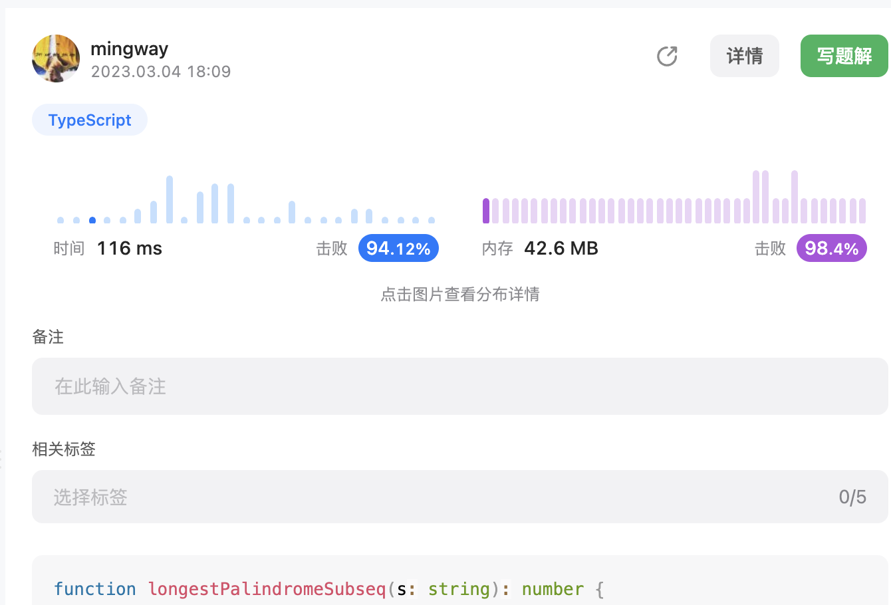

* 最长回文子序列

  给一个字符串`s`， 找出其最长的回文子序列，返回该序列长度。

  首先字问题就是里面每一段的最长回文子序列长度。遍历的过程关键是找到起点和终点。外层从小到大遍历终点，然后内层从大到小遍历起点。

  有三种情况，如果起点和终点相同，则可能就是子序列的起终点。如果不相同，则字问题就变成了不包含起点和不包含终点。

  以下使用一维数组，由于内层是从后往前，可能造成覆盖，所以需要用一个prev变量存起来

  ```ts
  function longestPalindromeSubseq(s: string): number {
      const len = s.length;
      const np = new Array(len).fill(1);
      for (let i = 1; i < len; i++) {
          let prev = np[i];
          for (let j = i - 1; j >= 0; j--) {
              const temp = np[j];
              if (j === i - 1) {
                  np[j] = s[j] === s[i] ? 2 : 1;
              } else {
                  np[j] = Math.max(np[j + 1], np[j], (s[j] === s[i] ? 2 : 0) + prev);
              }
              prev = temp;
          }
      }
      return np[0];
  };
  ```

  

​	

* 使用二维数组同样可以遍历，只不过空间复杂度可能高了一些，时间复杂度还是O(n^2)

  ```ts
  function longestPalindromeSubseq(s: string): number {
      const len = s.length;
      const np = new Array(len).fill(1);
      np.forEach((_, index) => {
          np[index] = new Array(len).fill(1);
      });
      for (let i = 1; i < len; i++) {
          for (let j = i - 1; j >= 0; j--) {
              if (j === i - 1) {
                  np[i][j] = s[j] === s[i] ? 2 : 1;
              } else {
                  if (i === 2 && j === 0) {
                  }
                  np[i][j] = Math.max(np[i - 1][j], np[i][j + 1], np[i - 1][j + 1] + (s[i] === s[j] ? 2 : 0));
              }
          }
      }
      return np[len - 1][0];
  };
  ```

  这里`np[i][j]`指的是从位置j到位置i的字符串的最长子序列长度，所以最终返回的是`np[len - 1][0]`。i是终点的index而j时起点的index。也有i是起点而j是终点的版本。
