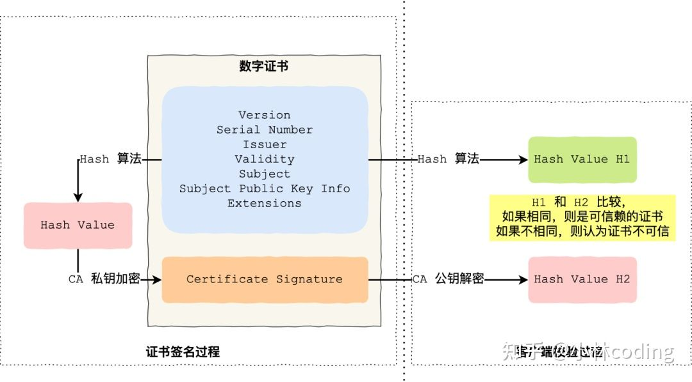

#### 2022/05/10

1. `HTTPS`是基于`TLS`或者`SSL`通信的`HTTP`协议，称为`HTTP over TLS`/`HTTP over SSL`或者`HTTP Secure`。故而`SSL`是独立于`HTTP`的协议。`HTTPS`经由`HTTP`进行通信，但要采用`SSL/TLS`进行加密数据包。

   其主要目的在于

   - 提供对服务器的身份认证机制
   - 通过加密来保护交换资料的隐私与完整性

   这就对应了`HTTP`相对于`HTTPS`的缺点

   - 明文传输数据
   - 不验证服务器的身份可能遭遇伪装
   - 无法验证报文的完整性，可能被篡改过。

   `PS`：`SSL`协议是独立于`HTTP`的，可以运用在应用层的其他协议：`Telnet`/`SMTP`...

   当然`HTTPS`也有弱势：

   - 加密通信会有更大的资源开销
   - 同时`SSL`通信以及加密过程导致`HTTPS`要慢很多

   重点在于`CA`证书的验证过程，首先保证理解前序知识

   - SSL证书中包括了一系列的内容，如图，这里还有证书的签名过程以及验证的主要流程

     

   - 包含有：

     - 公钥
     - 持有者信息
     - 签发的证书认证机构(`CA`)的信息，包括网址等
     - `CA`计算`Hash`时使用的算法
     - 证书的过期时间
     - 私钥加密之后的这个数字签名

   - 第一步会验证基本的信息

   - 然后按照证书签发链来验证证书的有效性

     - 首先查找操作系统中内置的受信任的根证书，验证这个证书颁发机构是否合法机构，即浏览器或者操作系统中有没有原装这个`CA`自签发的根证书，找不到，浏览器会直接报错，表示这个证书不受信任。
     - 找到了，再就拿到这个根证书的公钥，去验证中间证书的有效性，验证过程就是，首先通过`Hash`算法将证书的信息算出一个`Hash`值，再去使用公钥对中间证书的数字签名进行解密得到`Hash`值，对比两个哈希，如果吻合，则说明根证书信任这个中间证书
     - 然后重复流程进一步判断中间证书是否信任服务器传过来的这个证书，如果这个证书信任链打通了，就可以信任这个用户证书了，然后直接读取出证书中的公钥进行后续加密。