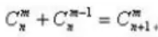

#### 2022/05/22

1. ##### 不同路径

   输入`m`, `n`，表示一个网格的行数以及列数。一个机器人要从网格的左上角移动到网格的右下角。

   每次只能向下或者向右移动一步。返回路径的条数。

* 这是一个组合问题。相当于从`m+n-2`个方向选择中选出`m-1`个选择为一个方向，另外`n-1`个就为另一个方向。根据组合问题的性质

  

  来构建一个二维的数组，行数为`m+n-2, 而列数为`n-1`和`m-1`中比较小的那个。然后初始化第一列以及交叉轴上的数字，因为行坐标不可能小于列坐标。故而遍历的时候一列一列地填，然后当前行的结果依赖于前一行的两个数字相加，对于机器而言加法可能比单纯的利用公式进行乘法然后再进行除法更快一些，当然如果最终结果会大于最大数，可能就需要进行乘除然后取模运算了

  同时，考虑到应该要让算法的空间距离更加近一些，应该将底数作为列，即第二位，这样遍历的时候更多的时候会是在距离相近的位置找数字，当然`JavaScript`中的二维数组并不是在堆中线性存储的，对于`C++`以及`C`等来说是这样的

  ```js
  /**
   * @param {number} m
   * @param {number} n
   * @return {number}
   */
  var uniquePaths = function (m, n) {
      /* 根据Cn m + Cn m-1 = Cn+1 m来构建一个二维的np表 */
      /* 得到底数以及要取出的个数 */
      const row = m + n - 2;
      const col = Math.min(m, n) - 1;/* 选出较小的那个 */
      /* 如果较小的数为1 */
      if (col === 0) {
          return 1;
      }
      /* 得到二维数组，row行col列,这里的row指求组合的底数 */
      const np = new Array(row).fill(0).map(item => new Array(col));
  
      /* 初始化，填充第一列以及交叉轴上的数字 */
      for (let i = 0; i < row; i++) {
          np[i][0] = i + 1;
          if (i < col) {
              np[i][i] = 1;
          }
      }
  
  
      /* 开始一列一列地填充 */
      for (let i = 1; i < col; i++) {
          for (let j = i + 1; j < row; j++) {
              np[j][i] = np[j - 1][i] + np[j - 1][i - 1];
          }
      }
  
      return np[row - 1][col - 1];
  };
  ```

* 现在是底数作为列，选择的数字作为行，这样行数较小。然而花了图之后发现由于需要每次都要访问前一行的数字，而这里的一行可能要大的多，空间距离反而较大

  ```js
  /**
   * @param {number} m
   * @param {number} n
   * @return {number}
   */
  var uniquePaths = function (m, n) {
      /* 根据Cn m + Cn m-1 = Cn+1 m来构建一个二维的np表 */
      /* 得到底数以及要取出的个数 */
      const row = Math.min(m, n) - 1;
      const col = m + n - 2;
  
      /* 某一个维度不需要移动 */
      if (row === 0) {
          return 1;
      }
  
      /* 初始化数组 */
      const np = new Array(row).fill(0).map(item => new Array(col));
  
      /* 填充第一行，即当从col中选取一个的时候的可能情况 */
      for (let i = 0; i < col; i++) {
          np[0][i] = i + 1;
      }
  
      /* 填充交叉位置 */
      for (let i = 0; i < row; i++) {
          np[i][i] = 1;
      }
  
  
      /* 开始一行一行地遍历，进行填充 */
      for (let i = 1; i < row; i++) {
          for (let j = i + 1; j < col; j++) {
              np[i][j] = np[i][j - 1] + np[i - 1][j - 1];
          }
      }
  
      return np[row - 1][col - 1];
  };
  ```

* 当然直接用公式两次进行乘除计算也慢不到哪里去，就是使用一个`np`数组进行计算在复杂的情况下更便于复用。

  ```js
  /**
   * @param {number} m
   * @param {number} n
   * @return {number}
   */
  var uniquePaths = function (m, n) {
      /* 根据Cn m + Cn m-1 = Cn+1 m来构建一个二维的np表 */
      /* 得到底数以及要取出的个数 */
      const base = m + n - 2;
      const top = Math.min(m, n) - 1;
  
      /* 直接两次循环根据公式进行计算 */
      let result = 1;
      for (let i = 0; i < top; i++) {
          result *= base - i;
      }
  
      for (let i = 2; i <= top; i++) {
          result /= i;
      }
  
      return result;
  };
  ```

* 以上的动态规划是按照组合公式的规律得到的，其实可以根据给出的示例看出，到达每一个有上有下的点的来源只有两种，从上面的格子来，或者从左边的格子来，于是只要将`Start`点所在的同一行同一列格子都初始化为1，然后即可进行遍历填充这个二维数组了。

  这样速度也更快一些

  ```js
  /**
   * @param {number} m
   * @param {number} n
   * @return {number}
   */
  var uniquePaths = function (m, n) {
      /* 通过真正的路径图进行理解，到达某一个格子只能从上方或者左方两个方向到达 */
      const np = new Array(m).fill(0).map(item => new Array(n));
  
      /* 初始化，在一条线上的路径数为1 */
      for (let i = 0; i < m; i++) {
          np[i][0] = 1;
      }
      for (let i = 0; i < n; i++) {
          np[0][i] = 1;
      }
  
      /* 开始一行一行地填充 */
      for (let i = 1; i < m; i++) {
          for (let j = 1; j < n; j++) {
              np[i][j] = np[i - 1][j] + np[i][j - 1];
          }
      }
  
      return np[m - 1][n - 1];
  };
  ```

* 同样可以进行延申，如果路中间出现了一个障碍物，那障碍物所在位置的路径就是0了。这样更为直观

* 使用一个一维数组，不断更新当前的位置即可，不过仍然需要填充`(m-1)*(n-1)`次

  ```js
  /**
   * @param {number} m
   * @param {number} n
   * @return {number}
   */
  var uniquePaths = function (m, n) {
      /* 只需要维护一个一维数组 */
      /* 不断更新当前位置 */
      const np = new Array(n).fill(1);
  
      /* 一行一行地填充 */
      for (let i = 1; i < m; i++) {
          for (let j = 1; j < n; j++) {
              np[j] = np[j] + np[j - 1];
          }
      }
      return np[n - 1];
  };
  ```

* 利用公式进行乘法的时候防止溢出，能整除的时候尽量先整除，当然之前也没有溢出

  ```js
  /**
   * @param {number} m
   * @param {number} n
   * @return {number}
   */
  var uniquePaths = function (m, n) {
      /* 使用公式计算的时候防止溢出，在乘的过程中进行除法 */
      const base = m + n - 2;
      let top = Math.min(m, n) - 1;
      const iter = top;
      let result = 1;
  
      for (let i = 0; i < iter; i++) {
          result *= (base - i);
          
          /* 能整除就先整除 */
          while (top !== 1 && result % top === 0) {
              result /= top;
              top--;
          }
      }
      return result;
  };
  ```

2. ##### 有障碍版不同路径

   输入一个网格大小的数组，起点在左上角，终点在右下角。同时这个数组中的障碍物和空位置分别用`1`以及`0`表示。

   返回考虑到障碍物，从起点到终点的最短路径数目，这里的最短路径指的是不做无用功，只能往下或者往右移动

* 和上一题的区别在于，每一次要更新到达每一个位置的路径数目的时候，要先判断这个地方是不是空位置。所以初始化的时候就将数组全部初始化为0。

  ```js
  /**
   * @param {number[][]} obstacleGrid
   * @return {number}
   */
  var uniquePathsWithObstacles = function (obstacleGrid) {
      const row = obstacleGrid.length;
      const col = obstacleGrid[0].length;
  
      /* 初始化一个数组，用于记录到达每个位置的路径数量 */
      const result = new Array(row).fill(0).map(item => new Array(col).fill(0));
  
      /* 填充第一行和第一列,一旦有一个障碍，之后就全都是0 */
      for (let i = 0; i < col; i++) {
          /* 有障碍物就视作0 */
          if (obstacleGrid[0][i] === 1) {
              break;
          } else {
              result[0][i] = 1;
          }
      }
  
      for (let i = 0; i < row; i++) {
          if (obstacleGrid[i][0] === 1) {
              break;
          } else {
              result[i][0] = 1;
          }
      }
  
      /* 开始遍历，每个格子的路径要么从上面来要么从左边来 */
      for (let i = 1; i < row; i++) {
          for (let j = 1; j < col; j++) {
              /* 没有障碍物的时候才更新 */
              if (obstacleGrid[i][j] === 0) {
                  result[i][j] = result[i - 1][j] + result[i][j - 1];
              }
          }
      }
  
      return result[row - 1][col - 1];
  };
  ```

* 也可以只用一个一维数组来记录，注意每一行的第一个位置并不总是1

  ```js
  /**
   * @param {number[][]} obstacleGrid
   * @return {number}
   */
  var uniquePathsWithObstacles = function (obstacleGrid) {
      /* 使用一个一维数组来记录每一行的路径数目 */
      const row = obstacleGrid.length;
      const col = obstacleGrid[0].length;
      const dp = new Array(col).fill(0);
  
      /* 首先初始化第一行,一旦遇到障碍物表示之后都是0了 */
      for (let i = 0; i < col; i++) {
          if (obstacleGrid[0][i] === 0) {
              dp[i] = 1;
          } else {
              break;
          }
      }
  
      /* 开始遍历之后的行 */
      for (let i = 1; i < row; i++) {
          /* 首先确定第一个值,只有当前一个为1并且当前没障碍物时为1 */
          dp[0] = (dp[0] === 1 && obstacleGrid[i][0] === 0) ? 1 : 0;
          for (let j = 1; j < col; j++) {
              dp[j] = obstacleGrid[i][j] === 1 ? 0 : (dp[j - 1] + dp[j]);
          }
      }
  
      return dp[col - 1];
  };
  ```

  