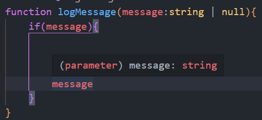
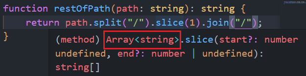

#### 2022/06/20

1. ##### 买卖股票的最佳时机Ⅲ

   输入`prices`数组。最多可以完成两笔交易，输出能获取的最大利润。

   不能同时拥有两支股票

* 动态规划，先保存只能只能一笔交易的结果数组，然后再遍历一遍，使得第二轮持有数组依赖于前一轮得到的非持有数组

  ```ts
  function maxProfit(prices: number[]): number {
      // 先得到最多只能进行一笔交易的情况，记录所有每天能得到的最大利益
      // 之后再进行一轮循环，第二笔交易依赖于第一笔
      // 第一轮每天的最大利益
      const unHoldList: number[] = [0];
      // 每天持有和非持有的最大利润
      let hold = -prices[0];
      let unHold = 0;
      const len = prices.length;
  
      // 开始第一轮交易
      for (let i = 1; i < len; i++) {
          const cur = prices[i];
  
          // 更新非持有状态, 判断是否卖出
          unHold = unHold > cur + hold ? unHold : cur + hold;
  
          // 更新持有状态，判断是否改为今天才买
          hold = hold > -cur ? hold : -cur;
  
          // 记录
          unHoldList.push(unHold);
      }
  
      // 第二轮交易，依赖于前一轮得到的unHoldList
      hold = -prices[0], unHold = 0;
      for (let i = 1; i < len; i++) {
          const cur = prices[i];
  
          // 更新非持有状态，判断是否卖出
          unHold = unHold > cur + hold ? unHold : cur + hold;
  
          // 更新持有状态，可以再一次买入
          hold = hold > unHoldList[i - 1] - cur ? hold : unHoldList[i - 1] - cur;
      }
  
      return unHold;
  };
  ```
  
  使用一个数组存储每天的四种状态，注意可以当天买入然后再卖出，所有可以依赖当天的前一种状态
  
  ```ts
  function maxProfit(prices: number[]): number {
      // 允许当天买入再当天卖出，虽然没有什么意义
      // np数组，5个元素，分别表示没有操作，第一次买入，第一次卖出后，第二次买入，第二次卖出。这里的买入卖出仅表示当天状态，不一定要持有
      const np: number[] = new Array(5).fill(0);
      // 初始化第一次和第二次买入
      np[1] = -prices[0], np[3] = -prices[0];
  
      const len = prices.length;
      for (let i = 0; i < len; i++) {
          const cur = prices[i];
  
          np[1] = Math.max(np[1], np[0] - cur);
          np[2] = Math.max(np[2], np[1] + cur);
          np[3] = Math.max(np[3], np[2] - cur);
          np[4] = Math.max(np[4], np[3] + cur);
      }
  
      return np[4];
  };
  ```

50. 函数重载 vs 条件类型

    对于参数是联合类型的函数重载，返回值类型并不能准确地描述真实地返回值

    ```ts
    function double(x: number | string): number | string;
    
    function double(x: any) {
        return x + x;
    }
    
    const doubleX = double("x"); // Type is string | number
    console.log(doubleX); // xx
    ```

    如果使用`extends`，来进行泛型约束，又可能导致返回值类型过于详细

    ```ts
    function double<T extends string | number>(x: T): T;
    
    function double(x: any) {
        return x + x;
    }
    
    const doubleX = double("x"); // Type is "x"
    console.log(doubleX); // xx
    
    const two = double(1); // Type is 1
    console.log(two); // 2
    ```

    传入字面量会导致得到的类型过于详细，而传入构造方法生成的类型才不会

    ```ts
    const doubleX = double(String("x")); // Type is string
    console.log(doubleX); // xx
    ```

    可以多定义几个声明类型，保证输入类型和输出类型的对应关系

    ```ts
    function double(x: number): number;
    
    function double(x: string): string;
    
    function double(x: any) {
        return x + x;
    }
    
    const doubleX = double("x"); // Type is string;
    
    const two = double(1); // Type is number
    ```

    但是如果是传入一个暂时不知道类型的联合类型的变量则又会报错

    ```ts
    function double(x: number): number;
    
    function double(x: string): string;
    
    function double(x: any) {
        return x + x;
    }
    
    const doubleX = double("x"); // Type is string;
    
    const two = double(1); // Type is number
    
    function f(val: string | number) {
        double(val);
        // ~~~ No overload matches this call.Overload 1 of 2, '(x: number): number', gave the following error.Argument of type 'string | number' is not assignable to parameter of type 'number'.Type 'string' is not assignable to type 'number'.
    }
    ```

    这个问题需要加上一个`string | number`类型的重载才能解决

* 这个实例最好的解决方案是`conditional types`, 使用一个条件语句来使泛型的返回类型更加精细，同时对于联合类型在决定返回值类型的时候会拆开进行判断，所以完全解决了传入一个联合类型变量的问题

  ```ts
  function double<T extends string | number>(val: T): T extends string ? string : number;
  
  function double(val: any) {
      return val + val;
  }
  
  const doubleX = double("x"); // Type is string
  
  const two = double(1); // Type is number
  
  function f(val: string | number) {
      return double(val);
  }
  
  const four = f(2); // Type is string | number
  ```

  只需要一个泛型的重载即可，同时以上不论是传入字符串，字符串字面量或者联合字符串字面量都会返回`string`类型

4. `ts`模拟`js`的的运行时特点，类型基于`Structural Typing`

   只要结构满足条件，则不会报错，判断二者之间相互兼容，尽管并没有显式地指定二者之间的联系

   ```ts
   // 二维向量
   interface Vector2D {
       x: number;
       y: number;
   }
   
   // 计算距离原点的距离
   function calculateLength(v: Vector2D): number {
       return (v.x ** 2 + v.y ** 2) ** 0.5;
   }
   
   // 命名的二维向量类型
   interface NamedVector2D {
       name: string;
       x: number;
       y: number;
   }
   
   // 由于ts是Structural Typing的类型系统，以下不会报错
   const point1: NamedVector2D = {
       name: "point1",
       x: 3,
       y: 4
   };
   
   console.log(calculateLength(point1)); // 5
   ```

   但是反过来就会报错了

   ```ts
   // 二维向量
   interface Vector2D {
       x: number;
       y: number;
   }
   
   // 命名的二维向量类型
   interface NamedVector2D {
       name: string;
       x: number;
       y: number;
   }
   
   // 计算距离原点的距离
   function calculateLength(v: NamedVector2D): number {
       return (v.x ** 2 + v.y ** 2) ** 0.5;
   }
   
   // 由于ts是Structural Typing的类型系统，以下不会报错
   const point1: Vector2D = {
       x: 3,
       y: 4
   };
   
   console.log(calculateLength(point1)); // 5
   // ~~~ Argument of type 'Vector2D' is not assignable to parameter of type 'NamedVector2D'. Property 'name' is missing in type 'Vector2D' but required in type 'NamedVector2D'.
   ```

* 以下增加一个三维向量和长度归一化方法

  ```ts
  // 二维向量
  interface Vector2D {
      x: number;
      y: number;
  }
  
  // 计算距离原点的距离
  function calculateLength(v: Vector2D): number {
      return (v.x ** 2 + v.y ** 2) ** 0.5;
  }
  
  // 三维向量
  interface Vector3D {
      x: number;
      y: number;
      z: number;
  }
  
  // 将三位向量的长度归一化
  function normalize(v: Vector3D): Vector3D {
      const len = calculateLength(v);
  
      return {
          x: v.x / len,
          y: v.y / len,
          z: v.z / len
      };
  }
  
  console.log(normalize({ x: 3, y: 4, z: 5 }));
  // {x: 0.6, y: 0.8, z: 1}
  ```

  显然并没有成功归一，因为`calculateLength`方法计算的长度并没有考虑到三维向量的`z`轴，但是由于`ts`的结构化类型系统，并不会报错

* 由于结构化类型，在使用`for in`遍历属性的时候会有意外的错误

  ```ts
  // 三维向量
  interface Vector3D {
      x: number;
      y: number;
      z: number;
  }
  
  // 计算L1长度
  function calculateLengthL1(v: Vector3D): number {
      let len = 0;
      for (const key in v) {
          if (v.hasOwnProperty(key)) {
              len += v[key];
              // ~~~ Element implicitly has an 'any' type because expression of type 'string' can't be used to index type 'Vector3D'. No index signature with a parameter of type 'string' was found on type 'Vector3D'.
          }
      }
      return len;
  }
  ```

  由于传入的`v`并不一定只有在接口中定义的属性，所以不能保证`v[key]`得到的值一定是`number`类型。当然可以通过设置**任意属性的类型**来避免报错

  ```ts
  // 三维向量
  interface Vector3D {
      x: number;
      y: number;
      z: number;
      [prop: string]: number;
  }
  ```

  但是这里应该避免直接遍历属性名

  ```ts
  // 三维向量
  interface Vector3D {
      x: number;
      y: number;
      z: number;
  }
  
  // 计算L1长度
  function calculateLengthL1(v: Vector3D): number {
      let len = Math.abs(v.x) + Math.abs(v.y) + Math.abs(v.z);
      return len;
  }
  ```

  类同样可以直接赋值，只需要满足结构要求即可。

  如果对象字面量`d`有`foo`属性，以及原型上的`constructor`属性，即`Object`的构造方法

  所以`ts`认为它是可以赋值为类型`C`的

  ```ts
  class C {
      public foo: string;
  
      public constructor(foo: string) {
          this.foo = foo;
      }
  }
  
  const c1 = new C("instance of C");
  
  const d: C = {
      foo: "object literal"
  };
  ```

* 可以利用类的结构类型特定，更方便地进行测试代码的编写

  ```ts
  // 从数据库中查询作者信息的函数
  interface Author {
      first: string;
      last: string;
  }
  
  // 不需要一个模拟的PostgresDB,直接设置一个有对应方法的DB接口即可
  interface DB {
      runQuery: (query: string) => any[];
  }
  
  // 由于PostgresDB拥有runQuery方法
  // 所以ts会在真实运行的时候通过编译
  function getAuthors(database: DB): Author[] {
      const rows = database.runQuery("SELECT FIRST, LAST FROM AUTHORS");
  
      return rows.map((row) => ({
          first: row[0],
          last: row[1]
      }));
  }
  ```

  使用一个包含了`PostgresDB`必要属性的接口，真实生产环境中同样会通过。`PostgresDB`并不一定要显式地声明实现了DB接口

  同时可以直接编写单元测试代码

  ```ts
  // 这样就可以直接编写测试代码了
  test("getAuthors", () => {
      const authors = getAuthors({
          runQuery(query: string): any[] {
              console.log(query);
              return [
                  ["Toni", "Morrison"],
                  ["Dwight", "Shrute"]
              ];
          }
      });
  
      expect(authors).toEqual([
          {
              first: "Toni",
              last: "Morrison"
          },
          {
              first: "Dwight",
              last: "Shrute"
          }
      ]);
  });
  ```

  需要明确对于定义的类型或者类，属性并没有被锁死，可以有不确定的属性，同时可以声明为某个类的实例可能并不是所期待的类实例

5. 限制`any`的使用

   通过类型断言字符串为`any`然后赋值给一个申明了是`number`的变量，不会报错，但是会造成混乱

   ```ts
   let age: number = "12" as any; // Type is number
   
   age += 1; // Type is number
   
   console.log(age); // 121
   ```

   因为`any`和任何类型都相互兼容，所以一个`any`类型的变量作为一个函数的参数不会报错，同样可能会造成问题，因为函数期待的是另一个类型的输入

   ```ts
   function calculateAge(birthDate: Date): number {
       return 22;
   }
   
   let birthDate: any = "1990-01-19";
   calculateAge(birthDate);
   ```

   以上不会报错，但是是有问题的

   同时`any`类型的对象会失去所有的服务，包括自动补全，语境下的提示，以及改名服务

   以下在写两个函数的过程中第二个没有语境下的提示，仅仅会有`vscode`给之前通过的单词进行提示

   ```ts
   interface Person {
       first: string;
       last: string;
   }
   
   const formatName = (p: Person) => `${p.first} ${p.last}`;
   
   const formatName_2 = (p: any) => `${p.first} ${p.last}`;
   ```

   同时如果改名的话，只会影响第一个函数

   ```ts
   interface Person {
       firstName: string;
       lastName: string;
   }
   
   const formatName = (p: Person) => `${p.firstName} ${p.lastName}`;
   
   const formatName_2 = (p: any) => `${p.first} ${p.last}`;
   ```

   `any`会在类型检查的时候掩盖错误

   如下是一个渲染一个选择框的受控组件，同时给渲染函数传如`props`。给`props`指定类型，不过回调函数接受的是any

   ```ts
   // 传给组件的props
   interface ItemPickerProps {
       selected: number;
       onItemSelected: (item: any) => void;
   }
   
   // 函数组件
   function renderItemPicker(props: ItemPickerProps) {
       // ...
   }
   
   // 当前选择的id
   let selected = 0;
   
   // 回调函数
   function handleItemSelected(item: any) {
       selected = item.id;
   }
   
   renderItemPicker({
       selected: selected,
       onItemSelected: handleItemSelected
   });
   ```

   如果之后修改，要将回调函数的输入改为`number`类型的`id`，如果只改动接口，编译过程不会报错，但是运行时会报错，因为真正的回调函数仍旧是`any`类型的输入

   ```ts
   // 传给组件的props
   interface ItemPickerProps {
       selected: number;
       onItemSelected: (id: number) => void;
   }
   ```

   故而最好给`item`一个指定的类型，例如真实的选择接口

   ```ts
   interface Item {
       id: number;
       title: string;
   }
   ```

* `any`类型会掩盖类型的设计

  例如一个比较复杂的页面/组件的`state`，良好的类型设计可以提高可理解性。

  频繁地使用`any`导致运行时错误导致会`TypeScript`地类型系统像在做无用功，需要不停地去跟踪真实地类型

  6. 通过编辑器理解`js`做的工作

     如下在不同地条件语句分支中，`message`的类型不同

     

     可以将鼠标放到一个链式调用的函数上得到上一个函数的输出类型

     ​				

     表示`split`方法得到的是`string[]`类型的数组

     以下会报两个一样的错

     ```ts
     function getElement(elOrId: string | HTMLElement | null): HTMLElement {
         if (typeof elOrId === "object") {
             return elOrId;
             // ~~~ Type 'HTMLElement | null' is not assignable to type 'HTMLElement'.
         } else if (elOrId === null) {
             return document.body;
         } else {
             const el = document.getElementById(elOrId);
             return el;
             // ~~~ Type 'HTMLElement | null' is not assignable to type 'HTMLElement'.
         }
     }
     ```

     第一个是由于`null`的`typeof`结果也是“`object`”

     而第二个则是`getElementById`可能会返回空

     所以应该改为

     ```ts
     function getElement(elOrId: string | HTMLElement | null): HTMLElement {
         if (elOrId === null) {
             return document.body;
         } else if (typeof elOrId === "object") {
             return elOrId;
         } else {
             const el = document.getElementById(elOrId);
             return el === null ? document.body : el;
         }
     }
     ```

     对于空元素也可以报错

     ```ts
     if(el === null){
         throw new Error("no some element with id" + elOrId);
     }
     return el;
     ```

     很显然在`if`语句之后，`js`已经断定`el`为`HTMLElement`类型

8. 将类型看作一个值的集合

   最小的集合是`never`，`never`类型的变量不能被赋值

   ```ts
   let val: never = "seven";
   // ~~~ Type 'string' is not assignable to type 'never'
   ```

   其次是单元类型如：

   ```ts
   type a = "a";
   
   let str: a = "a";
   ```

   ```ts
   type one = 1;
   
   let num: one = 1;
   
   let num2: one = 2;
   // ~~~ Type '2' is not assignable to type '1'
   ```

   然后是联合单元类型，如联合字符串字面量

   ```ts
   type AB = "A" | "B";
   type AB12 = "A" | "B" | 12;
   ```

* 所谓`assignable`指的是

  * `member of`, 一个值对于一个类型而言
  * `subsut of`，一个类型对于另一个类型而言

  ```ts
  let str: AB = "A"; // OK
  
  let str2:AB = "C"; 
  // ~~~ Type '"C"' is not assignable to type 'AB'
  ```

  以下是不同集合/类型之间赋值

  ```ts
  const ab: AB = Math.random() > 0.5 ? "A" : "B";
  // OK, set { "A", "B" } is assignable to type AB
  
  declare let twelve: AB12;
  
  const back: AB = twelve;
  // ~~~ Type 'AB12' is not assignable to type 'AB'.Type '12' is not assignable to type 'AB'.
  ```

  对于一个接口而言，它定义的集合中可以包含拥有多余属性的对象。

  这个能导致在对一个函数传入的对象进行属性遍历的时候需要进行很多属性验证。

* 两个符号的区别`，&`表示属于各个类型的元素取交集，`|`表示取交集，即所谓联合类型

  ```ts
  interface Person {
      name: string;
  }
  
  // 生命区间类
  interface Lifespan {
      birth: Date;
      death?: Date;
  }
  
  // 某个人的生命区间, 表示两个接口的交集，即拥有二者的所有属性的接口
  type PersonSpan = Person & Lifespan;
  
  const personSpan: PersonSpan = {
      name: "Shrute",
      birth: new Date("1979.02.03")
  };
  ```

  以上`Person` & `Lifespan`，表示既是前者的子集又是后者的子集，即取了交集

  而`Person` | `Lifespan`则表示并集

  故而以下对联合类型求属性集合，表示求得是二者得公共属性，而二者没有公共属性，得到`never`

  ```ts
  type PersonSpanKeys = keyof (Person | Lifespan); // Type is never
  ```

  而对交集求属性集合，即得到二者得联合属性

  ```ts
  type PersonSpanKeys = keyof (Person & Lifespan);
  // Type is "name" | keyof Lifespan
  ```

  可以通过继承来实现`PersonSpan`类

  ```ts
  // PersonSpan类，每个人的生命区间
  interface PersonSpan extends Person {
      birth: Date;
      death?: Date;
  }
  ```

`extends`关键字的作用相当于`is assignable to`, 表示`PersonSpan`是`Person`的子集，由于有一个必要属性`birth`，并且是一个真子集

对于类来说，就是子类了。

以下三个接口的关系则是二维是一维的子集，三维是二维的子集

```ts
interface Vector1D {
    x: number;
}

interface Vector2D {
    x: number;
    y: number;
}

interface Vector3D {
    x: number;
    y: number;
    z: number;
}
```

相当于用`extends`由上到下传递，用韦恩图表示就是范围越来越小了

故而`extends`应该也要理解为`subset of`。这里的`T extends String`, 从某种意义上来说，T一定是一个类型了，哪怕是单元类型

如

```ts
function getByKey<T extends String>(val:any,key:T){
    // ...
}
```

* 表示传入的`key`应该在`string`类型表示的范围内

```ts
interface Point {
    x: number;
    y: number;
}

function sortBy<K extends keyof T, T>(arr: T[], key: K): T[] {
    // ...
    return arr;
}

const points: Point[] = [
    {
        x: 1,
        y: 2
    },
    {
        x: 5,
        y: 1
    }
];

// 根据x进行排序，OK
sortBy(points, "x");

// 根据 x | y进行排序，OK
sortBy(points, Math.random() > 0.5 ? "x" : "y");

// 根据z进行排序，报错
sortBy(points, "x");
// Argument of type '"z"' is not assignable to parameter of type 'keyof Point'
```

* 以上报错为`not assignable to`, 和`extends`可以理解为同一个意思

* 同样可以用子集的思维方式理解`tuple`和`array`之间的关系

  `array`并不是`tuple`的子集，哪怕二者的结构完全一样

  ```ts
  const list = [1, 2];
  let tuple: [number, number] = list;
  // ~~~ Type 'number[]' is not assignable to type '[number, number]'.
  ```

  三元组不是二元组的子集，因为`ts`给`[number,number]`这样的二元组设置的类型中`length`属性为`2`；

  ```ts
  const triple: [number, number, number] = [1, 2, 3];
  let tuple: [number, number] = triple;
  // ~~~ Type '[number, number, number]' is not assignable to type '[number, number]'.Source has 3 element(s) but target allows only 2.
  ```

  当然，由于`ts`是结构型得类型系统，接口只要求拥有指定类型属性即可，所以并不能表示所有得类型，例如所有得整数

* 通过`exclude`/排除得到一个特定得集合，但是要求得到得仍然是正确的类型

  ```ts
  type T = Exclude<string | Date, string | number>;
  // Type is Date
  
  type NonZeroNum = Exclude<number, 0>;
  // Type is still number
  
  let num: NonZeroNum = 0; // Ok
  ```

9. 区分一个标识符是在`type space`还是`value space`

   ```ts
   // 圆柱接口
   interface Cylinder {
       radius: number;
       height: number;
   }
   
   // 函数，指的是一个真实的value
   const Cylinder = (radius: number, height: number) => ({ radius, height } as Cylinder);
   // Type is (radius: number, height: number) => Cylinder
   ```

   显然接口在`type space`中

   故而如果使用`instanceof`，则使用的是箭头函数

   ```ts
   function calculateVolume(shape: unknown) {
       if (shape instanceof Cylinder) {
           shape; // Type is {}
       }
   }
   ```

   如果`conpilerOption`中设置了`strict`并且要在`ts`中以函数的形式生命一个类，需要另外设置一个接口，因为函数不会自动生成一个对应的类型

   ```ts
   interface Cylinder {
       radius: number;
       height: number;
   }
   
   var Cylinder = /** @class */ (function () {
       function Cylinder(this: Cylinder, radius: number, height: number) {
           this.radius = radius;
           this.height = height;
       }
       return Cylinder;
   })();
   ```

   所以在`ts`中最好使用`class`关键字定义类

   在`type`和`interface`后面的标识符都位于类型空间，而`const`,`let`定义的则位于值空间

   ```ts
   type T1 = "string literal";
   
   type T2 = 123;
   
   const v1 = "string literal";
   
   const v2 = 345;
   ```

   编译后的结果中，所有在类型空间的内容都会被移除

   ```js
   "use strict";
   var v1 = "string literal";
   var v2 = 345;
   //# sourceMappingURL=index.js.map
   ```

   跟在类型声明`:`和类型断言`as`后面的都位于类型空间

   而在`=`后面的在值空间中

   两种类型交替出现

   ```ts
   interface Person {
       first: string;
       last: string;
   }
   
   const p: Person = {
       first: "Jacode",
       last: "Johnson"
   };
   ```

   如下类型断言都移除了

   ```ts
   const p = {
       first: "Jacode",
       last: "Johnson"
   };
   ```

   函数同样交替出现

   ```ts
   function email(p: Person, subject: string, body: string): Response {
       //...
   }
   ```

   `class`关键字定义的类会会同时生成一个类型和一个值

   类型是根据类的形状得到的，包括其实例属性和实例方法

   而值则对应构造函数，`instanceof`使用的就是它的值。在`ts`的一些声明文件中，类型和值可以区分开来

   ```ts
   // 有默认值得属性可以不用在constructor中初始化
   class Cylinder {
       radius = 1;
       height = 1;
   }
   
   function calculateVolume(shape:unknown){
       if(shape instanceof Cylinder){
           shape // Type is Cylinder
           shape.radius // Type is number
       }
   }
   ```

   编译为：

   ```ts
   class Cylinder {
       constructor() {
           this.radius = 1;
           this.height = 1;
       }
   }
   ```

   以下`enum`类型可以和`number`类型相互赋值

   ```ts
   enum Days {
       Sun,
       Mon,
       Tue,
       Wed,
       Thu,
       Fri,
       Sat
   }
   
   let one = Days.Mon; // Type is Days.Mon
   one = 1;
   one = Days.Sat;
   ```

   编译为

   ```ts
   var Days;
   (function (Days) {
       Days[Days["Sun"] = 0] = "Sun";
       Days[Days["Mon"] = 1] = "Mon";
       Days[Days["Tue"] = 2] = "Tue";
       Days[Days["Wed"] = 3] = "Wed";
       Days[Days["Thu"] = 4] = "Thu";
       Days[Days["Fri"] = 5] = "Fri";
       Days[Days["Sat"] = 6] = "Sat";
   })(Days || (Days = {}));
   let one = Days.Mon; // Type is Days.Mon
   one = 1;
   one = Days.Sat;
   ```

   以下是不同语境下`typeof`的作用

   前两个`typeof`得到的是`Typescript`中的类型

   而后两个得到的是字符串，字符串的类型是一个联合字符串字面量类型。只有八种可能性，而`JavaScript`是包含了六种原始类型和引用类型

   ```ts
   type person = typeof p; // Type is person
   
   type mailFn = typeof email; // Type is (p: Person, subject: string, body: string) => Response
   
   const val1 = typeof p; // Type is "string" | "number" | "bigint" | "boolean" | "symbol" | "undefined" | "object" | "function", value is "object"
   
   const val2 = typeof email; // value is "function"
   ```

   `typeof`不管功能如果，操作对象永远是真实的值

   ```ts
   type T3 = typeof Cylinder; // Type is typeof Cylinder
   
   const val3 = typeof Cylinder; // value is "function"
   ```

   以上`typeof`操作的是`Cylinder`的构造方法，即`Cylinder`这个类对应的值。故而`val3`得到的是`"function"`,而`type`得到的类型是构造方法的类型，一般方法的类型是`(...) => void`, 不过构造方法有标识，而不符合一般的类型

   如果需要得到实例的类型，即`Cylinder`这个类型。则需要使用`InstanceType`泛型函数

   ```ts
   type T4 = InstanceType<typeof Cylinder>; // Type is Cylinder
   ```

   如果需要得到接口或者类型的某个属性的类型，需要使用中括号形式进行索引

   ```ts
   const first: Person["first"] = p["first"]; // Type is string
   ```

   只要实在声明符或者`type`关键字后面，使用的就是类型，而对于一个类型，要得到其属性的类型，中括号中的索引可以是单元类型，联合类型乃至原始类型

   ```ts
   interface Person {
       first: string;
       age: number;
       mid: string;
       last: string;
   }
   
   const p: Person = {
       first: "Dwight",
       mid: "K",
       last: "Schrute",
       age: 40
   };
   
   const first: Person["first"] = p["first"]; // Type is string
   
   type T = Person["first" | "age"]; // Type is string | number
   
   type T2 = Person["first" | "last"]; // Type is string
   
   type PersonPropsType = Person[keyof Person]; // Type is string | number
   
   // 一个三元组类型
   type Tuple = [string, number, Date];
   
   type T3 = Tuple[2]; // Type is Date
   
   type T4 = Tuple[number]; // string | number | Date
   
   type T5 = keyof Tuple; // Type is keyof Tuple
   ```

   显然元组类型的所有属性的类型不是一个联合类型而是`number`以及一个`"length"`

   如下，三元组接口中有一个`length`属性，长度即类型数组的长度。同时也限制了实例的长度，这样四元组实例就不能赋值给三元组实例了

   ```ts
   type T5 = Tuple["length"]; // Type is 3
   ```

   很多关键字在两个空间中使用的时候都有双重含义：

   - `this`在值空间中是`js`的执行上下文。而作为类型，表示`ts`类型的`this`，即`“polymorphic this”`, 便于实现子类的方法链

   - `|`和`&`，在`ts类型系统`中表示联合操作和交叉操作

   - `const`，在`ts类型`中改变一个字面量或者字面量表达式的推断类型

   - `extends`用于定义子类关系(`subclass`), 子类型关系(`subtype`), 以及作为泛型中对类型参数的约束

     以集合的思维方式看，`extends`和`assignable to`都表示`subset of`

   * `in`可以表示一个键和对象的从属关系，在`ts`中可以用于表示联合类型的所有元素，用于`mapped type`

   如果想要将之前的`email`方法改为传入一个对象，并且将传入的对象进行结构，需要将值和类型分开。

   ```ts
   function email({ person, subject, body }: { person: Person; subject: string; body: string }) {
       // ...
   }
   ```

   不能像下面这样将结构和类型合在一块，因为结构语法的引号是重命名的意思，会导致报错

   ```ts
   function email({
       person: Person,
       /* Binding element 'Person' implicitly has an 'any' type. */
       subject: string,
       /* Binding element 'string' implicitly has an 'any' type. */
       /* Duplicate identifier 'string'. */
       body: string
       /* Binding element 'string' implicitly has an 'any' type. */
       /* Duplicate identifier 'string'. */
   }) {
       // ...
   }
   ```

   将后面的类型作为一个单独的类型，或者可以从上下文中进行类型推断

   ```ts
   interface Person {
       name: string;
   }
   
   interface EmailInfo {
       person: Person;
       subject: string;
       body: string;
   }
   
   function email({ person, subject, body }: EmailInfo) {
       // ...
   }
   ```

9. 优先使用类型声明，少用类型断言

   从代码的美观角度也应该多用类型声明。二者的区别在于类型声明仅仅是一个建议，`ts`仍然会对结构或者两个类型之间的关系进行检查。而类型断言的限制则很少，只需要断言来源类型和目标类型有一方可以覆盖另一方即可

   ```ts
   interface Person {
       name: string;
   }
   
   const alice: Person = {
       name: "alice",
       age: 1
       // ~~~ Type '{ name: string; age: number; }' is not assignable to type 'Person'.
       // ~~~ Object literal may only specify known properties, and 'age' does not exist in type 'Person'
   };
   
   const bob = {
       age: 1
       // ~~~ Conversion of type '{ age: number; }' to type 'Person' may be a mistake because neither type sufficiently overlaps with the other. If this was intentional, convert the expression to 'unknown' first.
   } as Person;
   ```

   只用对象字面量执行声明赋值的时候要求形状和接口定义的形状完全一致，可选属性可以没有

   以上是检查多余属性，由于类型声明会进行更多的安全检查，应该尽量使用类型声明

   同时对于匿名箭头函数的返回值，可以在参数列表之后定义返回值类型。同时可以指定最终返回类型进行类型验证

   ```ts
   interface Person {
       name: string;
   }
   
   const people: Person[] = ["Marry", "Lizzy", "Jane", "Lydia"].map((name): Person => ({ name }));
   ```

   类型断言一般在使用的使用比`ts`了解地更多地时候使用，因为`ts`对编译之外的运行时以及网页等信息都不了解

   ```ts
   document.querySelector("#btn")!.addEventListener("click", (e) => {
       e.currentTarget; // Type is EventTarget
       const button = e.currentTarget as HTMLButtonElement;
       button; // Type is HTMLButtonElement
   });
   
   ```

   非空断言，`!`。它仍旧是断言，表示能保证元素不为空，但是如果能够进行条件判断还是应该使用条件判断，因为类型断言在编译为`js`之后都会删除

   ```ts
   const foo = document.getElementById("foo");
   
   foo; // Type is HTMLElement | null
   
   const nonNumFoo = document.getElementById("foo")!;
   
   nonNumFoo; // Type is HTMLElement
   ```

10. 避免使用原始类型的对象包装类型

    原始类型是可以赋值给声明为包装类型的变量的，正因此可能会导致错误的使用，因为反过来包装类型不能赋值给原始类型的变量。而`ts`类型系统中和基本上所有的包在所有的情况下使用的都是原始类型。所以尽量使用小写字母开头的原始类型即可

    `Smybol`的构造函数原始类型的，并不是包装类型，同时不需要`new`关键字。

    ```ts
    console.log(typeof Symbol("sym")); // "symbol"
    
    // BigInt同理，不过还在finalized的过程中
    > typeof BigInt(1234)
    > 'bigint'
    ```

    


